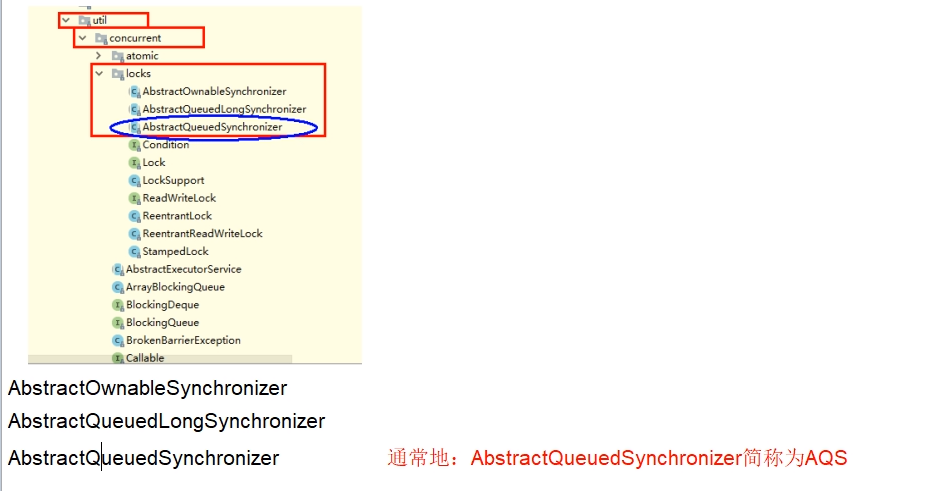
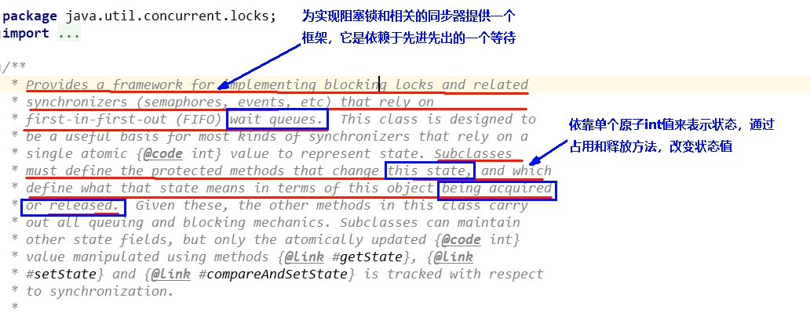
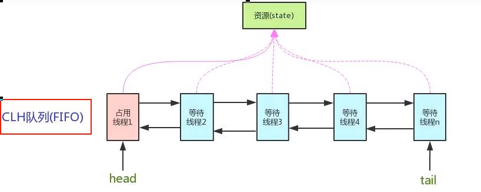
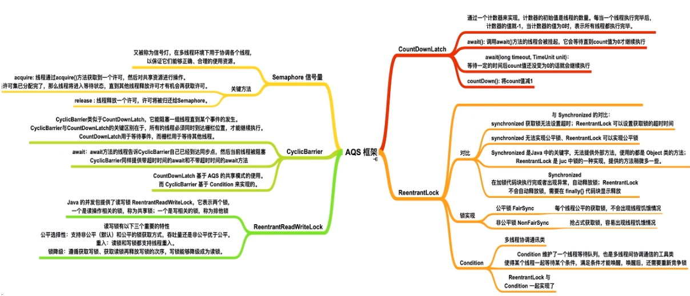
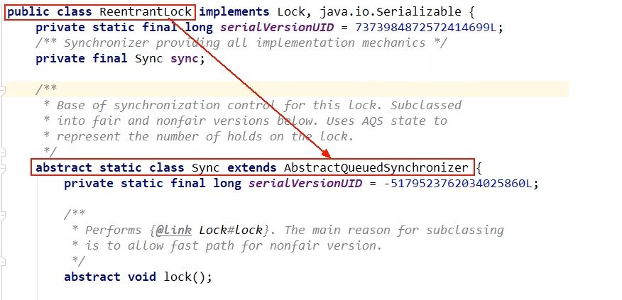
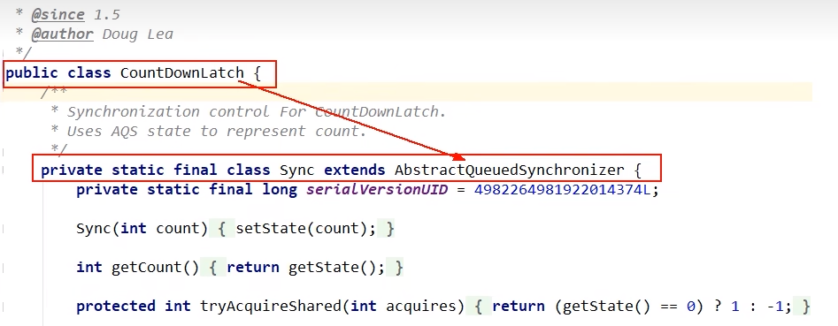
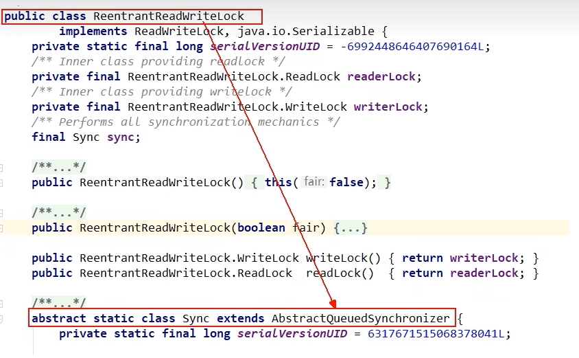
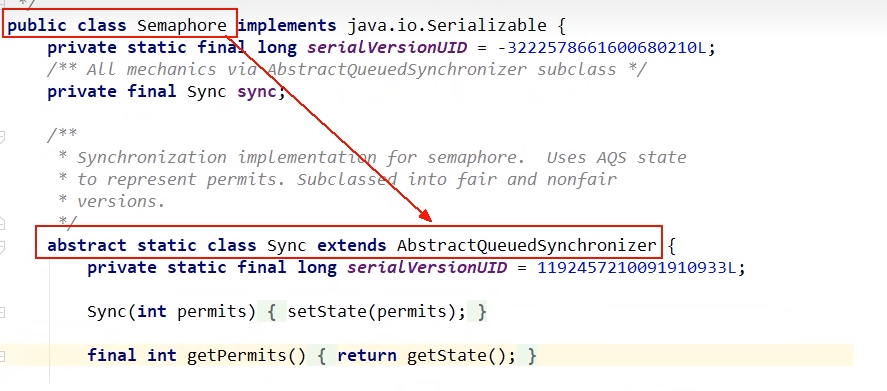
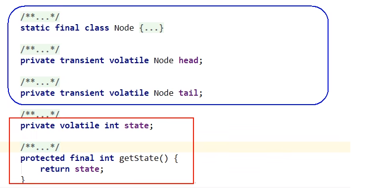
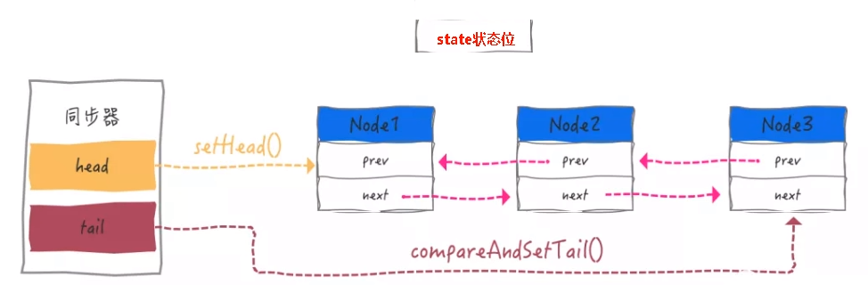

# 是什么

### 字面意思：

抽象的队列同步器

源代码：

### 技术解释

是用来实现锁或者其它同步器组件的公共基础部分的抽象实现，是重量级基础框架及整个JUC体系的基石，主要用于解决锁分配给"谁"的问题

官网解释

整体就是一个抽象的FIFO队列来完成资源获取线程的排队工作，并通过一个int类变量表示持有锁的状态

CLH: Craig、Landin and Hagersten 队列，是一个单向链表，AQS中的队列是CLH变体的虚拟双向队列FIFO

# AQS为什么是JUC内容中最重要的基石

### 和AQS有关的

#### ReentrantLock

#### CountDownLatch

#### ReentrantReadWriteLock

#### Semaphore

# 锁和同步器的关系

### 锁，面向锁的使用者

定义了程序员和锁交互的使用层API，隐藏了实现细节，你调用即可。

### 同步器，面向锁的实现者

Java并发大神DougLee，提出统一规范并简化了锁的实现，将其抽象出来屏蔽了同步状态管理、同步队列的管理和维护、阻塞线程排队和通知、唤醒机制等一切锁和同步组件实现的--------公共基础部分

#能干嘛

### 加锁会导致阻塞

有阻塞就需要排队，实现排队必然需要队列

### 解释说明

抢到资源的线程直接使用处理业条，抢不到资源的必然涉及一种排队等候机制。抢占资源失败的线程继续去等待(类似银行业务办理窗口都满了，暂时没有受理窗口的顾客只能去候客区排队等候)，但等候线程仍然保留获取锁的可能且获取锁流程仍在继续(候客区的顾客也在等着叫号，轮到了再去受理窗口办理业务)。

既然说到了排队等候机制，那么就一定会有某种队列形成，这样的队列是什么数据结构呢?

如果共享资源被占用，就需要一定的阻塞等待唤醒机制来保证锁分配。这个机制主要用的是CLH队列的变体实现的，将暂时获取不到锁的线程加入到队列中，这个队列就是AQS同步队列的抽象表现。它将要请求共享资源的线程及自身的等待状态封装成队列的结点对象(Node)，通过CAS、自旋以及LockSupport.park()的方式，维护state变量的状态，使并发达到同步的效果。

.png)

#### 源码说明

AQS使用一个volatile的int类型的成员变量来表示同步状态，通过内置的FIFO队列来完成资源获取的排队工作将每条要去抢占资源的线程封装成一个Node节点来实现锁的分配，通过CAS完成对State值的修改。

# 小总结

### AQS同步队列的基本结构

CLH: Craig、Landin and Hagersten 队列，是个单向链表，AQS中的队列是CLH变体的虚拟双向队列(FIFO)

