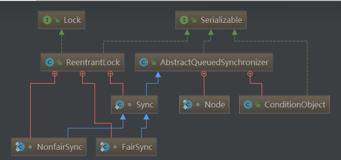
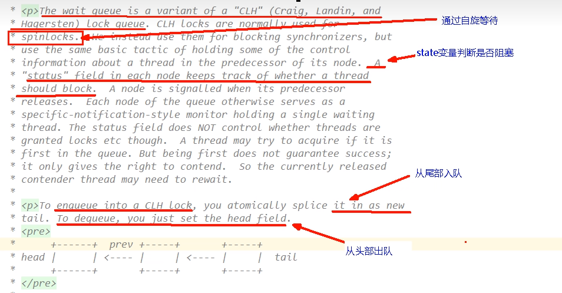
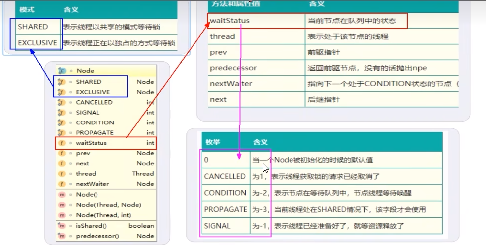

# AQS内部体系架构

## AQS自身

### AQS的int变量

#### AQS的同步状态State成员变量：private volatile int state;

#### 银行办理业务的受理窗口状态

零就是没人，自由状态可以办理

大于等于1，有人占用窗口，需要等待

#### AQS的CLH队列

CLH队列(三个大牛的名字组成)，成为一个双向队列

### 小总结

有阻塞就需要排队，实现排队必然需要队列

state变量+CLH双端队列

## 内部类Node(Node类在AQS类内部)

### Node的int变量

#### Node的等待状态waitState成员变量：volatile int waitStatus;

#### 说人话

等候区其他线程的等待状态，队列中每个排队的个体就是一个Node。

#### Node节点属性说明

 

