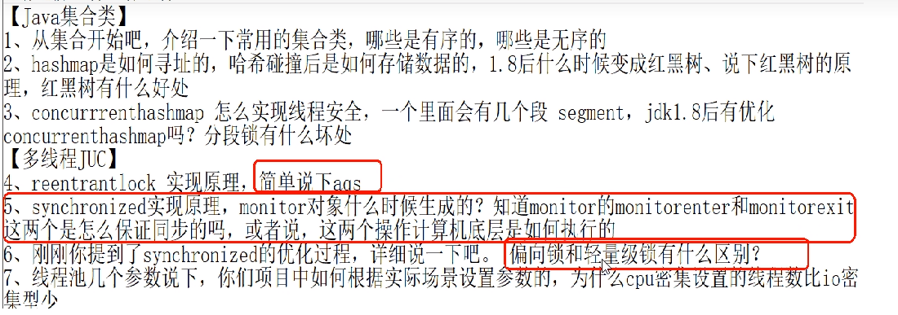

谈谈对synchronized的理解

synchronized的锁升级

# 大纲总结

阿里巴巴规约：

【强制】高并发时，同步调用应该去考量锁的性能损耗。能用无锁数据结构，就不要用锁；能锁区块，就不要锁整个方法体；能用对象锁，就不要用类锁。
说明：尽可能使加锁的代码块工作量尽可能的小，避免在锁代码块中调用RPC方法。

### synchronized 锁优化的背景

用锁能够实现数据的安全性，但是会带来性能下降。

无锁能够基于线程并行提升程序性能，但是会带来安全性下降，

### 锁的升级过程

### synchronized锁：

由对象头中的Mark Word根据锁标志位的不同而被复用及锁升级策略

