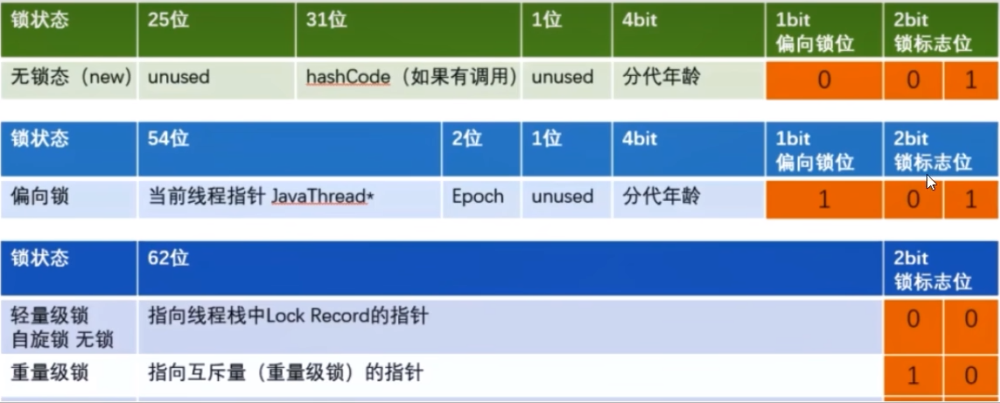
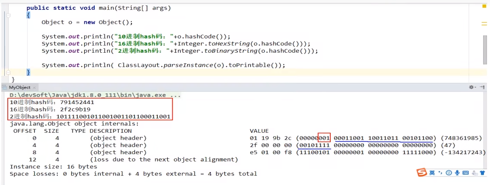
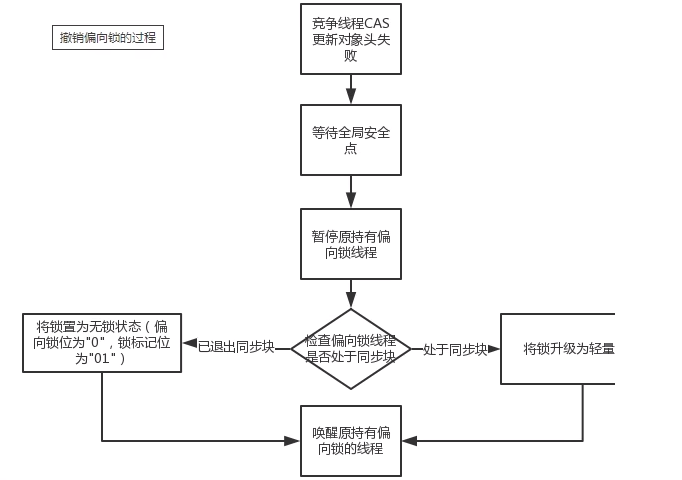
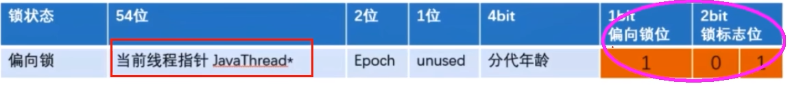
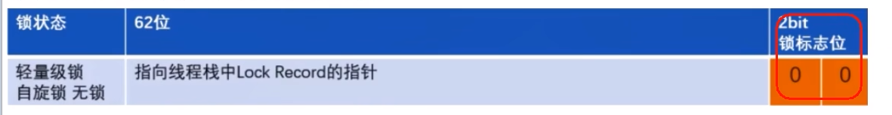
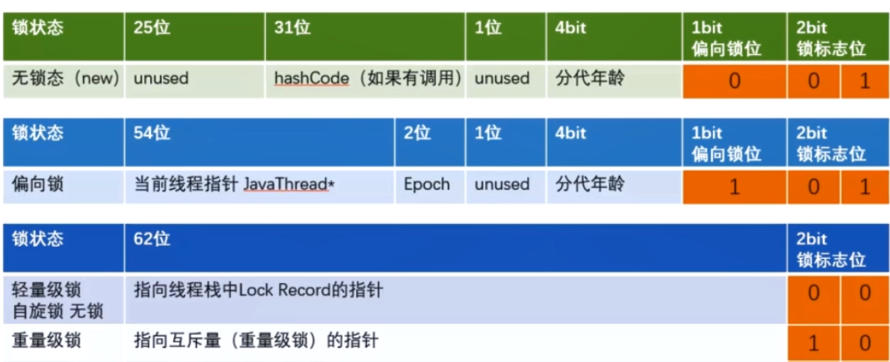
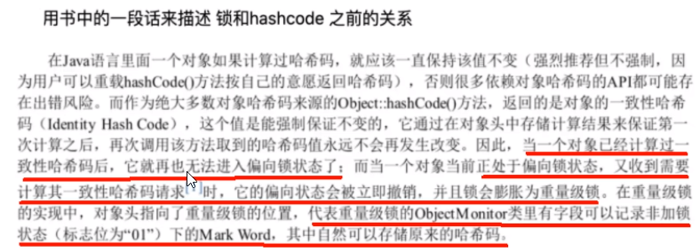
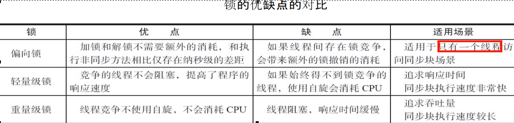

# 多线程访问情况，3种

只有一个线程来访问，有且唯一Only One

有多个线程(2个线程A、B来交替访问）

竞争激烈，更多个线程来访问

# 升级流程

### synchronized用的锁是存在Java对象头里的Mark Word中，锁升级功能主要依赖MarkWord中锁标志位和释放偏向锁标志位

### 64位标记图再看

### 锁指向，请牢记

偏向锁：MarkWord存储的是偏向的线程ID；

轻量锁：MarkWord存储的是指向线程栈中Lock Record的指针；

重量锁：MarkWord存储的是指向堆中的monitor对象的指针；

# 无锁

无锁：初始状态，一个对象被实例化后，如果还没有被任何线程竞争锁，那么它就为无锁状态（001）

# 偏向锁

### 是什么

偏向锁：单线程竞争

当线程A第一次竞争到锁时，通过操作修改Mark Word中的偏向线程ID、偏向模式。如果不存在其他线程竞争，那么持有偏向锁的线程将永远不需要进行同步。

### 主要作用

当一段同步代码一直被同一个线程多次访问，由于只有一个线程那么该线程在后续访问时便会自动获得锁

##### 小结论

Hotspot的作者经过研究发现，大多数情况下：

多线程的情况下，锁不仅不存在多线程竞争，还存在锁由同一个线程多次获得的情况，偏向锁就是在这种情况下出现的，它的出现是为了解决只有在一个线程执行同步时提高性能。

备注：

偏向锁会偏向于第一个访问锁的线程，如果在接下来的运行过程中，该锁没有被其他的线程访问，则持有偏向锁的线程将永远不需要触发同步。也即偏向锁在资源没有竞争情况下消除了同步语句，懒的连CAS操作都不做了，直接提高程序性能

###偏向锁的持有

### 说明

理论落地：

在实际应用运行过程中发现，“锁总是同一个线程持有，很少发生竞争”，也就是说锁总是被第一个占用他的线程拥有，这个线程就是锁的偏向线程。

那么只需要在锁第一次被拥有的时候，记录下偏向线程ID。这样偏向线程就一直持有着锁（后续这个线程进入和退出这段加了同步锁的代码块时，不需要再次加锁和释放锁。而是直接会去检查锁的MarkWord里面是不是放的自己的线程ID)。

如果相等，表示偏向锁是偏向于当前线程的，就不需要再尝试获得锁了，直到竞争发生才释放锁。以后每次同步，检查锁的偏向线程ID与当前线程ID是否一致，如果一致直接进入同步。无需每次加锁解锁都去CAS更新对象头。如果自始至终使用锁的线程只有一个，很明显偏向锁几乎没有额外开销，性能极高。

如果不等，表示发生了竞争，锁已经不是总是偏向于同一个线程了，这个时候会尝试使用CAS来替换MarkWord里面的线程ID为新线程的ID，
竞争成功，表示之前的线程不存在了，MarkWord里面的线程ID为新线程的ID，锁不会升级，仍然为偏向锁；
竞争失败，这时候可能需要升级变为轻量级锁，才能保证线程间公平竞争锁。
注意，偏向锁只有遇到其他线程尝试竞争偏向锁时，持有偏向锁的线程才会释放锁，线程是不会主动释放偏向锁的。

技术实现：

一个synchronized方法被一个线程抢到了锁时，那这个方法所在的对象就会在其所在的Mark Word中将偏向锁修改状态位，同时还会有占用前54位来存储线程指针作为标识。若该线程再次访问同一个synchronized方法时，该线程只需去对象头的Mark Word 中去判断一下是否有偏向锁指向本身的ID，无需再进入Monitor去竞争对象了。

### 偏向锁的撤销

当有另外线程逐步来竞争锁的时候，就不能再使用偏向锁了，要升级为轻量级锁

竞争线程尝试CAS更新对象头失败，会等待到全局安全点（此时不会执行任何代码）撤销偏向锁

偏向锁的撤销

偏向锁使用一种等到竞争出现才释放锁的机制，只有当其他线程竞争锁时，持有偏向锁的原来线程才会被撤销。

撤销需要等待全局安全点(该时间点上没有字节码正在执行)，同时检查持有偏向锁的线程是否还在执行：

①第一个线程正在执行synchronized方法（处于同步块），它还没有执行完，其它线程来抢夺，该偏向锁会被取消掉并出现锁升级。此时轻量级锁由原持有偏向锁的线程有，继续执行其同步代码，而正在竞争的线程会进入自旋等待获得该轻量级锁。

② 第一个线程执行完成synchronized方法（退出同步块），则将对象头设置成无锁状态并撤销偏向锁，重新偏向。

Java15逐步废弃偏向锁... ...

# 轻锁

### 是什么

轻量级锁：多线程竞争，但是任意时刻最多只有一个线程竞争，即不存在锁竞争太过激烈的情况，也就没有线程阻塞。

### 主要作用

有线程来参与锁的竞争，但是获取锁的冲突时间极短，本质就是自旋锁CAS

### 轻量级锁的获取

轻量级锁是为了在线程近乎交替执行同步块时提高性能。

主要目的：在没有多线程竞争的前提下，通过CAS减少重量级锁使用操作系统互斥量产生的性能消耗，说白了先自旋，不行才升级阻塞。

升级时机：当关闭偏向锁功能或多线程竞争偏向锁会导致偏向锁升级为轻量级锁

假如线程A已经拿到锁，这时线程B又来抢该对象的锁，由于该对象的锁已经被线程A拿到，当前该锁已是偏向锁了。

而线程B在争抢时发现对象头Mark Word中的线程ID不是线程B自己的线程ID（而是线程A)，那线程B就会进行CAS操作希望能获得锁。

此时线程B操作中有两种情况：

如果锁获取成功，直接替换Mark Word中的线程ID为B自己的ID(A→B)，重新偏向于其他线程(即将偏向锁交给其他线程，相当于当前线程“被"释放了锁），该锁会保持偏向锁状态，A线程Over，B线程上位；

如果锁获取失败，则偏向锁升级为轻量级锁(设置偏向锁标识为0并设置锁标志位为00)，此时轻量级锁由原持有偏向锁的线程持有，继续执行其同步代码，而正在竞争的线程B会进入自旋等待获得该轻量级锁。

### 自旋达到一定次数和程度

Java6之前：默认启用，默认情况下自旋的次数是10次或者自旋线程数超过cpu核数一半

Java6之后：自适应自旋锁

自适应意味着自旋的次数不是固定不变的。而是根据:同一个锁上一次自旋的时间；拥有锁线程的状态来决定

### 轻量锁与偏向锁的区别和不同

争夺轻量级锁失败时，自旋尝试抢占锁

轻量级锁每次退出同步块都需要释放锁，而偏向锁是在竞争发生时才释放锁

# 重锁

### 有大量的线程参与锁的竞争，冲突性很高

### 锁标志位

重量级锁原理

Java中synchronized的重量级锁，是基于进入和退出Monitor对象实现的。在编译时会将同步块的开始位置插入monitor enter指令，在结束位置插入monitor exit指令。

当线程执行到monitor enter指令时，会尝试获取对象所对应的Monitor所有权，如果获取到了，即获取到了锁，会在Monitor的owner中存放当前线程的id，这样它将处于锁定状态，除非退出同步块，否则其他线程无法获取到这个Monitor。

# 小总结

### 锁升级发生后，hashcode去哪了

锁升级为轻量级或重量级锁后，Mark Word中保存的分别是线程栈帧里的锁记录指针和重量级锁指针，已经没有位置再保存哈希码，GC年龄了，那么这些信息被移动到哪里去了呢?

在无锁状态下，Mark Word中可以存储对象的identity hash code值。当对象的hashCode()方法第一次被调用时，JVM会生成对应的identity hash code值并将该值存储到Mark Word中。

对于偏向锁，在线程获取偏向锁时，会用Thread D和epoch值覆盖identity hash code所在的位置。如果一个对象的hashCode0万法已经被调用过一次之后，这个对象不能被设置偏向锁。因为如果可以的化，那Mark Word中的identity hash code必然会被偏向线程ld给覆盖，这就会造成同一个对象前后两次调用hashCode()方法得到的结果不一致。

升级为轻量级锁时，JVM会在当前线程的栈帧中创建一个锁记录(Lock Record)空间，用于存储锁对象的Mak Word拷贝，该据贝中可以包含identity hash code，所以轻量级锁可以和identity hash code共存，哈希码和GC年龄自然保存在此，释放锁后会将这些信息写回到对象头。

升级为重量级锁后，Mark Word保在的重量级锁指针，代表重量级锁的ObiectMonitor类里有字段记录非加锁状态下的Mark Word，锁释放后也会将信息写回到对象头。

### 各种锁优缺点、synchronized锁升级和实现原理

synchronized锁升级过程总结:一句话，就是先自旋，不行再阻塞。

实际上是把之前的悲观锁(重量级锁)变成在一定条件下使用偏向锁以及使用轻量级(自旋锁CAS)的形式

synchronized在修饰方法和代码块在字节码上实现方式有很大差异，但是内部实现还是基于对象头的MarkWord来实现的。

JDK1.6之前synchronized使用的是重量级锁，JDK1.6之后进行了优化，拥有了无锁->偏向锁->轻量级锁->重量级锁的升级过程，而是无论什么情况都使用重量级锁。

偏向锁:适用于单线程适用的情况，在不存在锁竞争的时候进入同步方法/代码块则使用偏向锁。

轻量级锁:适用于竞争较不激烈的情况(这和乐观锁的使用范围类似)，存在竞争时升级为轻量级锁，轻量级锁采用的是自旋锁，如果同步方法/代码块执行时间很短的话，采用轻量级锁虽然会占用cpu资源但是相对比使用重量级锁还是更高效。

重量级锁:适用于竞争激烈的情况，如果同步方法/代码块执行时间很长，那么使用轻量级锁自旋带来的性能消耗就比使用重量级锁事严重，这时候就需要升级为重量级锁。

