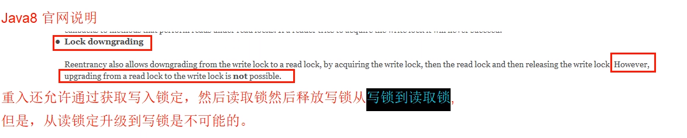
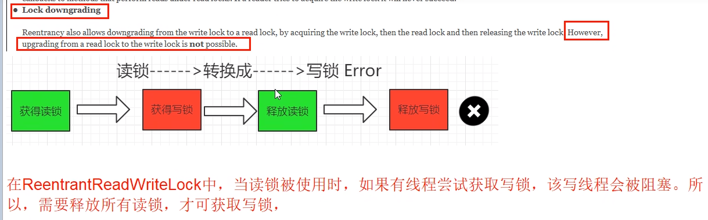
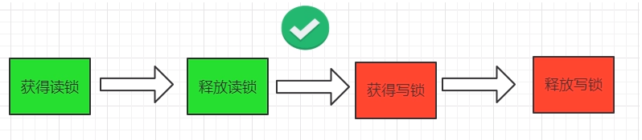

# 是什么

### 读写锁说明

ReentrantReadWriteLock

读写锁定义为：一个资源能够被多个读线程访问，或者被一个写线程访问，但是不能同时存在读写线程。即读写互斥，读读共享。

### 读写锁ReentrantReadWriteLock的意义和特点

它只允许读读共存，而读写和写写依然是互斥的，大多实际场景是“读/读”线程间并不存在互斥关系，

只有"读/写”线程或”写/写”线程间的操作需要五斥的。因此引入ReentrantReadWriteLock。

一个ReentrantReadWriteLock同时只能存在一个写锁但是可以存在多个读锁，但不能同时存在写锁和读锁，也即一个资源可以被多个读操作访问或一个写操作访问，但两者不能同时进行。

只有在读多写少情景之下，读写锁才具有较高的性能体现。

# 特点

一体两面，读写互斥，读读共享，读没有完成时候其他线程写锁无法获得

### 写锁 -> 读锁，ReentrantReadWriteLock可以降级

#### 《Java并发编程的艺术》中关于锁降级的说明

ReentrantReadWriteLock锁降级: 将写入锁降级为读锁(类似Linux文件读写权限理解，就像写权限要高于读权限一样)，锁的严苛程度变强叫做升级，反之叫做降级。

写锁的降级，降级成为了读锁

1 如果同一个线程持有了写锁，在没有释放写锁的情况下，它还可以继续获得读锁。这就是写锁的降级，降级成为了读锁。

2 规则惯例，先获取写锁，然后获取读锁，再释放写锁的次序。

3 如果释放了写锁，那么就完全转换为读锁。

#### 读写锁降级演示

**写锁可以降级，锁降级是为了让当前线程感知到数据的变化，目的是保证数据可见性。**

锁降级：遵循获取写锁 -> 再获取读锁 -> 再释放写锁的次序，写锁能够降级成为读锁。

如果一个线程占有了写锁，在不释放写锁的情况下，它还能占有读锁，即写锁降级为读锁。

如果有线程在读，那么写线程是无法获取写锁的，是悲观锁的策略

**线程获取读锁是不能直接升级为写入锁的**

#### 写锁和读锁是互斥的

写锁和读锁是互斥的(这里的互斥是指线程间的互斥，当前线程可以获取到写锁又获取到读锁，但是获取到了读锁不能继续获取写锁》，这是因为读写锁要保持写操作的可见性。因为，如果允许读锁在被获取的情况下对写锁的获取，那么正在运行的其他读线程无法感知到当前写线程的操作。

因此，分析读写锁ReentrantReadWriteLock，会发现它有个潜在的问题:

读锁结束，写锁有望；写锁独占，读写全堵!

如果有线程正在读，写线程需要等待读线程释放锁后才能获取写锁。

即ReentrantReadWriteLock读的过程中不允许写，只有等待线程都释放了读锁，当前线程才能获取写锁，也就是写入必须等待，这是一种悲观的读锁。

##### 后续讲解StampedLock时再详细展开

分析StampedLock，会发现它改进之处在于:

读的过程中也允许获取写锁介入(相当牛B，读和写两个操作也让你“共享”(注意引号))，这样会导致我们读的数据就可能不一致，所以，需要额外的方法来判断读的过程中是否有写入，这是一种乐观的读锁。

显然乐观锁的并发效率更高，但一旦有小概率的写入导致读取的数据不一致，需要能检测出来，再读一遍就行。

