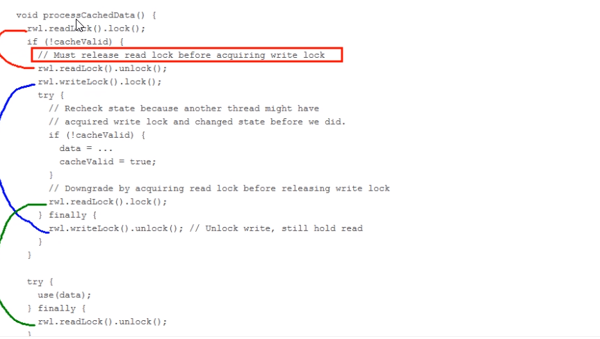

# 读写锁之读写规矩，解释为什么要锁降级

### Oracle公司ReentrantWriteReadLock源码总结

锁降级 下面的示例代码摘自ReentrantWVriteReadLock源码中:

ReentrantWriteReadLock支持锁降级，遵循按照获取写锁，获取读锁再释放写锁的次序，写锁能够降级成为读锁，不支持锁升级。

1 代码中声明了一个volatile类型的cacheValid变量，保证其可见性。

2 首先获取读锁，如果cache不可用，则释放读锁。获取写锁，在更改数据之前，再检查一次cacheValid的值，然后修改数据，将cacheValid置为true，然后在释放写锁前立刻抢夺获取读锁；此时，cache中数据可用，处理cache中数据，最后释放读锁。这个过程就是一个完整的锁降级的过程，目的是保证数据可见性。

总结：一句话，同一个线程自己持有写锁时再去拿读锁，其本质相当于重入。

如果违背锁降级的步骤，如果违背锁降级的步骤，如果话背锁障级的步骤

如果当前的线程C在修改完cache中的数据后，没有获取读锁而是直接释放了写锁，那么假设此时另一个线程D获取了写锁并修改了数据，那么C线程无法感知到数据已被修改，则数据出现错误。

如果遵循锁降级的步骤

线程C在释放写锁之前获取读锁，那么线程D在获取写锁时将被阻塞，直到线程C完成数据处理过程，释放读锁。这样可以保证返回的数据是这次更新的数据，该机制是专门为了缓存设计的。

