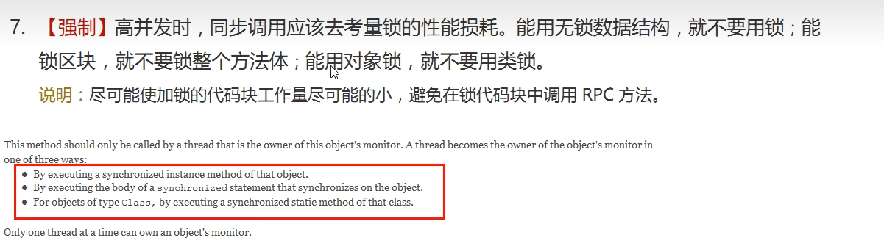
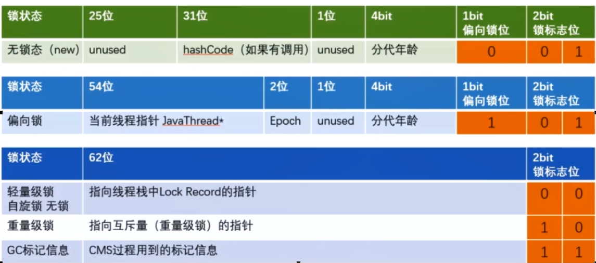
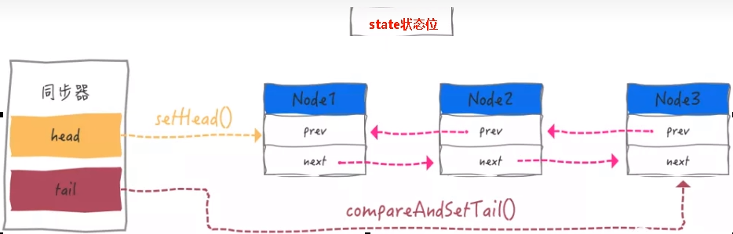

1. CompletableFuture

2. "锁"事儿

   - 悲观锁
   - 乐观锁
   - 自旋锁
   - 可重入锁(递归锁)
   - 写锁(独占锁)/读锁(共享锁)
   - 公平锁/非公平锁
   - 死锁
   - 偏向锁
   - 轻量锁
   - 重量锁
   - 邮戳(票据)锁

3. JMM

4. synchronized及升级优化

   - 锁的到底是什么

     

     作用于实例方法，当前实例加锁，进入同步代码前要获得当前实例的锁；

     作用于代码块，对括号里配置的对象加锁。

     作用于静态方法，当前类加锁，进去同步代码前要获得当前类对象的锁;

   - 无锁 -> 偏向锁 -> 轻量锁 -> 重量锁

   - Java对象内存布局和对象头

   - 64位图

     

5. CAS

   - CAS底层原理：JDK提供的CAS机制，在汇编层级，会禁止变量两侧的指令优化，然后使用cmpxchg指令比较并更新变量值(原子性)

   - ABA问题
     问题：

     线程X准备将变量的值从A改为B，然而这期间线程Y将变量的值从A改为C，然后再改为A；最后线程X检测变量值是A，并置换为B。但实际上，A已经不再是原来的A了，解决方法，是把变量定为唯一类型。值可以加上版本号，或者时间戳。

     解决:
     如加上版本号，线程Y的修改变为A1->B2->A3，此时线程X再更新则可以判断出A1不等于A3

6. volatile

   2特性：可见性、禁止指令重排

   内存屏障

7. LockSupport和线程中断

   ### LockSupport.park和Object.wait区别

   线程在Object.wait之后必须等到Object.notify才能唤醒

   LockSupport可以先unpark线程，等线程执行LockSupport.park是不会挂起的，可以继续执行

   LockSupport是基于Unsafe类，由JDK提供的线程操作工具类，主要作用就是挂起线程，唤醒线程。

   LockSupport.park

   LockSupport.unpark

8. AbstractQueuedSynchronizer

   ### 是什么

   volatile+cas机制实现的锁模板，保证了代码的同步性和可见性，而AQS封装了线程阻塞等待挂起，解锁唤醒其他线程的逻辑。AQS子类只需根据状态变量，判断是否可获取锁，是否释放锁，使用LockSupport挂起、唤醒线程即可

   

   AQS内部维护一个同步队列，元素就是包装了线程的Node。

   同步队列中首节点是获取到锁的节点，它在释放锁的时会唤醒后继节点，后继节点获取到锁的时候，会把自己设为首节点。

   线程会先尝试获取锁，失败则封装成Node，CAS加入同步队列的尾部。在加入同步队列的尾部时，会判断前驱节点是否是head结点，并尝试加锁(可能前驱节点刚好释放锁)，否则线程进入阻塞等待。

9. ThreadLocal

   当使用ThreadLocal声明变量时，ThreadLocal为每个使用该变量的线程提供独立的变量副本，每一个线程都可以独立地改变自己的副本，而不会影响其它线程所对应的副本

10. 原子增强类Atomic

