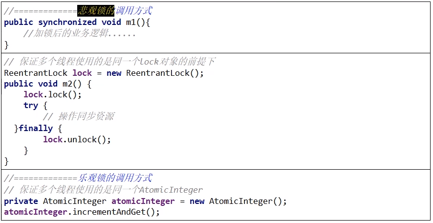

# 悲观锁

认为自己在使用数据的时候一定有别的线程来修改数据，因此在获取数据的时候会先加锁，确保数据不会被别的线程修改。

synchronized关键字和Lock的实现类都是悲观锁

适合写操作多的场景，先加锁可以保证写操作时数据正确。显式的锁定之后再操作同步资源

一句话：狼性锁

# 乐观锁

认为自己在使用数据时不会有别的线程修改数据或资源，所以不会添加锁。

在Java中是通过使用无锁编程来实现，只是在更新数据的时候去判断，之前有没有别的线程更新了这个数据。

如果这个数据没有被更新，当前线程将自己修改的数据成功写入。

如果这个数据已经被其它线程更新，则根据不同的实现方式执行不同的操作，比如放弃修改、重试抢锁等等

判断规则

1 版本号机制Version

2 最常采用的是CAS算法，Java原 子类中的递增操作就通过CAS自旋实现的。

使用场景：

适合读操作多的场景，不加锁的特点能够使其读操作的性能大幅提升。

乐观锁则直接去操作同步资源，是一种无锁算法，得之我幸不得我命

一句话：佛系锁

乐观锁一般有两种实现方式：采用Version版本号；CAS(Compare-and-Swap)，即比较并交换算法

