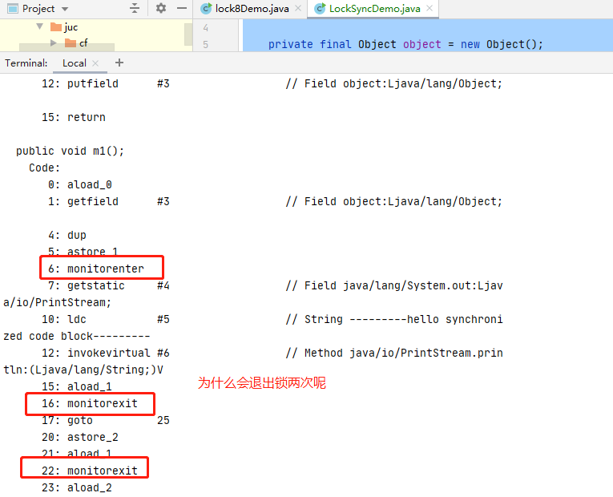
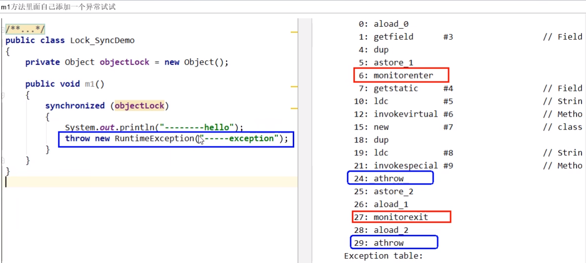
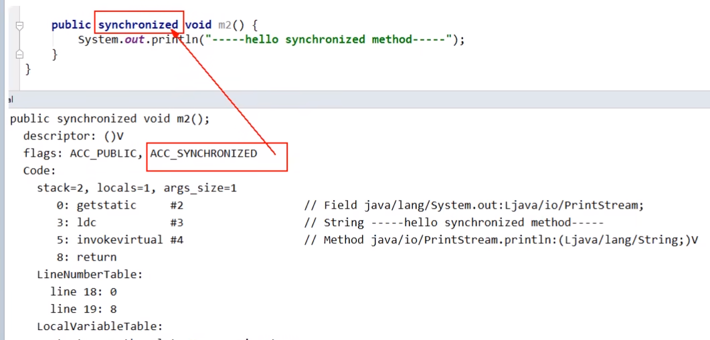
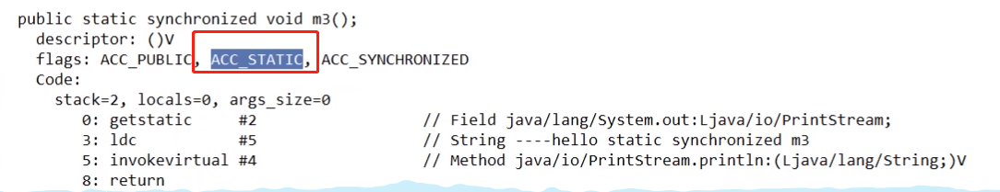

# javap -c ***.class 文件反编译

-c 对代码进行反汇编

如果需要获取更多的信息：

javap -v ***.class文件反编译 ->  -v 指的是verbose 输出附加信息(包括行号、本地变量表、反汇编等详细信息)

# synchronized同步代码块

```java
package com.juc.lock;

public class LockSyncDemo {

    private final Object object = new Object();
    public void m1() {
        synchronized (object) {
            System.out.println("---------hello synchronized code block---------");
        }
    }

    public static void main(String[] args) {

    }
}
```

### 运行上面的main方法，生成class文件，进入对应class文件，执行反编译命令，javap -c ***.class



synchronized同步代码块，实现使用的是monitorenter和monitorexit指令

一定是一个enter两个exit吗？一般情况是1个enter对应2个exit，极端情况下，在synchronized里面手动抛异常



# synchronized普通同步方法(对象锁)

反编译文件



调用指令将会检查方法的ACC_SYNCHRONIZED访问标志是否被设置。如果设置了，执行线程会将先持有monitor锁，然后再执行方法，最后在方法完成(无论是正常完成还是非正常完成)时释放 monitor

# synchronized静态同步方法(类锁)

javap -v ***.class文件反编译



ACC_STATIC，ACC_SYNCHRONIZED访问标志区分该方法是否静态同步方法


