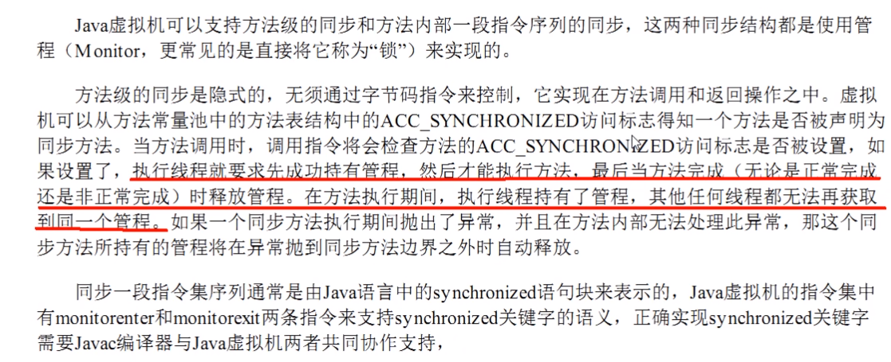

# 面试题：为什么任何一个对象都可以成为一个锁

# 什么是管程monitor

管程(英语:Monitors，也称为监视器)是一种程序结构，结构内的多个子程序(对象或模块)形成的多个工作线程互斥访问共享资源。

这些共享资源一般是硬件设备或一群变量。对共享变量能够进行的所有操作集中在一个模块中。(把信号量及其操作原语“封装”在一个对象内部)管程实现了在一个时间点，最多只有一个线程在执行管程的某个子程序。管程提供了一种机制，管程可以看做一个软件模块，它是将共享的变量和对于这些共享变量的操作封装起来，形成一个具有一定接口的功能模块，进程可以调用管程来实现进程级别的并发控制。

### 在HotSpot虚拟机中，monitor采用ObjectMonitor实现

ObjectMonitor.java 一> ObjectMonitor.cpp 一> objectMonitor.hpp

ObjectMonitor.hpp，每个对象天生都带着一个对象监视器，每一个被锁住的对象都会和Monitor关联起来

