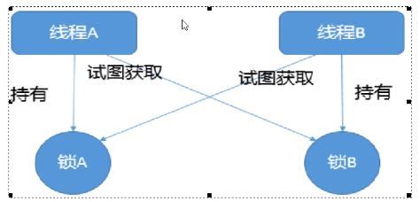

# 死锁是什么？

死锁是指两个或两个以上的线程在执行过程中,因争夺资源而造成的一种**互相等待的现象**,若无外力干涉那它们都将无法推进下去，如果系统资源充足，进程的资源请求都能够得到满足，死锁出现的可能性就很低，否则就会因争夺有限的资源而陷入死锁。

### 死锁产生的主要原因

系统资源不足

进程运行推进的顺序不合适

资源分配不当

### 如何排查死锁

纯命令：jps -l 查出程序进程号，jstack 进程编号

图形化：jconsole

