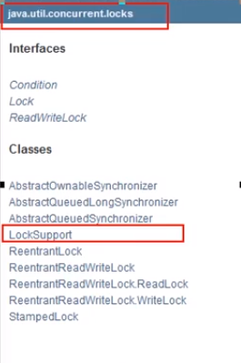
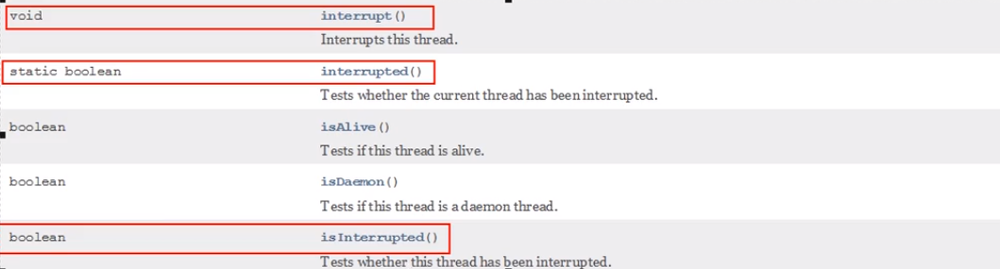

# LockSupport

# 线程中断机制

如何中断一个运行中的线程?

如何停止一个运行中的线程?

### 什么是中断机制

首先

一个线程不应该由其他线程来强制中断或停止，而是应该由线程自己自行停止，自己来决定自己的命运。所以，**Thread.stop,Thread.suspend,Thread.resume** 都已经被废弃了。

其次

在Java中没有办法立即停止一条线程，然而停止线程却显得尤为重要，如取消一个耗时操作。因此，Java提供了一种用于停止线程的协商机制一一中断，也即中断标识协商机制。

中断只是一种协作协商机制，Java没有给中断增加任何语法，中断的过程完全需要程序员自己实现。

若要中断一个线程，你需要手动调用该线程的interrupt方法，该方法也仅仅是将线程对象的中断标识设成true；接着你需要自己写代码不断地检测当前线程的标识位，如果为true，表示别的线程请求这条线程中断，此时究竟该做什么需要你自己写代码实现。
每个线程对象中都有一个中断标识位，用于表示线程是否被中断，该标识位为tue表示中断，为false表示未中断；通过调用线程对象的interrupt方法将该线程的标识位设为tue; 可以在别的线程中调用，也可以在自己的线程中调用。

### 中断的相关API方法之三大方法说明

| public void interrupt()             | 实例方法，just to set the interrupt flag 实例方法interrupt()仅仅是设置线程的中断状态为true，发起一个协商而不会立刻停止线程 |
| ----------------------------------- | ------------------------------------------------------------ |
| public static boolean interrupted() | 静态方法，Thread.interrupted(); 判断线程是否被中断并清楚当前中断状态  这个方法做了两件事： 返回当前线程的中断状态，测试当前线程是否已被中断 将当前线程的中断状态清零并重新设置为false，清除线程的中断状态 |
| public boolean isInterrupted()      | 实例方法，判断当前线程是否被中断(通过检查中断标志)           |

