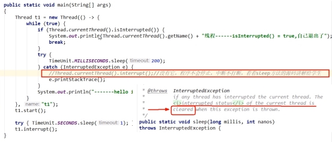
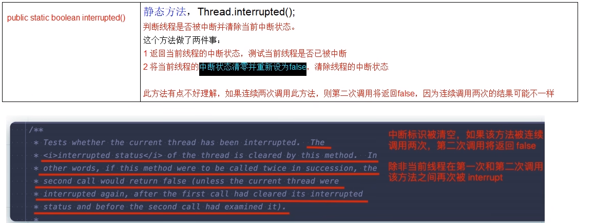
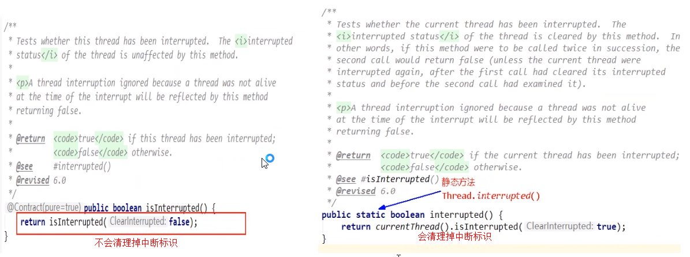
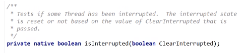

# 如何停止中断运行中的线程

- 通过一个volatile变量实现
- 通过AtomicBoolean
- 通过Thread类自带的中断API实例方法实现
  在需要中断的线程中不断监听中断状态，一旦发生中断，就执行相应的中断处理业务逻辑stop线程

说明：

具体来说，当对一个线程，调用 interrupt() 时:

1. 如果线程处于正常活动状态，那么会将该线程的中断标志设置为 true，仅此而己。
被设置中断标志的线程将继续正常运行，不受影响。
所以， interrupt() 并不能真正的中断线程，需要被调用的线程自己进行配合才行。
2. 如果线程处于被阻塞状态(例如处于sleep, wait, jin 等状态)，在别的线程中调用当前线程对象的interrupt方法，那么线程将立即退出被阻塞状态，并抛出一个InterruptedException异常。

# 当前线程的中断标识为true，是不是线程就立刻停止？

sleep方法抛出InterruptedException后，中断标识也被清空置为false,我们在
catch没有通过调用th.interrupt()方法再次将中断标识置为true,这就导致无限循
环了

### 小总结

中断只是一种写上机制，修改中断标识位仅此而已，不是立刻stop打断

# 静态方法Thread.interrupted()，谈谈你的理解

### 说明：

都是返回中断状态，静态方法interrupted和实例方法isInterrupted两者对比：

方法的注释也清晰的表达了“中断状态将会根据传入的Clearinterrupted参数值确定是否重置“。

所以，静态方法interrupted将会清除中断状态（传入的参数Clearlnterrupted为true），实例方法isinterrupted则不会（传入的参数Clearinterrupted为false)。

# 总结

线程中断相关的方法：

public void interrupt()，interrupt()方法是一个实例方法，它通知目标线程中断，也仅是设置目标线程的中断标志位为true。

public boolean islnterrupted()，islnterrupted()方法也是一个实例方法，它判断当前线程是否被中断（通过检查中断标志位）并获取中断标志

public static boolean interrupted()，Thread类的静态方法interrupted()，返回当前线程的中断状态真实值（boolean类型）后会将当前线程的中断状态设为false，此方法调用之后会清除当前线程的中断标志位的状态(将中断标志置为false了），返回当前值并清零置false

