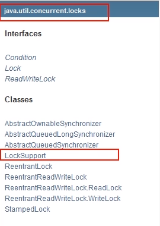
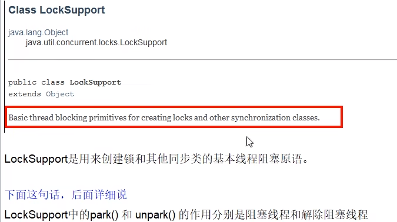
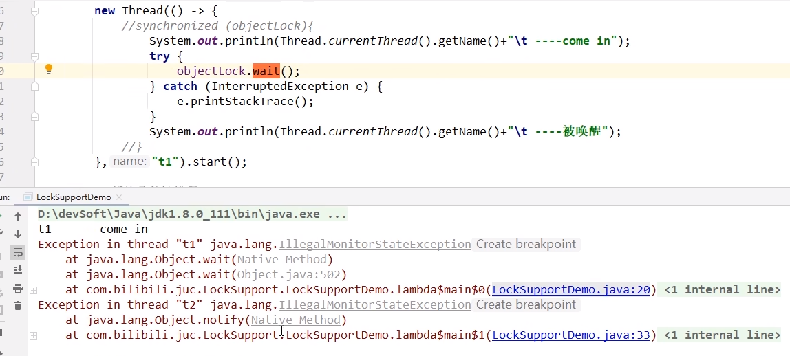
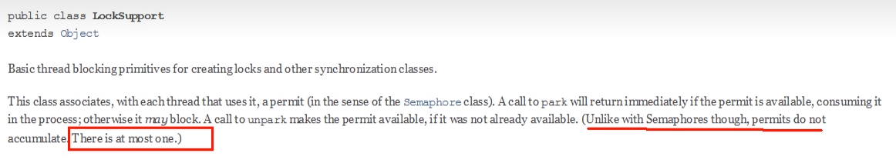
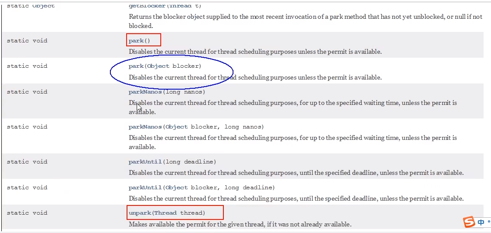

# LockSupport是什么

# 3种让线程等待和唤醒的方法

### 线程等待和唤醒的方法

1. 使用Object中的wait()方法让线程等待，使用Object中的notify()方法唤醒线程
2. 使用JUC包中Condition的await()方法让线程等待，使用signal()方法唤醒线程
3. LockSupport类可以阻塞当前线程以及唤醒指定被阻塞的线程

# Object类中的wait和notify方法实现线程等待和唤醒

正常：wait和notify都包裹在synchronized代码块里面，休眠和唤醒都是正常的

异常1：wait和notify方法，两个都去掉同步代码块，会报异常

异常2：程序先notify后wait，程序无法向后执行，线程无法被唤醒

# Condition接口中的await和signal方法实现线程的等待和唤醒

正常：await和signal都在lock锁里面，休眠和唤醒都是正常的

异常1：await和signal方法，两个都去掉加锁解锁方法块，会报异常

异常2：程序先signal后await，程序无法向后执行，线程无法被唤醒

#### 即Condition中的线程等待和唤醒方法，需要先获取锁，一定要先await后signal，一定不能反了

### 上述两个对象Object和Condition使用的限制条件：线程先要获得并持有锁，必须在锁块(synchronized或lock)中，必须要先等待后唤醒，线程才能够被唤醒

# LockSupport类中的park等待和unpark唤醒

### 是什么

它是通过park()和unpark(thread)方法来实现阻塞和唤醒线程的操作

官网解锁：

LockSupport是用来创建锁和其他同步类的基本线程阻塞原语。

LockSupport类使用了一种名为Permit（许可）的概念来做到阻塞和唤醒线程的功能，每个线程都有一个许可（permit）。

但与Semaphore不同的是，许可的累加上限是1。

### 主要方法

API：

阻塞：park()/park(Object blocker)，阻塞房钱线程/阻塞传入的具体线程

唤醒：unpark(Thread thread)，唤醒处于阻塞状态的指定线程。调用unpark(Thread thread)后，就会将thread线程的许可证permit发放，会自动唤醒park线程，即之前阻塞中的LockSupport.park()方法会立即返回。

