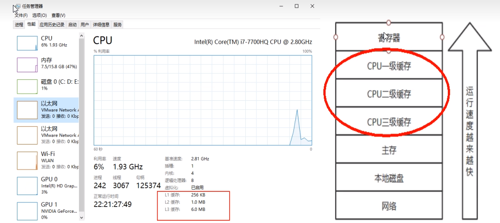
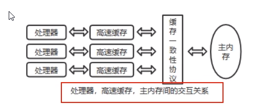

# 计算机硬件存储体系

### 推导出我们需要知道JMM

因为有这么多级的缓存(cpu和物理主内存的速度不一致的），

CPU的运行并不是直接操作内存而是先把内存里边的数据读到缓存，而内存的读和写操作的时候就会造成不一致的问题

JVM规范中试图定义一种Java内存模型(Java Memory Model,简称JMM)**来屏蔽掉各种硬件和操作系统的内存访问差异**，以实现让Java程序在各种平台下都能达到一致的内存访问效果。

所以，推导出我们需要知道JMM

# Java内存模型 Java Memory Model

JMM（Java内存模型Java Memory Model，简称JMM)本身是一种抽象的概念并不真实存在它仅仅描述的是一组约定或规范，通过这组规范定义了程序中（尤其是多线程）各个变量的读写访问方式并决定一个线程对共享变量的写入何时以及如何变成对另一个线程可见，关键技术点都是围绕多线程的原子性、可见性和有序性展开的。

原则：

JMM的关键技术点都是围绕多线程的原子性、可见性和有序性展开的

能干嘛?

1通过JMM来实现线程和主内存之间的抽象关系。

2屏蔽各个硬件平台和操作系统的内存访问差异以实现让Java程序在各种平台下都能达到一致的内存访问效果。

