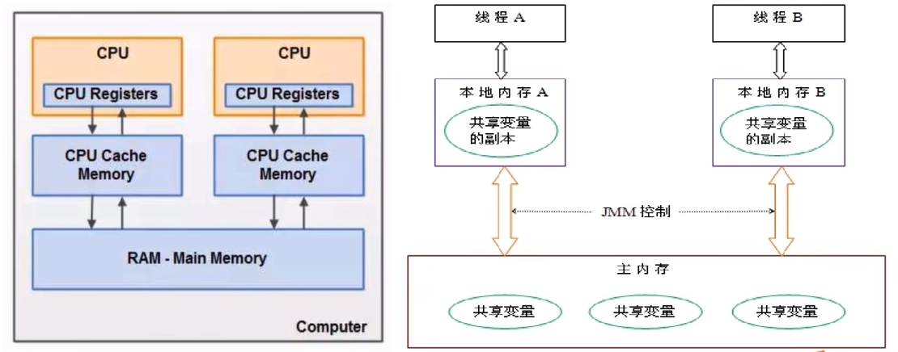
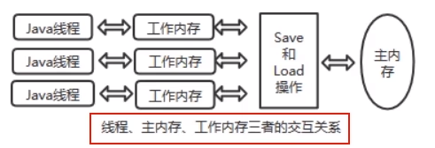

# 可见性

是指当一个线程修改了某一个共享变量的值，其他线程是否能够立即知道该变更，JMM规定了所有的变量都存储在主内存中。

系统主内存共享变量数据修改被写入的时机是不确定的，多线程并发下很可能出现“脏读”，所以每个线程都有自己的工作内存，线程自己的工作内存中保存了该线程使用到的变量的  。线程对变量的所有操作（读取，赋值等）都必需在线程自己的工作内存中进行，而不能够直接读写主内存中的变量。不同线程之间也无法直接访问对方工作内存中的变量，线程间变量值的传递均需要通过主内存来完成

### 线程脏读

- 主内存中有变量x，初始值为0
- 线程A要将x加1，先将x=0拷贝到自己的私有内存中，然后更新x的值
- 线程A将更新后的x值回刷到主内存的时间是不固定的
- 刚好在线程A没有回刷x到主内存时，线程B同样从主内存中读取x，此时为0，和线程A一样的操作，最后期盼的x=2就会变成x=1

# 原子性

指一个操作是不可打断的，即多线程环境下，操作不能被其他线程干扰

# 有序性

### 是什么

对于一个线程的执行代码而言，我们总是习惯性认为代码的执行总是从上到下，有序执行。但为了提升性能，编译器和处理器通常会对指令序列进行重新排序。Java规范规定JVM线程内部维持顺序化语义，即只要程序的最终结果与它顺序化执行的结果相等，那么指令的执行顺序可以与代码顺序不一致，此过程叫指令的重排序。

### 优缺点

JVM能根据处理器特性(CPU多级缓存系统、多核处理器等）适当的对机器指令进行重排序，使机器指令能更符合CPU的执行特性，最大限度的发挥机器性能。但是，指令重排可以保证串行语义一致，但没有义务保证多线程间的语义也一致（即可能产生“脏读”），简单说，两行以上不相干的代码在执行的时候有可能先执行的不是第一条，不见得是从上到下顺序执行，执行顺序会被优化。

从源码到最终执行示例图：

单线程环境里面确保程序最终执行结果和代码顺序执行的结果一致。

处理器在进行重排序时必须要考虑指令之间的数据依赖性

多线程环境中线程交替执行，由于编译器优化重排的存在，两个线程中使用的变量能否保证一致性是无法确定的，结果无法预测。

# 总结

我们定义的所有共享变量都储存在物理主内存中

每个线程都有自己独立的工作内存，里面保存该线程使用到的变量的副本(主内存中该变量的一份拷贝)

线程对共享变量所有的操作都必须先在线程自己的工作内存中进行后写回主内存，不能直接从主内存中读写(不能越级)

不同线程之间也无法直接访问其他线程的工作内存中的变量，线程间变量值的传递需要通过主内存来进行(同级不能相互访问)

