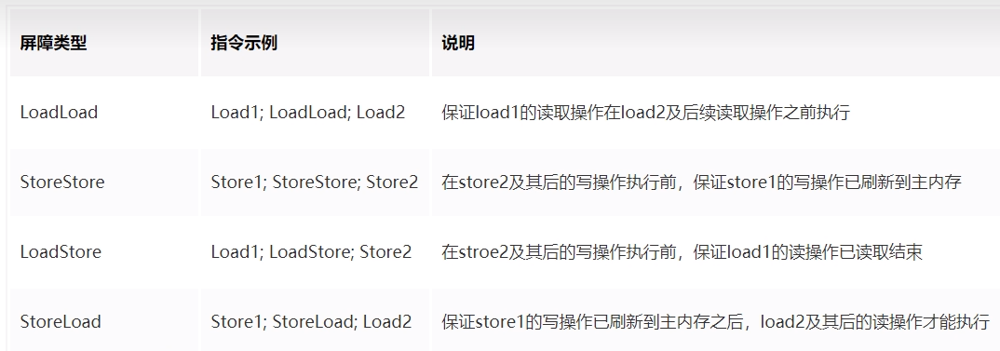

# 是什么

内存屏障(也称内存栅栏，屏障指令等，是一类同步屏障指令，是CPU或编译器在对内存随机访问的操作中的一个同步点，使得此点之前的所有读写操作都执行后才可以开始执行此点之后的操作)，避免代码重排序。内存屏障其实就是一种JVM指令，Java内存模型的重排规则会要求Java编译器在生成JVM指令时插入特定的内存屏障指令，通过这些内存屏障指令，volatile实现了Java内存模型中的可见性和有序性(禁重排)，但volatile 无法保证原子性。

内存屏障之前的所有写操作都要回写到主内存,

内存屏障之后的所有读操作都能获得内存屏障之前的所有写操作的最新结果(实现了可见性)。

写屏障( Store Memory Barrier) :告诉处理器在写屏障之前将所有存储在缓存(store bufferes)中的数据同步到主内存。也就是说当看到Store屏障指令，就必须把该指令之前所有写入指令执行完毕才能继续往下执行。

读屏障(LoadMemoryBarrier):处理器在读屏障之后的读操作，都在读屏障之后执行。也就是说在Load屏障指令之后就能够保证后面的读取数据指令一定能够读取到最新的数据。

因此重排序时，不允许把内存屏障之后的指令重排序到内存屏障之前。一句话：对一个volatile变量的写，先行发生于任意后续对这个volatile变量的读，也叫写后读。

# 内存屏障分类

### 粗分2种

读屏障(Load Barrier)：在读指令之前插入读屏障，让工作内存或CPU高速缓存当中的缓存数据失效，重新回到主内存中获取最新数据

写屏障(Store Barrier)：在写指令之后插入写屏障，强制把写缓冲区的数据刷回到主内存中

### 细分4种

