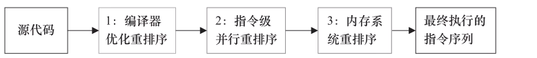
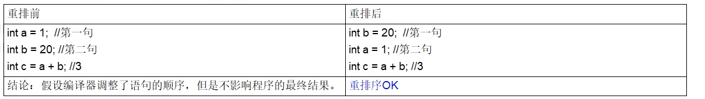

# 保证可见性

保证不同线程对某个变量完成操作后结果及时可见，即该共享变量一旦改变所有线程立即可见

# 没有原子性

volatile变量的复合操作不具有原子性，比如number++

对于volatile变量具备可见性，JVM只是保证从主内存加载到线程工作内存的值是最新的，也仅是数据加载时是最新的。但是多线程环境下，"数据计算"和"数据赋值"操作可能多次出现，若数据在加载之后，若主内存volatile修饰的变量发生修改后，线程工作内存中的操作将会作废去读主内存最新值，操作出现写丢失问题。即各线程私有内存和主内存公共内存中变量不同步，进而导致数据不一致。由此可见volatile解决的是变量读时的可见性问题，但无法保证原子性，对于多线程修改主内存共享变量的场景必须使用加锁同步。

### 字节码角度看i++

# 禁止指令重排

### 说明与案例

重排序

重排序是指编译器和处理器为了优化程序性能而对指令序列进行重新排序的一种手段，有时候会改变程序语句的先后顺序

不存在数据依赖关系，可以重排序；

存在数据依赖关系，禁止重排序；

但重排后的指令绝对不能改变原有的串行语义！这点在并发设计中必须要重点考虑！

重排序的分类和执行流程

编译器优化的重排序:编译器在不改变单线程串行语义的前提下，可以重新调整指令的执行顺序

指令级并行的重排序:处理器使用指令级并行技术来讲多条指令重叠执行，若不存在数据依赖性，处理器可以改变语句对应机器指令的执行顺序

内存系统的重排序:由于处理器使用缓存和读/写缓冲区，这使得加载和存储操作看上去可能是乱序执行

数据依赖性:若两个操作访问同一变量，且这两个操作中有一个为写操作，此时两操作间就存在数据依赖性。

案例：

不存在数据依赖关系，可以重排序===>重排序OK。

若存在数据依赖关系，禁止重排序===>重排序发生，会导致程序运行结果不同。

编译器和处理器在重排序时，会遵守数据依赖性，不会改变存在依赖关系的两个操作的执行，但不同处理器和不同线程之间的数据性不会被编译器和处理器考虑，其只会作用于单处理器和单线程环境，下面三种情况，只要重排序两个操作的执行顺序，程序的执行结果就会被改变。

