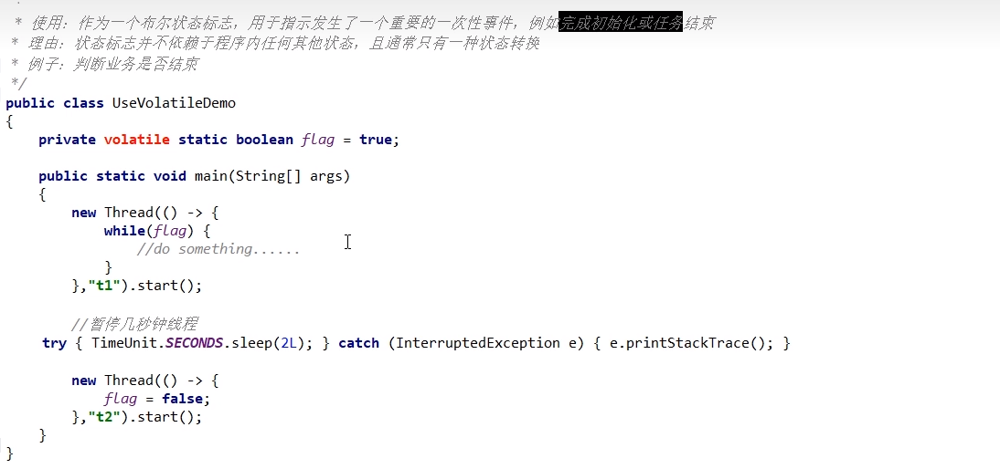
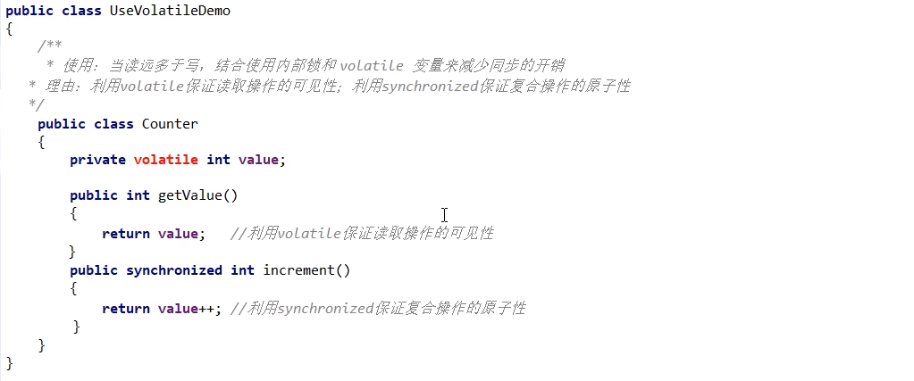
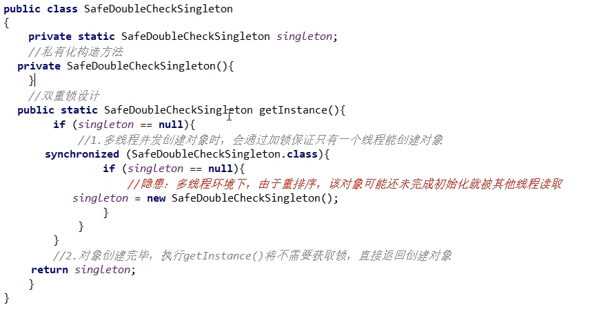
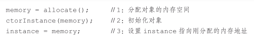
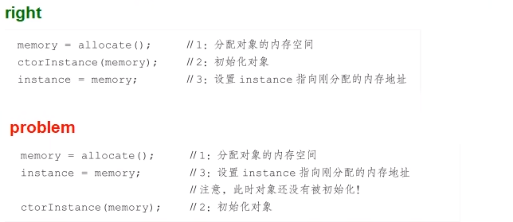
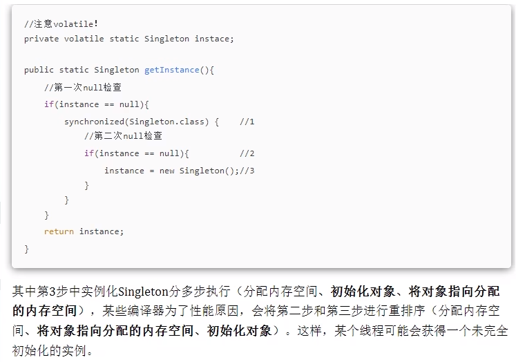
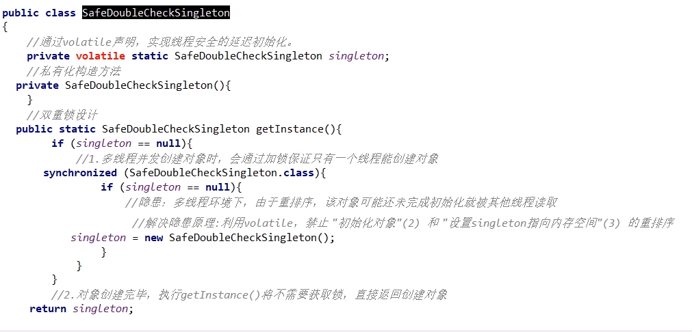

### 单一赋值可以，but含复合运算赋值不可以(i++之类)

例如volatile int a = 10, volatile boolean flag = false;是可以的

### 状态标志，判断业务是够结束

### 开销较低的读，写锁策略

### DCL双端锁的发布

### 问题

#### 单线程看问题代码

单线程环境下(或者说正常情况下)，在"问题代码处"，会执行如下操作，保证能获取到已完成初始化的实例

#### 多线程看问题代码

隐患：多线程环境下，在"问题代码处"，会执行如下操作，由于重排序导致2,3乱序，后果就是其他线程得到的是null而不是完成初始化的对象

这种场景在著名的双重检查锁定(double-checked-locking）中会出现：

### 解决：加volatile

