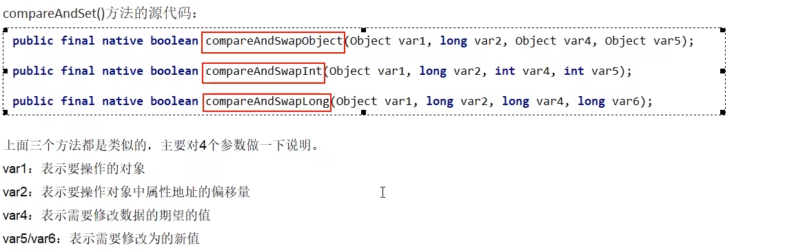

# 说明

CAS

compare and swap的缩写，中文翻译成比较并交换，实现并发算法时常用到的一种技术。

它包含三个操作数 一一 内存位置、预期原值及更新值。

执行CAS操作的时候，将内存位置的值与预期原值比较:

如果相匹配，那么处理器会自动将该位置值更新为新值，

如果不匹配，处理器不做任何操作，多个线程同时执行CAS操作只有一个会成功。

### 原理

CAS ( CompareAndSwap )

CAS有3个操作数，位置内存值V，旧的预期值A，要修改的更新值B。

当且仅当旧的预期值A和内存值V相同时，将内存值V修改为B，否则什么都不做或重来，当它重来重试的这种行为成为------自旋!

# 硬件级别的保证

CAS是JDK提供的非阻塞原子性操作，它通过硬件保证了比较---更新的原子性。

它是非阻塞的且自身具有原子性，也就是说这玩意效率更高且通过硬件保证，说明这玩意更可靠。

CAS是一 条CPU的原子指令(cmpxchg指令)，不会造成所谓的数据不一致问题，Unsafe提供的CAS方法(如compareAndSwapXXX) 底层实现即为CPU指令cmpxchg。

执行cmpxchg指令的时候，会判断当前系统是否为多核系统，如果是就给总线加锁，只有一个线程会对总线加锁成功，加锁成功之后会执行cas操作，也就是说CAS的原子性实际上是CPU实现独占的，比起用synchronized重量级锁，这里的排他时间要短很多，所以在多线程情况下性能会比较好。

# 源码分析compareAndSet(int expect, int update)

