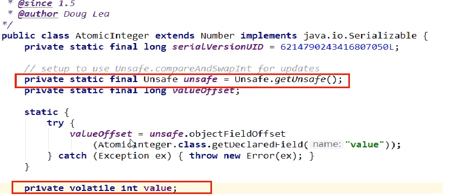

# UnSafe

1 Unsafe是CAS的核心类，由于Java方法无法直接访问底层系统，需要通过本地(native) 方法来访问，Unsafe相当于一个后门，基于该类可以直接操作特定内存的数据。Unsafe类存在于sun.misc包中，其内部方法操作可以像C的指针一样直接操作内存。

注意Unsafe类中的所有方法都是native修饰的，也就是说Unsafe类中的方法都直接调用操作系统底层资源执行相应任务

2 变量valueOffset，表示该变量值在内存中的偏移地址，因为Unsafe就是根据内存偏移地址获取数据的。

3 变量value用volatile修饰，保证了多线程之间的内存可见性。

