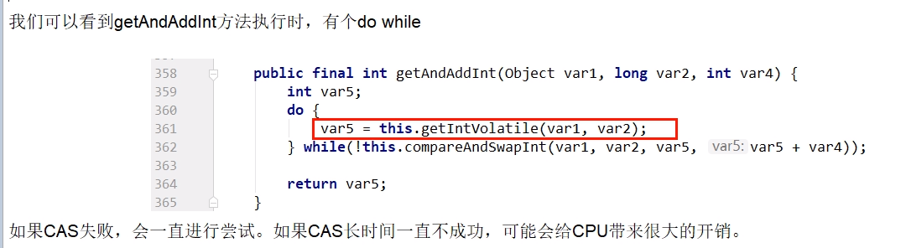

# 是什么

自旋锁(spinlock)
CAS是实现自旋锁的基础，CAS利用CPU指令保证了操作的原子性，以达到锁的效果，至于自旋呢，看字面意思也很明白，自己旋转。是指尝试获取锁的线程不会立即阻塞，而是采用循环的方式去尝试获取锁，当线程发现锁被占用时，会不断循环判断锁的状态，直到获取。这样的好处是减少线程上下文切换的消耗，缺点是循环会消耗CPU

# CAS缺点

### 循环时间长开销很大

### 容易出现ABA问题

ABA问题怎么产生的

CAS会导致“ABA问题”。

CAS算法实现一个重要前提需要取出内存中某时刻的数据并在当下时刻比较并替换，那么在这个时间差类会导致数据的变化。

比如说一个线程1从内存位置V中取出A，这时候另一个线程2也从内存中取出A，并且线程2进行了一些操作将值变成了B,然后线程2又将V位置的数据变成A，这时候线程1进行CAS操作发现内存中仍然是A，预期OK，然后线程1操作成功。

尽管线程1的CAS操作成功，但是不代表这个过程就是没有问题的。

### 版本号时间戳原子引用

使用AtomicStampedReference，带版本号解决ABA的问题

