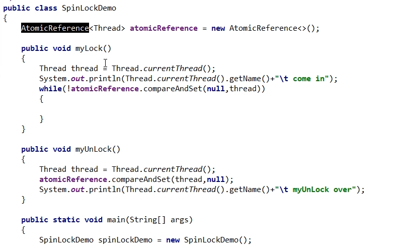

# 引用类型原子类

- AtomicReference

  自旋锁

  

- AtomicStampedReference

  携带版本号的引用类型原子类，可以解决ABA问题

  <font color = 'red'>解决修改过几次的问题</font>

- AtomicMarkableReference

  原子更新带有标记位的引用类型对象

  <font color = 'red'>解决是否修改过</font>

  它的定义就是将状态戳简化为truelfalse

  类似一次性筷子

  案例

  ```java
  package com.juc.atomic;
  
  import java.util.concurrent.TimeUnit;
  import java.util.concurrent.atomic.AtomicMarkableReference;
  
  public class AtomicMarkableReferenceDemo {
  
      public static AtomicMarkableReference markableReference = new AtomicMarkableReference(100, false);
      public static void main(String[] args) {
          new Thread(() -> {
              boolean marked = markableReference.isMarked();
              System.out.println(Thread.currentThread().getName() + "\t" + "默认标识：" + marked);
              try {TimeUnit.SECONDS.sleep(1);} catch (InterruptedException e) {e.printStackTrace();}
              markableReference.compareAndSet(100, 1000, marked, !marked);
          }, "t1").start();
  
          new Thread(() -> {
              boolean marked = markableReference.isMarked();
              System.out.println(Thread.currentThread().getName() + "\t" + "默认标识：" + marked);
              try {TimeUnit.SECONDS.sleep(2);} catch (InterruptedException e) {e.printStackTrace();}
              boolean b = markableReference.compareAndSet(100, 2000, marked, !marked);
              System.out.println(Thread.currentThread().getName() + "\t" + "t2线程CASresult： " + b);
              System.out.println(Thread.currentThread().getName() + "\t" + markableReference.getReference());
          }, "t2").start();
      }
  }
  ```

  


