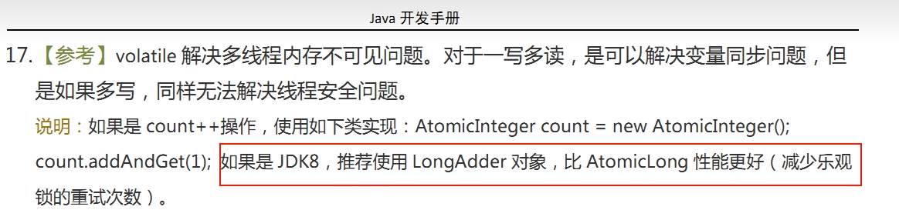

### DoubleAccumulator

### DoubleAdder

### LongAccumulator

### LongAdder

### 入门讲解

LongAdder只能用来计算加法，且从零开始计算

LongAccumulator提供了自定义的函数操作

案例：

```java
package com.juc.atomic;

import java.util.concurrent.CountDownLatch;
import java.util.concurrent.atomic.AtomicLong;
import java.util.concurrent.atomic.LongAccumulator;
import java.util.concurrent.atomic.LongAdder;

class ClickNumber {
    int number = 0;
    public synchronized void clickBysynchronized() {
        number++;
    }

    AtomicLong atomicLong = new AtomicLong(0);
    public void clickAtomicLong() {
        atomicLong.getAndIncrement();
    }

    LongAdder longAdder = new LongAdder();
    public void clickLongAdder() {
        longAdder.increment();
    }

    LongAccumulator longAccumulator = new LongAccumulator((x, y) -> x + y, 0);
    public void clickLongAccumulator() {
        longAccumulator.accumulate(1);
    }

}
/**
 * 需求：50个线程，每个线程100W次，求总点赞数
 */
public class AccumulatorCompreDemo {

    public static final int _1W = 10000;
    public static final int threadNum = 50;

    public static void main(String[] args) throws InterruptedException {
        ClickNumber clickNumber = new ClickNumber();
        long startTime;
        long endTime;

        CountDownLatch countDownLatch1 = new CountDownLatch(threadNum);
        CountDownLatch countDownLatch2 = new CountDownLatch(threadNum);
        CountDownLatch countDownLatch3 = new CountDownLatch(threadNum);
        CountDownLatch countDownLatch4 = new CountDownLatch(threadNum);

        startTime = System.currentTimeMillis();
        for (int i = 0; i < threadNum; i++) {
            new Thread(() -> {
                try {
                    for (int j = 0; j < 100 * _1W; j++) {
                        clickNumber.clickBysynchronized();
                    }
                } finally {
                    countDownLatch1.countDown();
                }
            }, String.valueOf(i)).start();
        }
        countDownLatch1.await();
        endTime = System.currentTimeMillis();
        System.out.println("-----------costTime: " + (endTime - startTime) + "毫秒 \t clickBysynchronized: " + clickNumber.number);

        startTime = System.currentTimeMillis();
        for (int i = 0; i < threadNum; i++) {
            new Thread(() -> {
                try {
                    for (int j = 0; j < 100 * _1W; j++) {
                        clickNumber.clickAtomicLong();
                    }
                } finally {
                    countDownLatch2.countDown();
                }
            }, String.valueOf(i)).start();
        }
        countDownLatch2.await();
        endTime = System.currentTimeMillis();
        System.out.println("-----------costTime: " + (endTime - startTime) + "毫秒 \t clickAtomicLong: " + clickNumber.atomicLong.get());

        startTime = System.currentTimeMillis();
        for (int i = 0; i < threadNum; i++) {
            new Thread(() -> {
                try {
                    for (int j = 0; j < 100 * _1W; j++) {
                        clickNumber.clickLongAdder();
                    }
                } finally {
                    countDownLatch3.countDown();
                }
            }, String.valueOf(i)).start();
        }
        countDownLatch3.await();
        endTime = System.currentTimeMillis();
        System.out.println("-----------costTime: " + (endTime - startTime) + "毫秒 \t clickLongAdder: " + clickNumber.longAdder.sum());

        startTime = System.currentTimeMillis();
        for (int i = 0; i < threadNum; i++) {
            new Thread(() -> {
                try {
                    for (int j = 0; j < 100 * _1W; j++) {
                        clickNumber.clickLongAccumulator();
                    }
                } finally {
                    countDownLatch4.countDown();
                }
            }, String.valueOf(i)).start();
        }
        countDownLatch4.await();
        endTime = System.currentTimeMillis();
        System.out.println("-----------costTime: " + (endTime - startTime) + "毫秒 \t clickLongAccumulator: " + clickNumber.longAccumulator.get());
    }
}

-----------costTime: 1756毫秒 	 clickBysynchronized: 50000000
-----------costTime: 1084毫秒 	 clickAtomicLong: 50000000
-----------costTime: 435毫秒 	 clickLongAdder: 50000000
-----------costTime: 369毫秒 	 clickLongAccumulator: 50000000
```

阿里巴巴手册推荐Java8之后，使用LongAdder，性能更好




