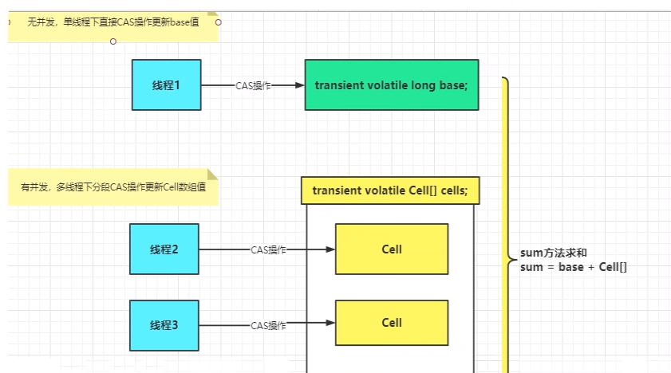

# 一句话

LongAdder的基本思路就是分散热点，将value值分散到一个Cell数组中，不同线程会命中到数组的不同槽中，各个线程只对自己槽中的那个值进行CAS操作，这样热点就被分散了，冲突的概率就小很多。如果要获取真正的long值，只要将各个槽中的变量值累加返回。

sum()会将所有Cell数组中的value和base累加作为返回值，核心的思想就是将之前AtomicLong一个value的更新压力分散到多个value中去，从而降级更新热点。

# 数学表达

### 内部有一个base变量，一个Cell[]数组

base变量：低并发，直接累加到该变量上

Cell[]：高并发，累加进各个线程自己的槽Cell[i]中

