# 小总结

LongAdder在无竞争的情况，跟AtomicLong一样，对同一个base进行操作，当出现竞争关系时则是采用化整为零分散热点的做法，用空间换时间，用一个数组cells，将一个value拆分进这个数组cells。多个线程需要同时对value进行操作时候，可以对线程id进行hash得到hash值，再根据hash值映射到这个数组cells的某个下标，再对该下标所对应的值进行自增操作。当所有线程操作完毕，将数组cells的所有值和base都加起来作为最终结果。

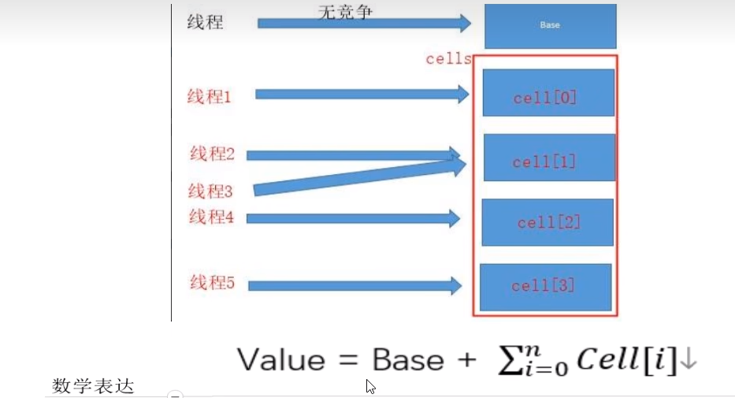

# add(1L)

.png)

### 条件递增，逐步解析

1. 最初无竞争时只更新base；
2. 如果更新base失败后，首次新建一个cell[数组]
3. 当多个线程竞争同一个Cell比较激烈时，可能就要对Cell[]扩容

### 上述小总结

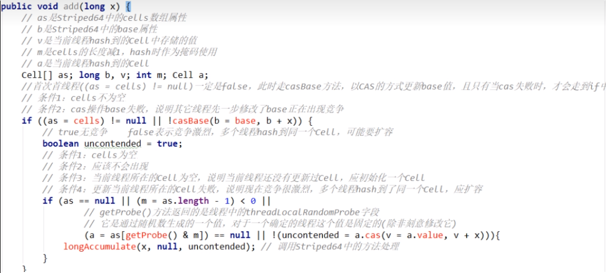

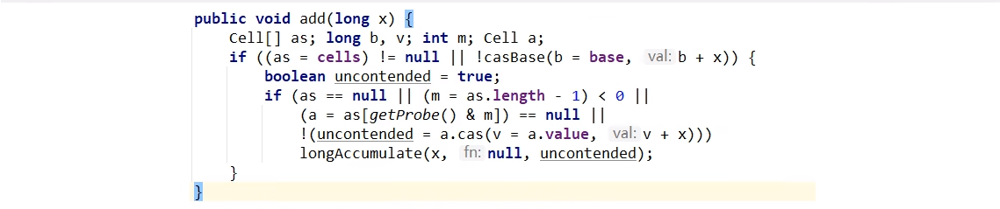

1如果Cells表为空，尝试用CAS更新base字段，成功则退出；

2如果Cells表为空，CAS更新base字段失败，出现竞争，uncontended为true,调用
longAccumulate;

3如果Cells表非空，但当前线程映射的槽为空，uncontended为true，调用longAccumulate;

4如果Cells表非空，且前线程映射的槽非空，CAS更新Cell的值，成功则返回，否则，
uncontended设为false,调用longAccumulate。

# longAccumulate

### longAccumulate入参说明

- longx需要增加的值，一般默认都是1
- LongBinaryOperator fn 默认传递的是null
- wasUncontended竞争标识，如果是false则代表有竞争。只有cells初始化之后，并且当前线程CAS竞争修改失败，才会是talse

###  Striped64中一些变量或者方法的定义

- base：类似于AtomicLong中全局的value值。在没有竞争情况下数据直接累加到base上，或者cells扩容时，也需要将数据写入到base上
- collide：表示扩容意向，false一定不会扩容，true可能会扩容。
- cellsBusy：初始化cells或者扩容cells需要获取锁，0：表示无锁状态1:表示其他线程已经持有了锁
- casCellsBusy()：通过CAS操作修改cellsBusy的值，CAS成功代表获取锁，返回true
- NCPU：当前计算机CPU数量，Cell数组扩容时会使用到
- getProbe()：获取当前线程的hash值
- advanceProbe()：重置当前线程的hash值

### 步骤

### 线程hash值：probe

初始化.png)

初始化.png)

### 总纲

上述代码首先给当前线程分配一个hash值，然后进入一个for(;;)自旋，这个自旋分为三个分支：

CASE1：Cell[]数组已经初始化

CASE2：Cell[]数组未初始化（首次新建）

CASE3：Cell[]数组正在初始化中

### 计算

刚刚要初始化Cell[]数组（首次新建），未初始化过Cell[]数组，尝试占有锁并首次初始化cells数组

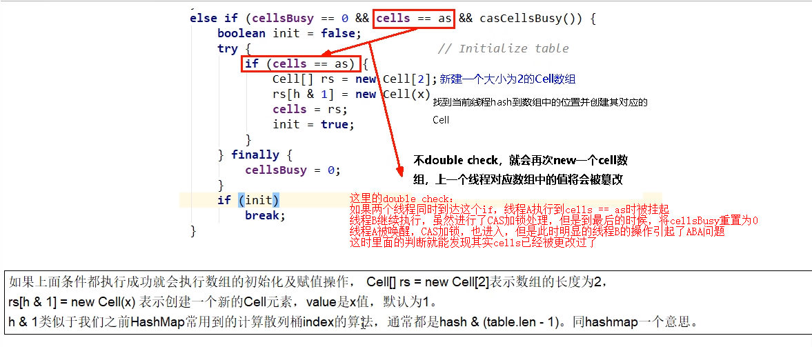

### 兜底：多个线程尝试CAS修改失败的线程会走到这个分支

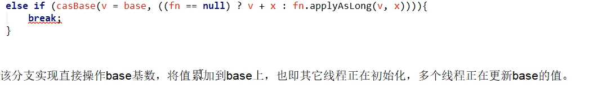

### Cell数组不再为空且可能存在Cell数组扩容

解释一：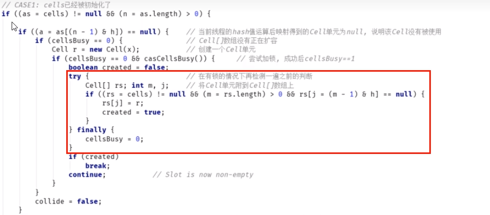

上面代码判断当前线程hash后指向的数据位置元素是否为空，如果为空则将Cell数据放入数组中，跳出循环。如果不空则继续循环。

解释二：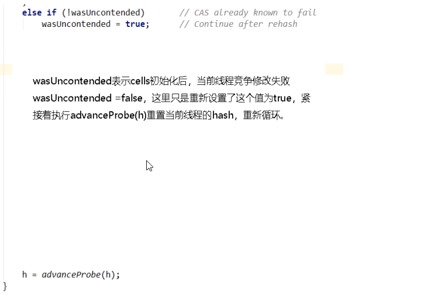

解释三：

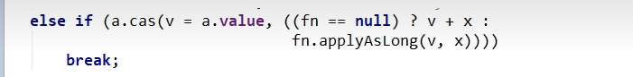

说明当前线程对应的数组中有了数据，也重置过hash值，这时通过CAS操作会试对当前数中的value值进行累加x操作，x默认为1，如果CAS成功则直接姚出循环。

解释四：

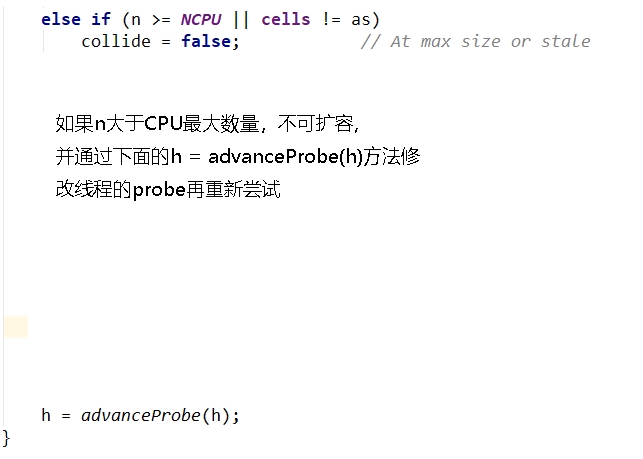

解释五：

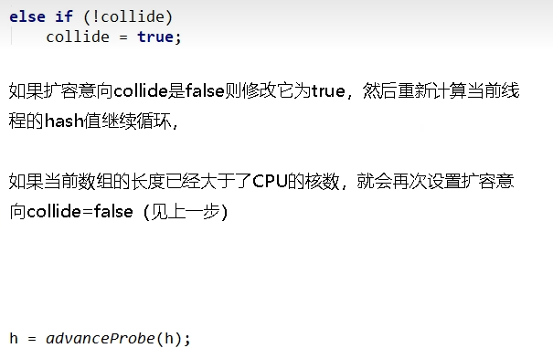

解释六：

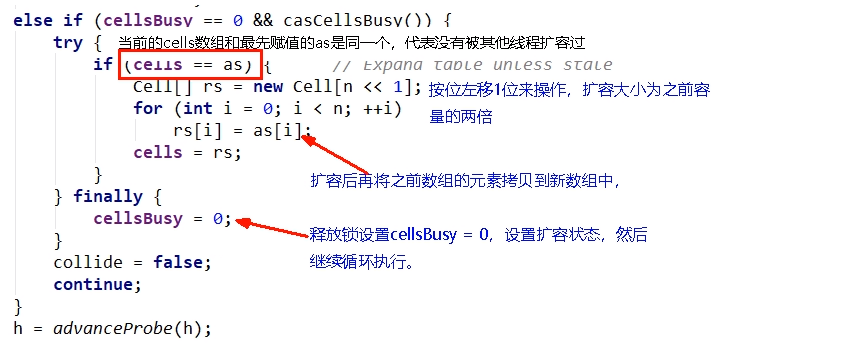

### 上面6个分片步骤总结

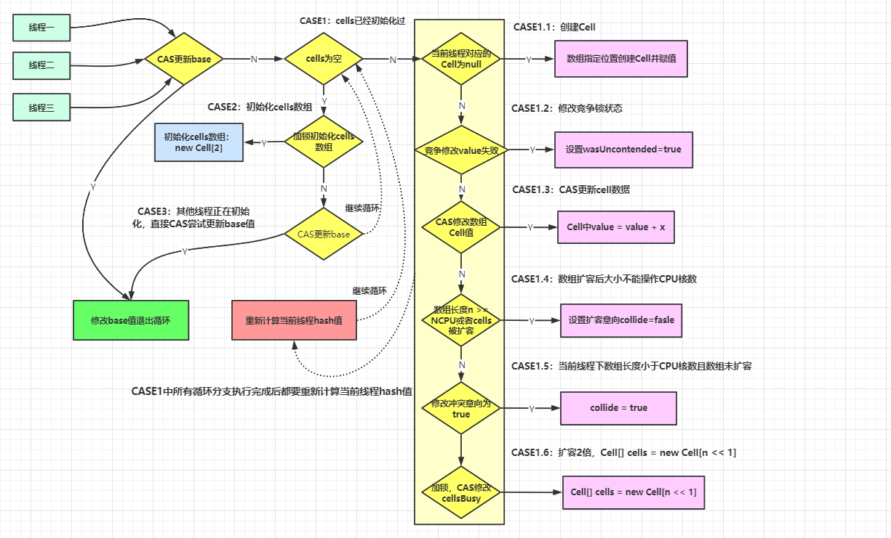

# sum

sum()会将所有Cell数组中的value和base累加作为返回值。

核心的思想就是将之前AtomicLong一个value的更新压力分散到多个value中去，从而降级更新热点。

### 为什么在并发情况下sum的值不精确

sum执行时，并没有限制对base和cells的更新（一句要命的话）。所以LongAdder不是强一致性的，它是最终一致性的。

首先，最终返回的sum局部变量，初始被复制为base，而最终返回时，很可能base已经被更新了，而此时局部变量sum不会更新，造成不一致。

其次，这里对cell的读取也无法保证是最后一次写入的值。所以，sum方法在没有并发的情况下，可以获得正确的结果。

