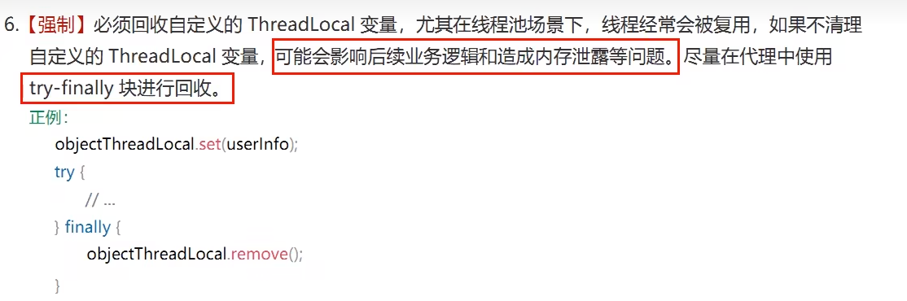

# 是什么

ThreadLocal提供线程局部变量。这些变量与正常的变量不同，因为每一个线程在访问ThreadLocal实例的时候（通过其get或set方法）都有自己的、独立初始化的变量副本。ThreadLocal实例通常是类中的私有静态字段，使用它的目的是希望将状态（例如，用户ID或事务ID）与线程关联起来。

### 能干嘛

实现每一个线程都有自己专属的本地变量副本（自己用自己的变量不麻烦别人，不和其他人共享，人人有份，人各一份)，主要解决了让每个线程绑定自己的值，通过使用get()和set()方法，获取默认值或将其值更改为当前线程所存的副本的值从而避免了线程安全问题，比如我们之前讲解的8锁案例，资源类是使用同一部手机，多个线程抢夺同一部手机使用，假如人手一份是不是天下太平？?

阿里巴巴手册对使用ThreadLocal的使用规范要求：

