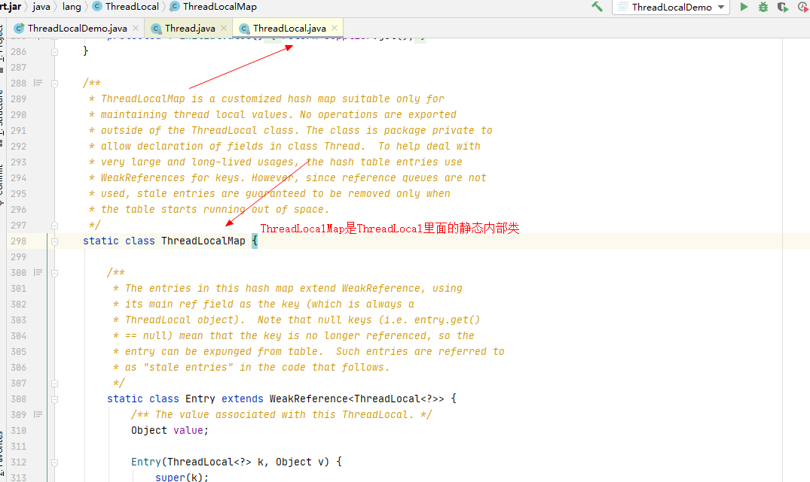
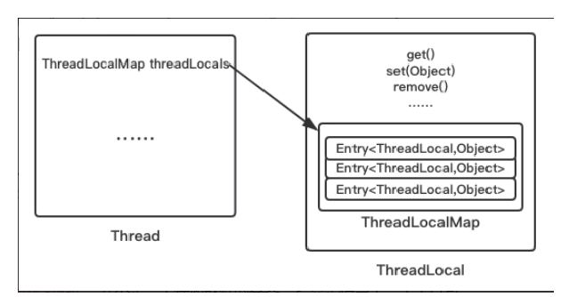

# Thread，ThreadLocal，ThreadLocalMap关系

### Thread和ThreadLocal


再次体会，各自线程，人手一份

### ThreadLocal和ThreadLocalMap



### 三者总概括


threadLocalMap实际上就是一个以threadLocal实例为key，任意对象为value的Entry对象。

```java
void createMap(Thread t, T firstValue) {
	t.threadLocals = new ThreadLocalMap(firstKey: this, firstValue);
}
```

当我们为threadLocal变量赋值，实际上就是以当前threadLocal实例为key，值为value的Entry往这个threadLooallMap中存放

# 小总结

近似的可以理解为：

ThreadLocallMap从字面上就可以看出这是一个保存ThreadLocal对象的map(其实是以ThreadLocal为Key),不过是经过了两层包装的ThreadLocal对象：



<font color = 'red'>JVM内部维护了一个线程版的Map<ThreadLocal,Value></font>(通过ThreadLocal对象的set方法，结果把ThreadLocal对象自己当做key，放进了ThreadLoalMap中），每个线程要用到这个T的时候，用当前的线程去Map里面获取，<font color = 'red'>通过这样让每个线程都拥有了自己独
的变量，人手一份</font>，竞争条件被彻底消除，在并发模式下是绝对安全的变量。


