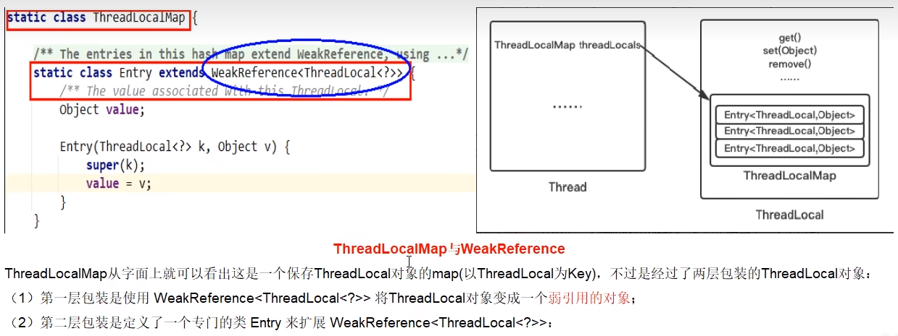
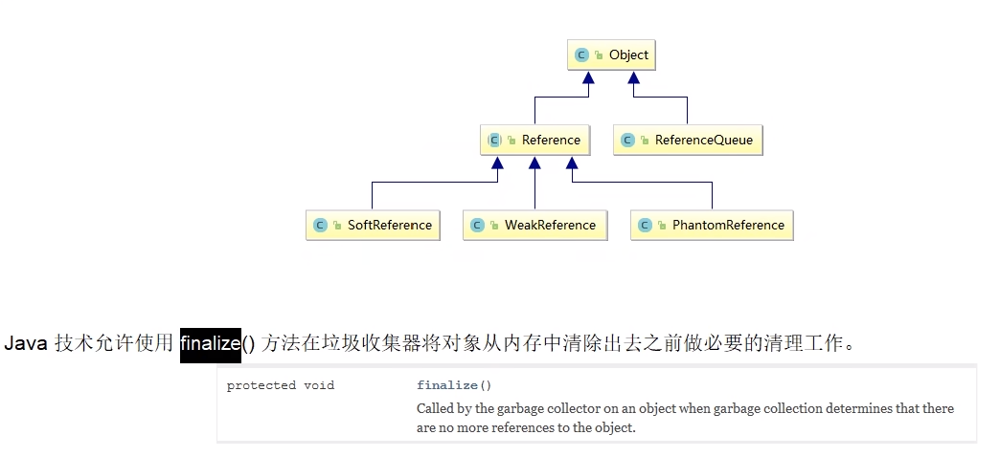

# 从阿里规范开始说起

为什么要用到弱引用？不用会如何？

# 什么是内存泄露

不再会被使用的对象或者变量占用的内存不能被回收，就是内存泄露。

# 内存泄露是谁惹的祸

在回顾ThreadLocalMap

### 强引用、软引用、弱引用、虚引用分别是什么

整体架构

#### 强引用

当内存不足，JVM开始垃圾回收，对于强引用的对象，就算是出现了OOM也不会对该对象进行回收，死都不收。

强引用是我们最常见的普通对象引用，只要还有强引用指向一个对象，就能表明对象还“活着”，垃圾收集器不会碰这种对象。

在Java中最常见的就是强引用，把一个对象赋给一个引用变量，这个引用变量就是一个强引用。

当一个对象被强引用变量引用时，它处于可达状态，它是不可能被垃圾回收机制回收的，即使该对象以后永远都不会被用到，JVM也不会回收。因此强引用是造成Java内存泄漏的主要原因之一。

对于一个普通的对象，如果没有其他的引用关系，只要超过了引用的作用域或者显式地将相应(强）引用赋值为null，一般认为就是可以被垃圾收集的了(当然具体回收时机还是要看垃圾收集策略)。

#### 弱引用

软引用是一种相对强引用弱化了一些的引用，需要用java.lang.ref.SoftReference类来实现，可以让对象豁免一些访圾收集。

对于只有软引用的对象来说，
当系统内存充足时它不会被回收，
工
当系统内存不足时它
会被回收。
软引用通常用在对内存敏感的程序中，比如高速缓存就有用到软引用，内存够用的时候就保留，不够用就回收！

