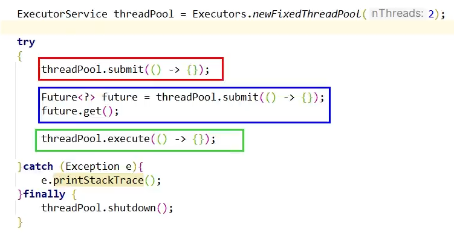

# 线程池抛出异常怎么办

往线程池提交请求，处理方法的三种请求形式，导致对异常处理也不一样




###  方式一：threadPool.submit(() -> {}) 会将异常信息吞掉

```java
    private static void defaultSubmit() {
        ExecutorService threadPool = Executors.newFixedThreadPool(2);

        try {
            // 1 默认调用，submit会吞掉异常
            threadPool.submit(() -> {
                System.out.println(Thread.currentThread().getName() + "\t进入池中submit方法");
                for (int i = 1; i <= 4; i++) {
                    if (i == 3) {
                        int age = 10/0;
                    }
                    System.out.println("---come in execute: " + i);
                }
                System.out.println(Thread.currentThread().getName() + "\t进入池中submit方法---end");
            });
        } catch (Exception e) {
            e.printStackTrace();
        } finally {
            threadPool.shutdown();
        }
    }
    
Connected to the target VM, address: '127.0.0.1:50840', transport: 'socket'
pool-1-thread-1	进入池中submit方法
---come in execute: 1
---come in execute: 2
Disconnected from the target VM, address: '127.0.0.1:50840', transport: 'socket'

Process finished with exit code 0

```

### 方式二：Future<?> future = threadPool.submit(() -> {})

### future.get();

```java
/**
     * 2 submit执行后，如果get方法调用想要获得返回值，会抛出异常
     */
private static void defaultSubmitAndGet() {
    ExecutorService threadPool = Executors.newFixedThreadPool(2);

    try {
        // 2 submit执行后，如果不获取返回值异常将被吞掉
        // 但如果get方法调用想要获得返回值，会抛出异常
        // 即没有 future.get(); 异常将被吞掉，写上future.get(); 异常将会抛出
        Future<?> future = threadPool.submit(() -> {
            System.out.println(Thread.currentThread().getName() + "\t进入池中submit方法");
            int age = 20 / 0;
            System.out.println(Thread.currentThread().getName() + "\t进入池中submit方法---end");
        });
        future.get();// 如果没有这一行，异常被吞
    } catch (Exception e) {
        e.printStackTrace();
    } finally {
        threadPool.shutdown();
    }
}

pool-1-thread-1	进入池中submit方法
java.util.concurrent.ExecutionException: java.lang.ArithmeticException: / by zero
	at java.base/java.util.concurrent.FutureTask.report(FutureTask.java:122)
	at java.base/java.util.concurrent.FutureTask.get(FutureTask.java:191)
	at com.juc.Thread.ThreadPoolExceptionDemo.defaultSubmitAndGet(ThreadPoolExceptionDemo.java:51)
	at com.juc.Thread.ThreadPoolExceptionDemo.main(ThreadPoolExceptionDemo.java:9)
Caused by: java.lang.ArithmeticException: / by zero
	at com.juc.Thread.ThreadPoolExceptionDemo.lambda$defaultSubmitAndGet$1(ThreadPoolExceptionDemo.java:48)
	at java.base/java.util.concurrent.Executors$RunnableAdapter.call(Executors.java:539)
	at java.base/java.util.concurrent.FutureTask.run$$$capture(FutureTask.java:264)
	at java.base/java.util.concurrent.FutureTask.run(FutureTask.java)
	at java.base/java.util.concurrent.ThreadPoolExecutor.runWorker(ThreadPoolExecutor.java:1136)
	at java.base/java.util.concurrent.ThreadPoolExecutor$Worker.run(ThreadPoolExecutor.java:635)
	at java.base/java.lang.Thread.run(Thread.java:842)
```

### 方式三：threadPool.execute(() -> {})

```java
/**
     * 默认使用，execute 会抛出异常
     */
private static void defaultExecute() {
    ExecutorService threadPool = Executors.newFixedThreadPool(2);

    try {
        // 3 默认调用execute会抛出异常
        threadPool.execute(() -> {
            System.out.println(Thread.currentThread().getName() + "\t进入池中submit方法");
            for (int i = 1; i <= 4; i++) {
                if (i == 3) {
                    int age = 10/0;
                }
                System.out.println("---come in execute: " + i);
            }
            System.out.println(Thread.currentThread().getName() + "\t进入池中submit方法---end");
        });
    } catch (Exception e) {
        e.printStackTrace();
    } finally {
        threadPool.shutdown();
    }
}

pool-1-thread-1	进入池中submit方法
---come in execute: 1
---come in execute: 2
Exception in thread "pool-1-thread-1" java.lang.ArithmeticException: / by zero
	at com.juc.Thread.ThreadPoolExceptionDemo.lambda$defaultExecute$2(ThreadPoolExceptionDemo.java:71)
	at java.base/java.util.concurrent.ThreadPoolExecutor.runWorker(ThreadPoolExecutor.java:1136)
	at java.base/java.util.concurrent.ThreadPoolExecutor$Worker.run(ThreadPoolExecutor.java:635)
	at java.base/java.lang.Thread.run(Thread.java:842)
Disconnected from the target VM, address: '127.0.0.1:64350', transport: 'socket'

Process finished with exit code 0

```


### 线程池异常的包装和优雅停机

```java
private static void handleException() {
    ThreadPoolExecutor threadPool = new ThreadPoolExecutor(
        Runtime.getRuntime().availableProcessors(),
        Runtime.getRuntime().availableProcessors() * 2,
        1L,
        TimeUnit.SECONDS,
        new LinkedBlockingDeque<>(100)) {
        @Override
        protected void afterExecute(Runnable runnable, Throwable throwable) {
            // execute 运行
            if (throwable != null) {
                System.out.println(throwable.getMessage() + throwable);
            }
            // submit 运行
            if (throwable == null && runnable instanceof Future<?>) {
                try {
                    Future<?> future = (Future<?>) runnable;
                    if (future.isDone()) {
                        future.get();
                    }
                } catch (CancellationException ce) {
                    throwable = ce;
                } catch (ExecutionException ee) {
                    throwable = ee.getCause();
                    ee.printStackTrace();
                } catch (InterruptedException ie) {
                    ie.printStackTrace();
                    Thread.currentThread().interrupt();
                }
            }
        }
    };

    // threadPool.submit(() -> {
    //     // 默认submit方法（不获取返回值）会吞掉异常，我们改写后可以抛出异常了
    //     System.out.println(Thread.currentThread().getName() + "\t进入池中submit方法");
    //     int age = 10/0;
    //     System.out.println(Thread.currentThread().getName() + "\t进入池中submit方法---end");
    // });

    System.out.println();
    try {
        TimeUnit.MILLISECONDS.sleep(10);
    } catch (InterruptedException e) {
        throw new RuntimeException(e);
    }

    threadPool.execute(() -> {
        // execute 会抛出异常
        System.out.println(Thread.currentThread().getName() + "\t进入池中submit方法");
        for (int i = 0; i < 4; i++) {
            if (i == 2) {
                int age = 10/0;
            }
            System.out.println("---come in execute: " + i);
        }
        System.out.println(Thread.currentThread().getName() + "\t进入池中submit方法---end");
    });

    // 线程池优雅停机
    finalOK_shutdownAndAwaitTermination(threadPool);
}

/**
     * 参考官网使用，最后的终结，优雅关停，but有点费事
     * @param threadPool
     */
public static void finalOK_shutdownAndAwaitTermination(ExecutorService threadPool)
{
    if (threadPool != null && !threadPool.isShutdown())
    {
        threadPool.shutdown();
        try
        {
            if (!threadPool.awaitTermination(120, TimeUnit.SECONDS))
            {
                threadPool.shutdownNow();

                if (!threadPool.awaitTermination(120, TimeUnit.SECONDS))
                {
                    System.out.println("Pool did not terminate");
                }
            }
        } catch (InterruptedException ie) {
            threadPool.shutdownNow();
            Thread.currentThread().interrupt();
        }
    }
}
```


