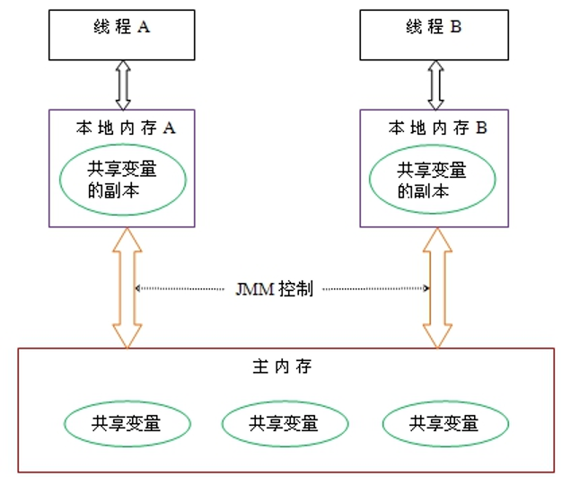
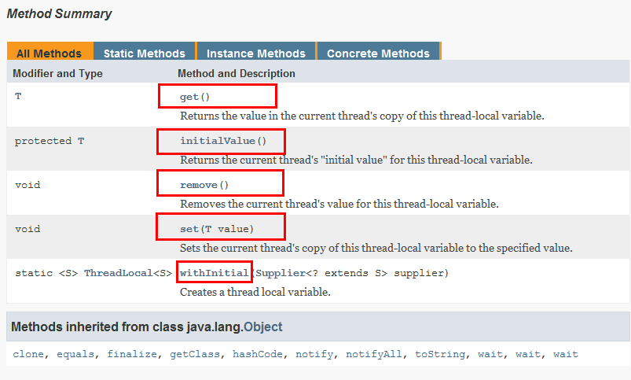
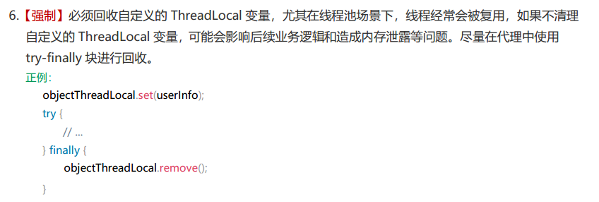
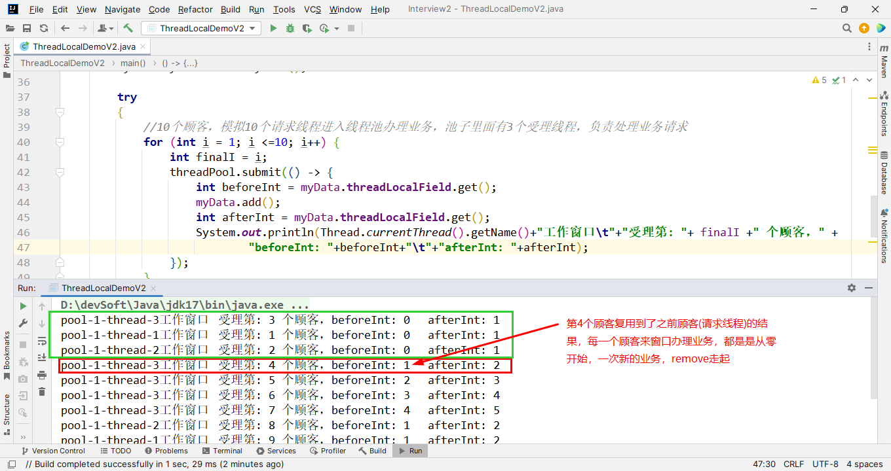

### 是什么？

ThreadLocal提供线程局部变量。这些变量与正常的变量不同，因为每一个线程在访问ThreadLocal实例的时候（通过其get或set方法）都有自己的、独立初始化的变量副本。ThreadLocal实例通常是类中的私有静态字段，使用它的目的是希望将状态（例如，用户ID或事务ID）与线程关联起来。

### 能干嘛？

实现每一个线程都有自己专属的本地变量副本(自己用自己的变量不麻烦别人，不和其他人共享，人人有份，人各一份)，

主要解决了让每个线程绑定自己的值，通过使用get()和set()方法，获取默认值或将其值更改为当前线程所存的副本的值从而避免了线程安全问题。



### API介绍



### ThreadLocal 线程使用问题

阿里手册：



使用问题：

```java
class MyData
{
    ThreadLocal<Integer> threadLocalField = ThreadLocal.withInitial(() -> 0);

    public void add()
    {
        threadLocalField.set(1 + threadLocalField.get());
    }
}

/**
 *
 * 【强制】必须回收自定义的ThreadLocal变量，尤其在线程池场景下，线程经常会被复用，如果不清理
 * 自定义的ThreadLocal变量，可能会影响后续业务逻辑和造成内存泄露等问题。尽量在代理中使用
 * try-finally块进行回收。
 *
 * 每次结束业务，需要清空数据结束上一个顾客的数据，不然复用到了前一个顾客的数据，不体面
 *
 */
public class ThreadLocalDemoV2
{
    public static void main(String[] args)
    {
        ExecutorService threadPool = Executors.newFixedThreadPool(3);
        MyData myData = new MyData();

        try
        {
            //10个顾客，模拟10个请求线程进入线程池办理业务，池子里面有3个受理线程，负责处理业务请求
            for (int i = 1; i <=10; i++) {
                int finalI = i;
                threadPool.submit(() -> {
                    try {
                        int beforeInt = myData.threadLocalField.get();
                        myData.add();
                        int afterInt = myData.threadLocalField.get();
                        System.out.println(Thread.currentThread().getName()+"工作窗口\t"+"受理第: "+ finalI +" 个顾客，" +
                                "beforeInt: "+beforeInt+"\t"+"afterInt: "+afterInt);
                    } finally {
                        myData.threadLocalField.remove();
                    }
                });
            }
        }catch (Exception e){
            e.printStackTrace();
        }finally {
            threadPool.shutdown();
        }
    }
}
```




### 总结

因为每个Thread内<font color = 'red'>都有自己的实例副本</font>且该副本只由当前线程自己使用

既然其它Thread不可访问，那就不存在多线程间共享的问题。

统一设置初始值，但是每个线程对这个值的修改都是各自线程互相独立的


