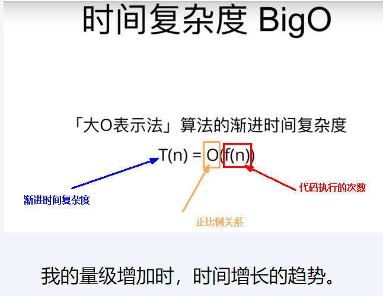
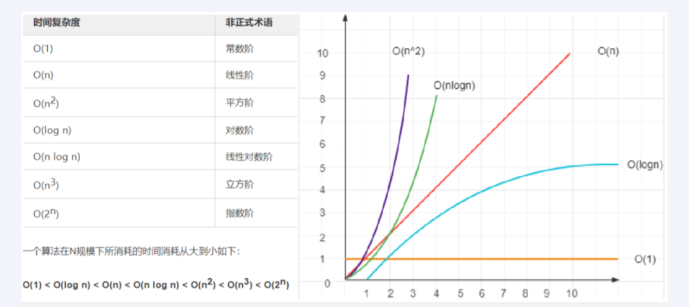

### 标准刷题

### 算法理论

#### 如何评价一个算法的好坏？

一个算法的好坏是通过**时间复杂度**与**空间复杂度**来衡量，简单来说，所花的**时间**与**占用内存**便是衡量一个算法好坏的标准

**时间复杂度**：就是执行算法的时间成本

**空间复杂度**：就是执行算法的内存空间成本

#### 什么事大欧表示法

时间复杂度 与 空间复杂度 都是用“大O“ 来表示(大欧表示法)，写作 O(*)

由于目前内存空间便宣，此刻我们谈论复杂度，一般谈论的都是时间复杂度

时间复杂度BigO，大欧表示法

常见时间复杂度的“大O表示法"描述有以下几种

