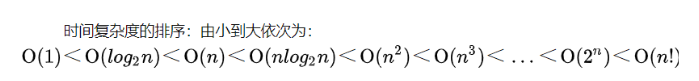

### 常数阶O(1)

哈希表（HashMap）

### 对数阶O(logN)

二分搜索(binary search) O(log2N)

```java
public class T1
{
    public static int binarySearch(int[] arraySorted,int target)
    {
        int left = 0;
        int right = arraySorted.length-1;

        while(left <= right)
        {
            int middle = left + (right - left)/2;
            // int mid = (left+right)/2

            if(arraySorted[middle] == target){
                return middle;
            }else if(arraySorted[middle] > target){
                right = middle - 1;
            }else{
                left = middle + 1;
            }
        }
        return -1;
    }

    public static void main(String[] args)
    {
        int[] arrays = new int[]{1,11,22,33,77,99,103};
        int target = 77;

        System.out.println(binarySearch(arrays,target));
    }
}
```

### 线性阶O(N)

一次完成的for循环

```java
public void circle(int n) 
{
    for(int i = 0; i < n; i++) { // 执行n次
        System.out.println(i); // 执行n次
    }
}
```

### 线性对数阶O(nlogN)

```java
/**
 * 将一个复杂度为 O(logn)的代码重复执行 n次，那么此时代码的复杂度就变成 O(nlogn)
 * @param n
 */
public void logarithm(int n) {
    int count = 1;
    for(int i = 0; i < n; i++) 
    { // 执行n次
             while (count <= n) 
        { // 执行logn次
             count = count*2; // 执行nlogn次
        }
    }
}
```

### 平方阶O(n^2)

```java
public void square(int n) {
    for(int i = 0; i < n; i++){ // 执行n次
        for(int j = 0; j <n; j++) { // 执行n次
            System.out.println(i+j); // 执行n方次
        }
    }
}

 
/**
 * 当内层循环和外层循环的次数不一致时，时间复杂度如下，
 * 内层循环执行m次，其时间复杂度为O(m)，
 * 外层循环执行次数为n次，其时间复杂度为O(m)。
 * 整段代码的时间复杂度是就是O(m*n)，即循环的时间复杂度等于循环体的时间复杂度乘以该循环运行次数。
 * @param n
 * @param m
 */
public void square(int n, int m) {
    for(int i = 0; i < n; i++){ // 执行n次
        for(int j = 0; j <m; j++) { // 执行m次
            System.out.println(i+j); // 执行mn次
        }
    }
}
```

### 立方阶O(n^3)

```java
void demo(int n){
    for(int i = 0; i < n; i++){
        for(int j = 0; j < n; j++){
            for(int k = 0; k < n; k++){
                System.out.print("Hello, World");
            }
            System.out.print("------");
        }
        System.out.print("******");
    }
}
```

### 指数阶(2^n)

HashMap扩容，原值一倍

### 小总结




