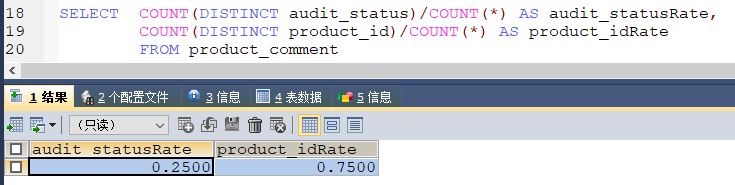
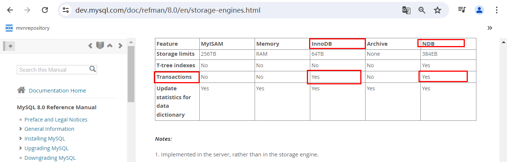
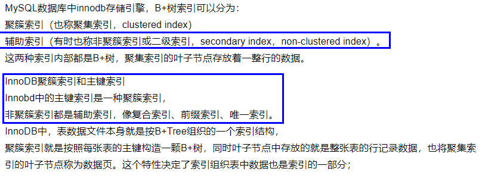
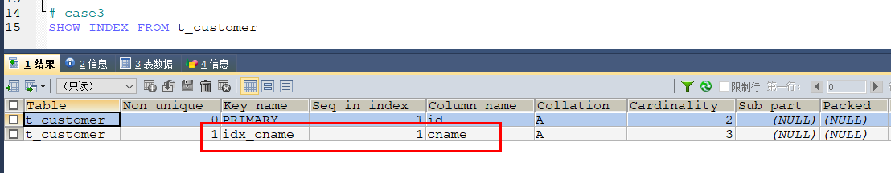

### 如何建立复合索引，一般你加在哪些字段?建索引的理论依据或者经验你分享下

索引创建军规：


<font color = 'red'>区分度定最佳左前缀位置</font>



```sql
SELECT COUNT(DISTINCT audit_status)/COUNT(*) AS audit_statusRate,
       COUNT(DISTINCT product_id)/COUNT(*) AS product_itRate
FROM   product_comment
```

<font color = 'red'>那个字段越接近于1，那个就是区分度更好的，就放在最左边。</font>

#### 结论

区分度最高、重复率最低。尽可能满足上述2个条件的字段建索引，效果最好

### 面试题：Innodb的行锁到底锁了什么?

#### 哪些引擎支持数据库事务？



#### MySQL锁级别

- 表级锁：开销小，加锁快；不会出现死锁；锁定粒度大，发生锁冲突的概率最高，并发度最低
- 行级锁：开销大，加锁慢；会出现死锁；锁定粒度最小，发生锁冲突的概率最低，并发度也最高
- 页面锁(不要求)：开销和加锁时间界于表锁和行锁之间；会出现死锁；锁定粒度界于表锁和行锁之间，并发度一般

#### SQL

```sql
CREATE TABLE `t_customer` (

  `id` INT(20) NOT NULL AUTO_INCREMENT,

  `cname` VARCHAR(50) NOT NULL,

  `age` INT(10) NOT NULL,

  `phone` VARCHAR(20) NOT NULL,

  `sex` TINYINT(4) NOT NULL,

  `birth` TIMESTAMP NOT NULL DEFAULT CURRENT_TIMESTAMP ON UPDATE CURRENT_TIMESTAMP,

  PRIMARY KEY (`id`)

) ENGINE=INNODB AUTO_INCREMENT=4 DEFAULT CHARSET=utf8mb4;

INSERT INTO t_customer(id,cname,age,phone,sex,birth) VALUES(4,'z3',22,'13811112222',1,NOW());

INSERT INTO t_customer(id,cname,age,phone,sex,birth) VALUES(5,'z4',24,'13811112223',0,NOW());

INSERT INTO t_customer(id,cname,age,phone,sex,birth) VALUES(6,'z5',25,'13811112224',1,NOW());

SELECT * FROM t_customer; 

create index idx_cname on  t_customer(cname);
```

#### 案例01

##### 步骤

| session01                                                    | session02---新启动一个客户端连接                             |
| ------------------------------------------------------------ | ------------------------------------------------------------ |
| BEGIN;<br />UPDATE t_customer SET age=55 WHERE phone='13811112222' |                                                              |
|                                                              | UPDATE t_customer SET age=55 WHERE id=5; #转圈等锁。<br />或者<br />UPDATE t_customer SET age=44 WHERE id=6; #转圈等锁。 |
| commit/rollback;                                             |                                                              |
|                                                              | ok，更新成功                                                 |
| <font color = 'red'>phone字段我们没有建索引，不会命中</font> |                                                              |

##### 结论

索引没命中，表锁；<font color = 'red'>没有使用到索引</font>

### 案例02

#### 步骤案例一：

| session01                                            | session02                                                    |
| ---------------------------------------------------- | ------------------------------------------------------------ |
| BEGIN;<br />UPDATE t_customer SET age=55 WHERE id=4; |                                                              |
|                                                      | UPDATE t_customer SET age=55 WHERE id=5; # OK<br />或者<br />UPDATE t_customer SET age=33 WHERE id=6; # OK<br />或者<br />UPDATE t_customer SET age=11 WHERE id=4; #转圈等锁 |
| **按照主键索引id**                                   |                                                              |

索引命中，行锁



<font color = 'red'>id主键索引/聚簇索引/一级索引</font>

#### 步骤案例二：



| session01                                                    | session02                                                    |
| ------------------------------------------------------------ | ------------------------------------------------------------ |
| BEGIN;<br /><font color = 'red'>UPDATE t_customer SET age=1 WHERE cname='z3'</font> |                                                              |
|                                                              | UPDATE t_customer SET age=44 WHERE cNAME='z4'; #ok<br />UPDATE t_customer SET age=55 WHERE cNAME='z5'; #ok<br /><font color = 'red'>UPDATE t_customer SET age=11 WHERE cNAME='z3' # 转圈圈</font><br /><font color = 'red'>UPDATE t_customer SET age=11 WHERE id=4 # 转圈圈</font> |
| **按照辅助索引cname**                                        |                                                              |

索引命中，行锁

<font color = 'red'>辅助索引+非聚簇索引+二级索引</font>


### 小总结

InnoDB的行锁，是通过锁住索引来实现的，如果加锁查询的时候

没有使用到索引，会将整个聚簇索引都锁住，相当于锁表了。

命中索引锁行，

没有命中锁表，问题会扩大化，小心


