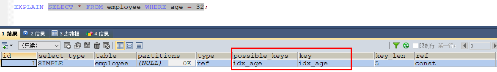
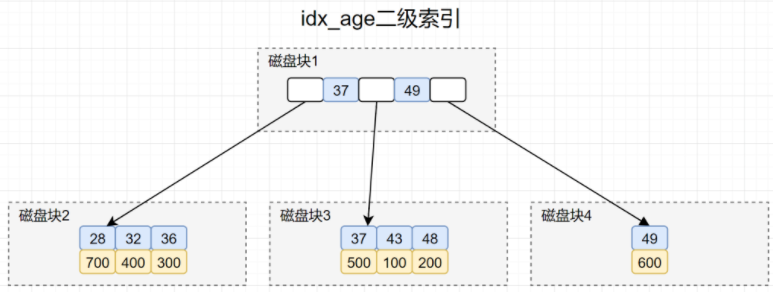
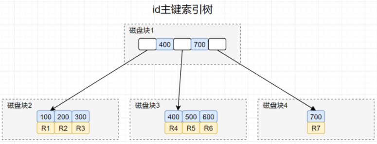
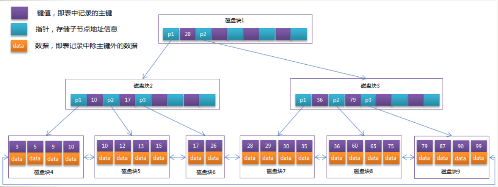

### 通过辅助索引(二级索引)拿到主键后再回到主键索引查询的过程，就叫做「回表」

少用，最好不用；**回表是指数据库根据素引(非主键)找到了指定的记录所在行后，还需要根据主键再次到数据块里获取数据的操作**。

### 建表SQL

```sql
CREATE TABLE `employee` (
  `id` INT(11) NOT NULL,
  `name` VARCHAR(255) DEFAULT NULL,
  `age` INT(11) DEFAULT NULL,
  `date` DATETIME DEFAULT NULL,
  `sex` INT(1) DEFAULT NULL,
  PRIMARY KEY (`id`),
  KEY `idx_age` (`age`) USING BTREE
) ENGINE=INNODB DEFAULT CHARSET=utf8;

INSERT INTO employee VALUES(100,'小伦',43,'2021-01-20','0');
INSERT INTO employee VALUES(200,'俊杰',48,'2021-01-21','0');
INSERT INTO employee VALUES(300,'紫琪',36,'2020-01-21','1');
INSERT INTO employee VALUES(400,'立红',32,'2020-01-21','0');
INSERT INTO employee VALUES(500,'易迅',37,'2020-01-21','1');
INSERT INTO employee VALUES(600,'小军',49,'2021-01-21','0');
INSERT INTO employee VALUES(700,'小燕',28,'2021-01-21','1');

EXPLAIN SELECT * FROM employee WHERE age = 32;
```

### 如果SELECT * FROM employee WHERE age= 32查询SQL,需要执行几次树搜索操作?

#### explain分析



#### 回表分析

##### 1.age索引



1 搜索idx_age索引树，将磁盘块1加载到内存，由于32<37,搜索左路分支，加载到磁盘寻址磁盘块2。

2 将磁盘块2加载到内存中，在内存继续遍历，找到age=32的记录，取得id = 400，拿到id=400后，回到id主键索引树。

##### 2.主键索引



3 搜索id主键索引树，将磁盘块1加载内存，在内存遍历找到了400，但是B+树索引非叶子节点是不保存数据的。

索引会继续搜索400的右分支，到磁盘寻址磁盘块3.

4 将磁盘块3加载内存再内存遍历，找到id=400的记录，拿到第4行(Row4)这一行的数据，查询成功。

##### 过程分析

1 搜索idx_age索引树，将磁盘块1加载到内存，由于32<37,搜索左路分支，加载到磁盘寻址磁盘块2。

2 将磁盘块2加载到内存中，在内存继续遍历，找到age=32的记录，取得id = 400，拿到id=400后，回到id主键索引树。

3 搜索id主键索引树，将磁盘块1加载内存，在内存遍历找到了400，但是B+树索引非叶子节点是不保存数据的。

索引会继续搜索400的右分支，到磁盘寻址磁盘块3.

4 将磁盘块3加载内存再内存遍历，找到id=400的记录，拿到第4行(Row4)这一行的数据，查询成功。

##### 结论

在idx_age二级索引树找到主键id后，回到id主键索引搜索的过程,就称为回表

### B+树检索原理

**由于B+树的非叶子节点只存储键值信息，假设每个磁盘块能存储4个键值及指针信息，则变成B+树后其结构如下图所示：** 



**B+树中**，所有数据记录节点都是按照键值大小顺序存放在同一层的叶子节点上，而非叶子节点上只存储key值信息，这样可以大大加大每个节点存储的key值数量，降低B+树的高度。

**<font color = 'red'>B+树算法</font>**： 通过继承了B树的特征，B+树相比B树，新增叶子节点与非叶子节点关系。

叶子节点中包含了键值和数据，

根节点和枝节点中，只是包含键值和子节点引用，<font color = 'red'>不包含数据。</font>

通过非叶子节点查询叶子节点获取对应的数据，所有相邻的叶子节点包含非叶子节点使用链表进行结合，叶子节点是顺序排序并且相邻节点有顺序引用的关系

### 总结

回表是指数据库根据索引（非主键）找到了指定的记录所在行后，还需要根据主键再次到数据块里获取数据的操作。这个过程在MySQL中<font color = 'red'>可能涉及两次查询</font>：首先通过索引扫描找到满足条件的记录的主键值，然后再通过主键值去主键索引中查找完整的行记录。

具体来说，在InnoDB存储引擎中，<font color = 'red'>当通过非聚簇索引查询数据时，由于索引中不包含完整的行数据，因此需要根据索引中找到的主键值再去聚簇索引中查找完整的行数据，这个过程就是回表。</font>

然而，回表操作虽然提供了更全面的数据信息，但也带来了一些问题和局限性。**首先，回表操作需要访问两次索引**，增加了IO开销和CPU消耗，对查询性能有一定的影响。特别是在高并发、大数据量的情况下，回表可能成为性能瓶颈。其次，由于回表操作是基于物理地址来获取数据，如果在回表过程中发生了数据修改（如DELETE、UPDATE），则可能会读取到不一致或错误的数据。

因此，在设计索引时，需要结合具体的业务场景和查询需求，选择合适的索引策略，<font color = 'red'>以尽量减少回表的次数和影响</font>，提高查询效率和性能。例如，可以通过使用覆盖索引来避免回表操作，覆盖索引是指索引包含了查询所需的所有字段的值，因此可以直接通过索引获取查询结果，而无需再去访问数据表。


