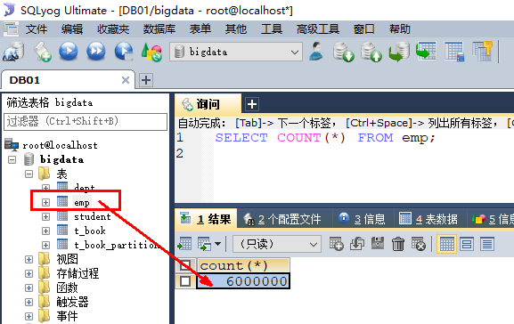
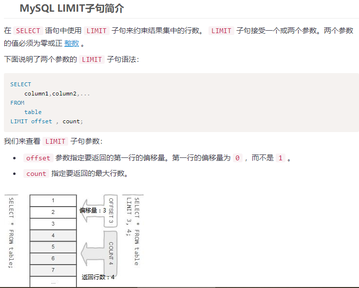
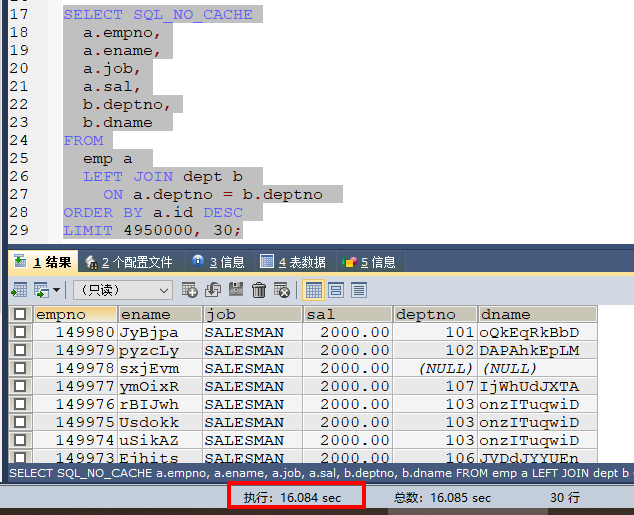
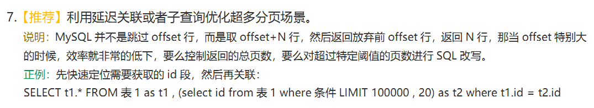
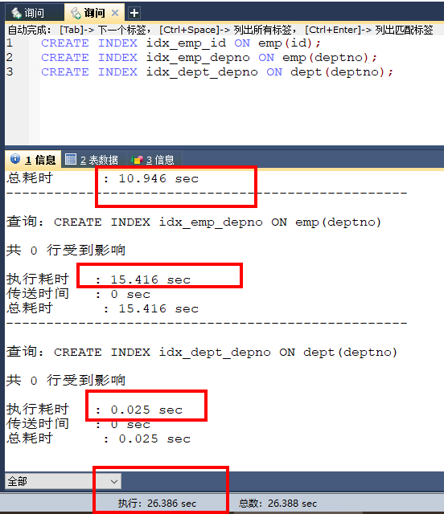

### 准备阶段：



### MySQL的limit查询说明

select * from table limit (offet+1)，含(offset+1)开始走count步 



### 优化前

```sql
/*偏移量为100，取30。查询速度还是比较快的*/
SELECT SQL_NO_CACHE
  a.empno,
  a.ename,
  a.job,
  a.sal,
  b.deptno,
  b.dname 
FROM
  emp a 
  LEFT JOIN dept b 
    ON a.deptno = b.deptno 
ORDER BY a.id DESC 
LIMIT 100, 30;


/*偏移量为4950000，取30，查询在20s左右，速度很慢*/
SELECT SQL_NO_CACHE
  a.empno,
  a.ename,
  a.job,
  a.sal,
  b.deptno,
  b.dname 
FROM
  emp a 
  LEFT JOIN dept b 
    ON a.deptno = b.deptno 
ORDER BY a.id DESC 
LIMIT 4950000, 30;
```

#### 为什么会这样呢

其实是因为limit后面的偏移量太大导致的。比如 limit 4950000,30。

这个等同于数据库要扫描出 4950030条数据，然后再丢弃前面的 49500000条数据返回剩下30条数据给用户，这种取法明显不合理。 

比如：

 limit 10000,20的意思扫描满足条件的10020行，扔掉前面的10000行，返回最后的20行，问题就在这里。 

假如 LIMIT 2000000, 30 

扫描了200万+ 30行，慢的都堵死甚至会导致磁盘io 100%消耗。  但是: limit 30 这样的语句仅仅扫描30行。


#### 说明

因为limit后面的偏移量太大导致的。

比如像上面的 limit 4950000,30 ，这个等同于数据库要扫描出 4950030条数据，然后再丢弃前面的 4950000条数据，返回剩下30条数据给用户，这种取法明显不合理

分页操作通常会使用limit加上偏移量的办法实现，同时再加上合适的order by子句。<font color = 'red'>生产危险隐患：当偏移量非常大的时候，它会导致MySQL扫描大量不需要的行然后再抛弃掉。</font>



### 参考阿里巴巴手册



### 建索引

CREATE INDEX idx_emp_id ON emp(id);

CREATE INDEX idx_emp_depno ON emp(deptno);

CREATE INDEX idx_dept_depno ON dept(deptno);

已经有600W的数据下建索引耗时参考：



### <font color = 'red'>优化后</font>

#### 使用索引覆盖+子查询优化;

因为我们有主键id，并且在上面建了索引，所以可以先在索引树中找到开始位置的 id值，再根据找到的id值查询行数据。

```sql
/*子查询获取偏移100条的位置的id，在这个位置上往后取30*/
SELECT 
  a.empno,
  a.ename,
  a.job,
  a.sal,
  b.deptno,
  b.dname 
FROM
  emp a 
  LEFT JOIN dept b 
    ON a.deptno = b.deptno 
WHERE a.id >= (SELECT id FROM emp ORDER BY id LIMIT 100,1)
ORDER BY a.id LIMIT 30;

/*子查询获取偏移4950000条的位置的id，在这个位置上往后取30,优化后的SQL执行很快*/
SELECT 
  a.empno,
  a.ename,
  a.job,
  a.sal,
  b.deptno,
  b.dname 
FROM
  emp a 
  LEFT JOIN dept b 
    ON a.deptno = b.deptno 
WHERE a.id >= (SELECT id FROM emp ORDER BY id LIMIT 4950000,1)
ORDER BY a.id LIMIT 30;
```

#### 起始位置重定义

记住上次查找结果的主键位置，避免使用偏移量 offset

```sql
/*记住了上次的分页的最后一条数据的id是100，这边就直接跳过100，从101开始扫描表*/
SELECT 
  a.empno,
  a.ename,
  a.job,
  a.sal,
  b.deptno,
  b.dname 
FROM
  emp a 
  LEFT JOIN dept b 
    ON a.deptno = b.deptno 
WHERE a.id > 100 ORDER BY a.id LIMIT 30

/*记住了上次的分页的最后一条数据的id是4950000，这边就直接跳过4950000，从4950001开始扫描表*/
SELECT 
  a.empno,
  a.ename,
  a.job,
  a.sal,
  b.deptno,
  b.dname 
FROM
  emp a 
  LEFT JOIN dept b 
    ON a.deptno = b.deptno 
WHERE a.id > 4950000 ORDER BY a.id LIMIT 30;
```

#### 服务降级不让使用

阿里的方案：

配置limit的偏移量和获取数一个最大值，超过这个最大值，就返回空数据。因为<font color = 'red'>按照业务来说</font>，超过这个值你已经不是在分页了，而是在刷数据了，如果确认要找数据，应该输入合适条件来缩小范围，而不是一页一页分页。

客户请求request的时候 如果offset大于某个数值就先返回一个4xx的错误，避免黑客攻击or刷单行为呢，正常人，很少翻查10页以后的内容。

另外，该有的限流、降级也应该考虑进去。比如工具多线程调用，在短时间频率内5000次调用，可以使用计数服务判断并反馈用户调用过于频繁，直接给予断掉


 


