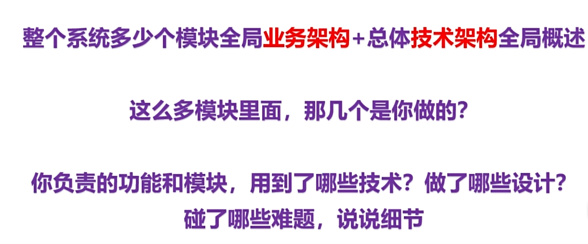
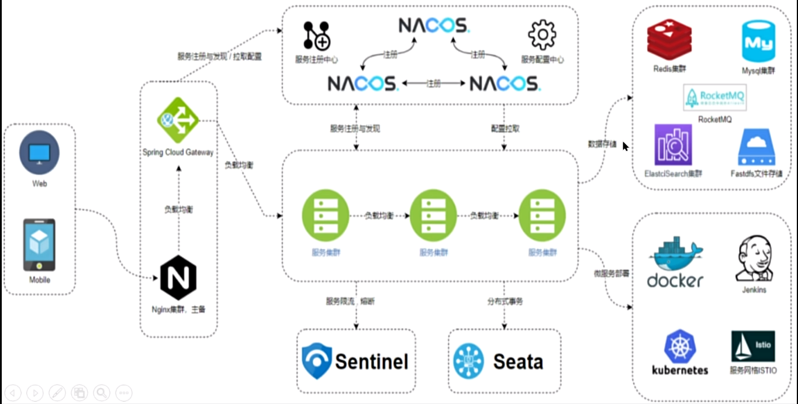
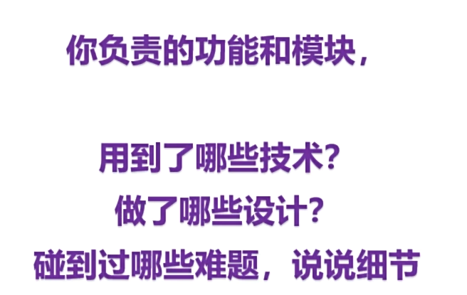
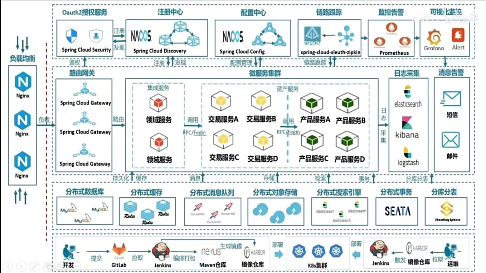
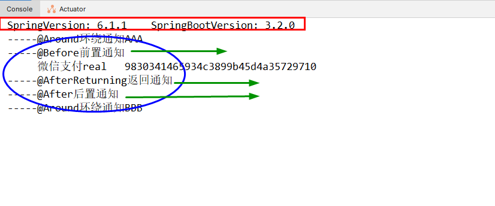
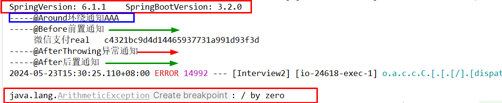

### 主流技术标准



### 你做了什么



### 架构图



### 说说AOP的全部通知加载顺序，异常发生后环绕通知和后置通知还会执行吗?

```java
@Aspect
@Component
public class PayAspect
{
    @Before("execution(public void com.luojia.interview2.aopreview.PayServiceImpl.pay(..))")
    public void beforeNotify()
    {
        System.out.println("-----@Before前置通知");
    }
    @After("execution(public void com.luojia.interview2.aopreview.PayServiceImpl.pay(..))")
    public void afterNotify()
    {
        System.out.println("-----@After后置通知");
    }
    @AfterReturning("execution(public void com.luojia.interview2.aopreview.PayServiceImpl.pay(..))")
    public void afterReturningNotify()
    {
        System.out.println("-----@AfterReturning返回通知");
    }
    @AfterThrowing("execution(public void com.luojia.interview2.aopreview.PayServiceImpl.pay(..))")
    public void afterThrowingNotify()
    {
        System.out.println("-----@AfterThrowing异常通知");
    }

    @Around("execution(public void com.luojia.interview2.aopreview.PayServiceImpl.pay(..))")
    public Object aroundNotify(ProceedingJoinPoint proceedingJoinPoint) throws Throwable
    {
        Object retValue = null;

        System.out.println("-----@Around环绕通知AAA");
        retValue = proceedingJoinPoint.proceed();//放行
        System.out.println("-----@Around环绕通知BBB");

        return retValue;
    }
}
```


```java
@Service
public class PayServiceImpl implements PayService
{
    @Override
    public void pay()
    {
        System.out.println("     微信支付real   "+ IdUtil.simpleUUID());

        //int age=10/0;
    }
}
```


```java
@RestController
public class PayAopReviewController
{
    @Resource
    private PayService payService;

    @GetMapping(value = "/pay/aop")
    public String pay()
    {
        System.out.println("SpringVersion: "+ SpringVersion.getVersion()+"\t"+ "SpringBootVersion: "+ SpringBootVersion.getVersion());

        payService.pay();


        return IdUtil.simpleUUID();
    }
}
```

### 测试正常流程



### 测试异常流程

将PayServiceImpl 设置分母为零




