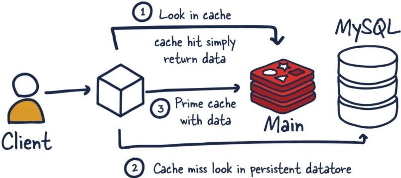
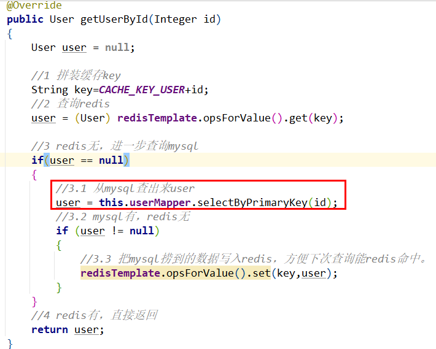

### 与传统数据库关系(mysql)

Redis是key-value数据库(NoSQL一种)，mysql是关系数据库

Redis数据操作主要在内存，而mysql主要存储在磁盘

Redis在某一些场景使用中要明显优于mysql，比如计数器、排行榜等方面

Redis通常用于一些特定场景，需要与Mysql一起配合使用<font color = 'red'>两者并不是相互替换和竞争关系，而是共用和配合使用</font>


```java
@Override
public int addUser(User user) {
    log.info("插入之前user:{}",user);
    int retValue = userMapper.insertSelective(user);
    log.info("插入之后user:{}",user);
    log.info("=================================");

    if(retValue > 0) {
        //到数据库里面，重新捞出新数据出来，做缓存
        user=this.userMapper.selectByPrimaryKey(user.getId());
        //缓存key
        String key=CACHE_KEY_USER+user.getId();
        //往mysql里面插入成功随后再从mysql查询出来，再插入redis
        redisTemplate.opsForValue().set(key,user);
    }
    return retValue;
}


@Override
public User getUserById(Integer id) {
    User user = null;

    //缓存key
    String key=CACHE_KEY_USER+id;
    //1 查询redis
    user = (User) redisTemplate.opsForValue().get(key);

    //redis无，进一步查询mysql
    if(user==null) {
        //从mysql查出来user
        user=this.userMapper.selectByPrimaryKey(id);
        // mysql有，redis无
        if (user != null) {
            //把mysql捞到的数据写入redis，方便下次查询能redis命中。
            redisTemplate.opsForValue().set(key,user);
        }
    }
    return user;
}
```

### 如何自研<font color = 'red'>Redis缓存框架</font>，赋能团队

第一步：实现热拔插AOP+反射+Redis自定义缓存注解 + SpringElExpress，优雅重构缓存代码

第二步：打造我司基础架构分布式缓存组件，<font color = 'red'>要求查询部分变一行代码实现</font>

#### 总体要求：

可配置：自定义缓存注解标签

可插拔：添加注解，方法自带redis缓存查询功能；没有注解，方法没有redis缓存查询功能

可通用：自己开发自定义redis缓存通用代码给全团队赋能公用；不要和业务透辑代码写死，可以独立出来并配置

高可用：高并发下可以实时起效

效果：

before：



after：

```java
/**
     * 会将返回值存进redis里，key生成规则需要程序员用SpEL表达式自己指定，value就是程序从mysql查出并返回的user
     * redis的key 等于  keyPrefix:matchValue
     */
@Override
@LuoJiaRedisCache(keyPrefix = "user", matchValue = "#id")
public User getUserByIdAop(Integer id) {
    return userMapper.selectByPrimaryKey(id);
}
```

###创建个注解类

```java
package com.luojia.demo.selfRedisCache.annotation;

import java.lang.annotation.ElementType;
import java.lang.annotation.Retention;
import java.lang.annotation.RetentionPolicy;
import java.lang.annotation.Target;

@Target(ElementType.METHOD)
@Retention(RetentionPolicy.RUNTIME)
public @interface LuoJiaRedisCache {

    // 设置Redis键的前缀
    String keyPrefix();

    // SpringEL表达式，解析占位符对应的匹配value值
    String matchValue();
}
```

### 切面类

```java
package com.luojia.demo.selfRedisCache.aop;

import com.luojia.demo.selfRedisCache.annotation.LuoJiaRedisCache;
import jakarta.annotation.Resource;
import org.aspectj.lang.ProceedingJoinPoint;
import org.aspectj.lang.Signature;
import org.aspectj.lang.annotation.Around;
import org.aspectj.lang.annotation.Aspect;
import org.aspectj.lang.annotation.Pointcut;
import org.aspectj.lang.reflect.MethodSignature;
import org.springframework.core.DefaultParameterNameDiscoverer;
import org.springframework.data.redis.core.RedisTemplate;
import org.springframework.expression.Expression;
import org.springframework.expression.spel.standard.SpelExpressionParser;
import org.springframework.expression.spel.support.StandardEvaluationContext;
import org.springframework.stereotype.Component;

import java.lang.reflect.Method;

@Component
@Aspect
public class LuoJiaRedisCacheAspect {

    @Resource
    private RedisTemplate redisTemplate;

    @Pointcut("@annotation(com.luojia.demo.selfRedisCache.annotation.LuoJiaRedisCache)")
    public void chchePointCut() {}

    @Around("chchePointCut()")
    public Object doCache(ProceedingJoinPoint joinPoint) {
        Object result = null;

        try {
            // 1.获得重载后的方法名
            MethodSignature signature = (MethodSignature) joinPoint.getSignature();
            Method method = signature.getMethod();

            // 2.确定方法名后获得该方法上
            LuoJiaRedisCache luoJiaRedisCache = method.getAnnotation(LuoJiaRedisCache.class);
            // 3.拿到注解标签，获得该注解上面配置的参数进行封装和调用
            String keyPrefix = luoJiaRedisCache.keyPrefix();
            String matchValue = luoJiaRedisCache.matchValue();
            // 4.SpringEL 解析器
            SpelExpressionParser parser = new SpelExpressionParser();
            Expression expression = parser.parseExpression(matchValue); // #id
            StandardEvaluationContext context = new StandardEvaluationContext();

            // 5.获得方法里面的形参个数
            Object[] args = joinPoint.getArgs();
            DefaultParameterNameDiscoverer discoverer = new DefaultParameterNameDiscoverer();
            String[] parameterNames = discoverer.getParameterNames(method);
            for (int i = 0; i < parameterNames.length; i++) {
                System.out.println("获得方法里参数名和值：" + parameterNames[i] + "\t" + args[i].toString());
                context.setVariable(parameterNames[i], args[i].toString());
            }

            // 6.通过上述，拼接redis 的最终key形式
            String key = keyPrefix + ":" + expression.getValue(context).toString();
            System.out.println("-----拼接redis的最终key形式：" + key);

            // 7.先去redis 里面查询看看有没有
            result = redisTemplate.opsForValue().get(key);
            if (result != null) {
                System.out.println("------redis 里面有数据，直接返回结果" + result);
                return result;
            }

            // 8.redis 没有，去MySQL查询数据
            result = joinPoint.proceed();
            // 9.mysql 步骤结束，将数据存放到redis
            if (result != null) {
                System.out.println("--------redis 无数据，将结果放入到redis中");
                redisTemplate.opsForValue().set(key, result);
            }
        } catch (Throwable e) {
            throw new RuntimeException(e);
        }

        return result;
    }
}
```

### 修改service 类

```java
@Override
public int addUserAop(User user) {
    log.info("插入之前user：{}", user);
    int retValue = userMapper.insertSelective(user);
    log.info("插入之后user:{}", user);
    if (retValue > 0) {
        user = userMapper.selectByPrimaryKey(user.getId());
        String key = CACHE_KEY_USER + user.getId();
        redisTemplate.opsForValue().set(key, user);
    }
    return retValue;
}

/**
     * 会将返回值存进redis里，key生成规则需要程序员用SpEL表达式自己指定，value就是程序从mysql查出并返回的user
     * redis的key 等于  keyPrefix:matchValue
     */
@Override
@LuoJiaRedisCache(keyPrefix = "user", matchValue = "#id")
public User getUserByIdAop(Integer id) {
    return userMapper.selectByPrimaryKey(id);
}
```

 


