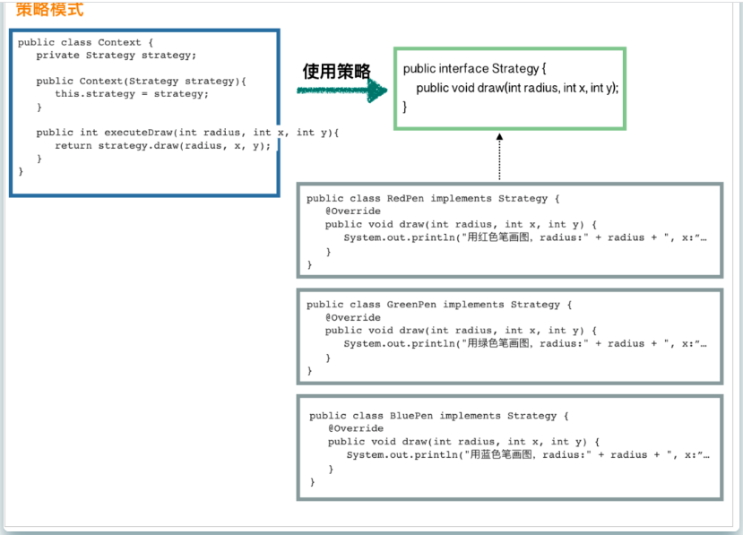
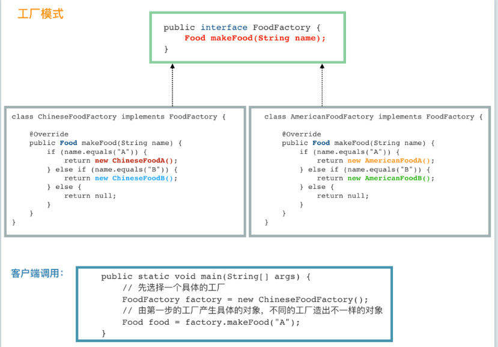
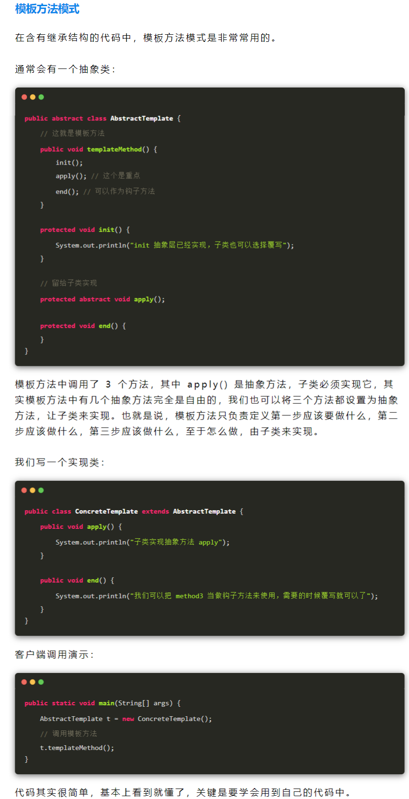

###   策略模式



### 工厂模式



### 模板方法模式



抽象类：AbstractColaHandler

```java
package com.luojia.demo.design.pattern.v3;

import org.springframework.beans.factory.InitializingBean;

public abstract class AbstractColaHandler implements InitializingBean {

    public void getCoca(String parameter) {
        throw new UnsupportedOperationException();
    }

    // 模板方法1，按照业务名字可乐自己单独实现
    public String cocaMethod(String name) {
        throw new UnsupportedOperationException();
    }

    // 模板方法2，按照业务名字百事可乐自己单独实现
    public String pepsiMethod(String name) {
        throw new UnsupportedOperationException();
    }

    // 模板方法3，按照业务名字娃哈哈自己单独实现
    public String wahahaMethod(String name) {
        throw new UnsupportedOperationException();
    }

    protected void initReSource() {
        System.out.println("init抽象类父类已经统一实现，子类也可以重写");
    }

    // 保留给子类实现
    public abstract String invokeCommon();
}
```

工厂类：Factory

```java
package com.luojia.demo.design.pattern.v3;

import java.util.Map;
import java.util.concurrent.ConcurrentHashMap;

public class FactoryV3 {

    private static Map<String, AbstractColaHandler> strategyMap = new ConcurrentHashMap<>();

    public static AbstractColaHandler getInvokeStrategy(String srt) {
        return strategyMap.get(srt);
    }

    public static void register(String str, AbstractColaHandler handler) {
        System.out.println("str: " + str + "\t handler: " + handler);
        if (null == str || null == handler) return;

        strategyMap.put(str, handler);
    }

}
```

### 策略类

```java
package com.luojia.demo.design.pattern.v3;

import org.springframework.stereotype.Component;

@Component
public class CocaHandlerV3 extends AbstractColaHandler {
    @Override
    public void getCoca(String parameter) {
        System.out.println("我是可口可乐+策略+工厂+模板" + parameter);
    }

    @Override
    public String cocaMethod(String name) {
        return "可口可乐 CocaHandlerV3 独有";
    }

    @Override
    public String invokeCommon() {
        return "我是 CocaHandlerV3 统一实现抽象父类的invokeCommon方法";
    }

    @Override
    public void afterPropertiesSet() throws Exception {
        FactoryV3.register("coca", this);
    }
}
```


```java
package com.luojia.demo.design.pattern.v3;

import org.springframework.stereotype.Component;

@Component
public class pepsiHandlerV3 extends AbstractColaHandler {

    @Override
    public void getCoca(String parameter) {
        System.out.println("我是百事可乐+策略+工厂+模板" + parameter);
    }

    @Override
    public String pepsiMethod(String name) {
        return "百事可乐 CocaHandlerV3 独有";
    }

    @Override
    public String invokeCommon() {
        return "我是 pepsiHandlerV3 统一实现抽象父类的invokeCommon方法";
    }

    @Override
    public void afterPropertiesSet() throws Exception {
        FactoryV3.register("pepsi", this);
    }
}
```


```java
package com.luojia.demo.design.pattern.v3;

import org.springframework.stereotype.Component;

@Component
public class WahahaHandlerV3 extends AbstractColaHandler{

    @Override
    public void getCoca(String parameter) {
        System.out.println("我是娃哈哈+策略+工厂+模板" + parameter);
    }

    @Override
    public String wahahaMethod(String name) {
        return "娃哈哈 CocaHandlerV3 独有";
    }

    @Override
    public String invokeCommon() {
        return "我是 WahahaHandlerV3 统一实现抽象父类的invokeCommon方法";
    }

    @Override
    public void afterPropertiesSet() throws Exception {
        FactoryV3.register("wahaha", this);
    }
}
```


