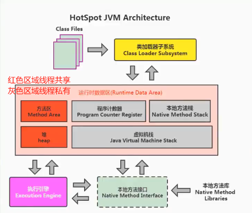
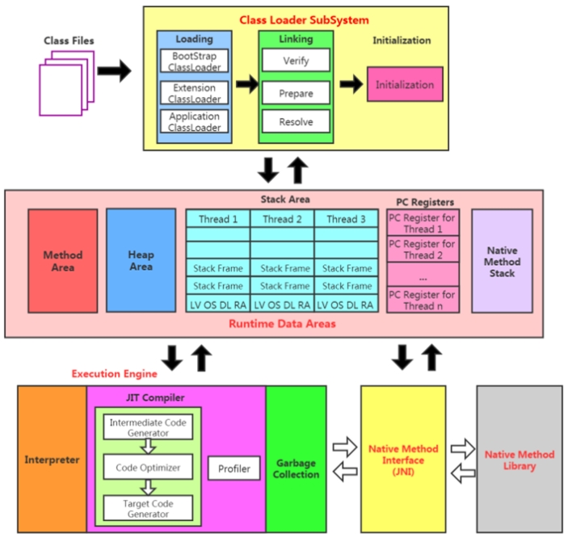
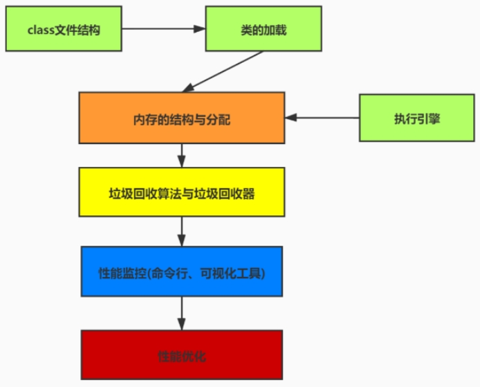

## JVM生命周期

### 虚拟机的启动

Java虚拟机的启动是通过引导类加载器(bootstrap class loader创建一个初始类(initialclass)来完成的，这个类是由虚拟机的具体实现指定的。

### 虚拟机的退出有如下的几种情况:

- 某线程调用Runtime类或System类的exit方法，或 Runtime类的 halt 力法，并且Java安全管理器也允许这次exit或halt操作。
- 程序正常执行结束
- 程序在执行过程中遇到了异常或错误而异常终止
- 由于操作系统出现错误而导致Java虚拟机过程终止

## JVM架构图

这个架构可以分成三层看:

- 最上层：javac编译器将编译好的字节码class文件，通过java 类装载器执行机制，把对象或class文件存放在jvm划分内存区域。
- 中间层：称为Runtime Data Area，主要是在Java代码运行时用于存放数据的，从左至右为方法区(永久代、元数据区)、堆(共亨，GC回收对象区域)、栈、程序计数器、寄存器、本地方法(私有)。
- 最下层：解释器、JIT(just in time)编译器和 GC(Garbage co1lection，垃圾回收器)

## JVM有哪几块知识脉络？

