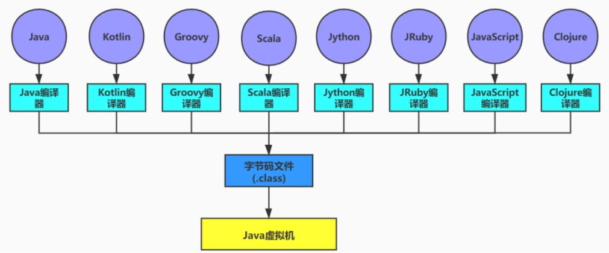
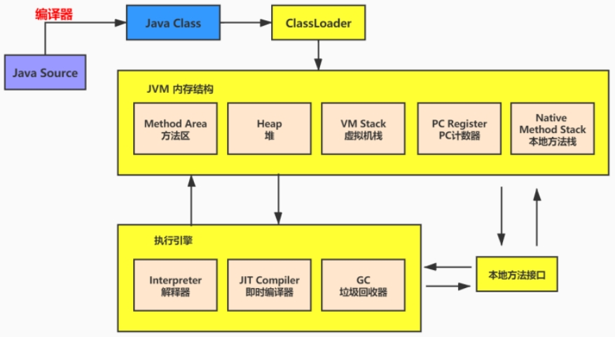
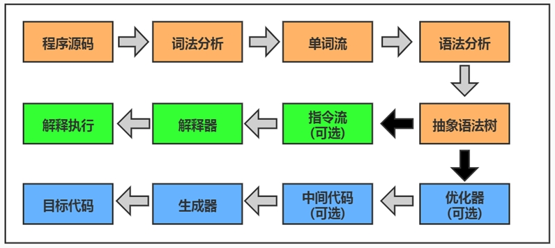
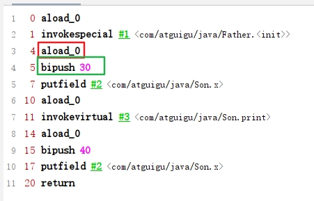

## 字节码文件是跨平台的吗？

 Java 虚拟机不和包括 Java 在内的任何语言绑定，它只与“Class 文件”这种特定的二进制文件格式所关联。
无论使用何种语言进行软件开发，只要能将源文件编译为正确的Class文件，那么这种语言就可以在Java虚拟机上执行。可以说，统一而强大的Class文件结构，就是Java虚拟机的基石、桥梁。

想要让一个Java程序正确地运行在JVM中，Java源码就必须要被编译为符合JVM规范的字节码。

### class文件里是什么？

字节码文件里是什么？
源代码经过编译器编译之后便会生成一个字节码文件，字节码是一种二进制的类文件，它的内容是JVM的指令，而不像C、C++经由编译器直接生成机器码。

随着Java平台的不断发展，在将来，Class文件的内容也一定会做进一步的扩充，但是其基本的格式和结构不会做重大调整。

### javac编译器的编译步骤

javac编译器在将Java源码编译为一个有效的字节码文件过程中经历了4个步骤，分别是词法解析、语法解析、语义解析以及生成字节码。

 

大部分的程序代码转换成物理机的目标代码或虚拟机能执行的指令集之前，都需要经过上图中的各个步骤。

## 字节码指令

### 什么是字节码指令？

什么是字节码指令(byte code)？

Java虚拟机的指令由一个字节长度的、代表着某种特定操作含义的操作码（opcode）以及跟随其后的零至多个代表此操作所需参数的操作数（operand）所构成。虚拟机中许多指令并不包含操作数，只有一个操作码。

比如： 

 

