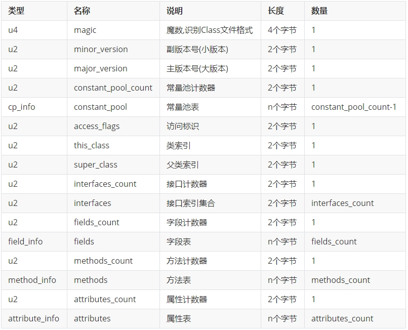
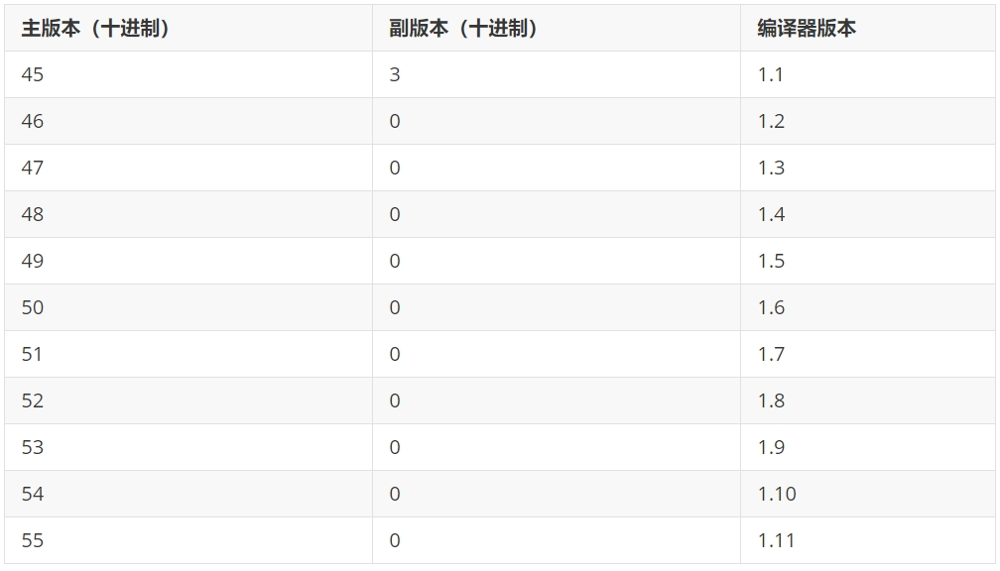
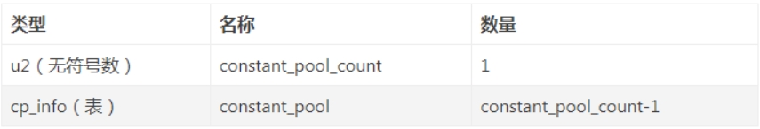
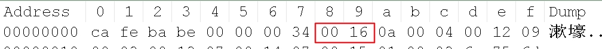
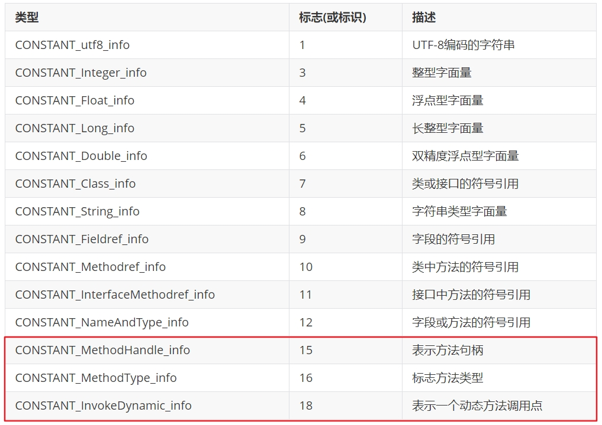
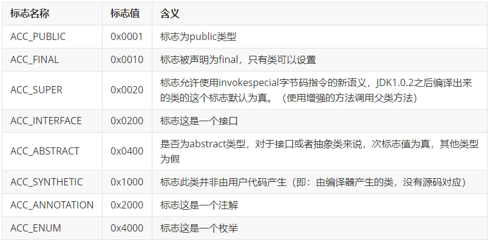
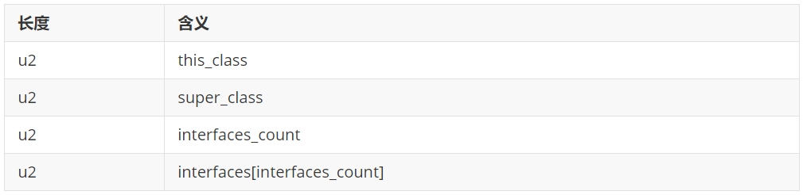

## class文件结构细节概述

- class文件结构概述

  Class文件的结构并不是一成不变的，随着Java虚拟机的不断发展，总是不可避免地会对Class文件结构做出一些调整，但是其基本结构和框架是非常稳定的。

Class文件的总体结构如下：

- 魔数
- Class文件版本
- 常量池
- 访问标识(或标志)
- 类索引，父类索引，接口索引集合
- 字段表集合
- 方法表集合
- 属性表集合

这是一张Java字节码总的结构表，我们按照上面的顺序逐一进行解读就可以了。

## class文件的魔数是什么

**Magic Number（魔数）：class文件的标志**

- 每个 Class 文件开头的4个字节的无符号整数称为魔数（Magic Number）
- 它的唯一作用是确定这个文件是否为一个能被虚拟机接受的有效合法的Class文件。即：魔数是Class文件的标识符。
- 魔数值固定为0xCAFEBABE。不会改变。
- 如果一个Class文件不以0xCAFEBABE开头，虚拟机在进行文件校验的时候就会直接抛出以下错误：
  Error: A JNI error has occurred, please check your installation and try again
  Exception in thread "main" java.lang.ClassFormatError: Incompatible magic value 1885430635 in class file StringTest
- 使用魔数而不是扩展名来进行识别主要是基于安全方面的考虑，因为文件扩展名可以随意地改动。

## 如何确保高版本的JVM可执行低版本的class文件

- 不同版本的Java编译器编译的Class文件对应的版本是不一样的。目前，高版本的Java虚拟机可以执行由低版本编译器生成的Class文件,但是低版本的Java虚拟机不能执行由高版本编译器生成的Class文件。否则JVM会抛出java.lang.UnsupportedClassVersionError异常。 （向下兼容）
- 在实际应用中，由于开发环境和生产环境的不同，可能会导致该问题的发生。因此，需要我们在开发时，特别注意开发编译的JDK版本和生产环境中的JDK版本是否一致。

**class文件版本号**

- 紧接着魔数的 4 个字节存储的是 Class 文件的版本号。同样也是4个字节。第5个和第6个字节所代表的含义就是编译的副版本号minor_version，而第7个和第8个字节就是编译的主版本号major_version。
- 它们共同构成了class文件的格式版本号。譬如某个 Class 文件的主版本号为 M，副版本号为 m，那么这个Class 文件的格式版本号就确定为 M.m。
- 版本号和Java编译器的对应关系如下表：
  

- Java 的版本号是从45开始的，JDK 1.1之后的每个JDK大版本发布主版本号向上加1。
- 虚拟机JDK版本为1.k （k >= 2）时，对应的class文件格式版本号的范围为45.0 - 44+k.0 （含两端）。

 ## 常量池

### 常量池的作用

常量池：存放所有常量

- 常量池是Class文件中内容最为丰富的区域之一。常量池对于Class文件中的字段和方法解析也有着至关重要的作用。
- 常量池：可以理解为Class文件之中的资源仓库，它是Class文件结构中与其他项目关联最多的数据类型（后面的很多数据类型都会指向此处），也是占用Class文件空间最大的数据项目之一。
- 常量池表项中，用于存放编译时期生成的各种字面量和符号引用，这部分内容将在类加载后进入方法区的运行时常量池中存放。
- 在版本号之后，紧跟着的是常量池的数量，以及若干个常量池表项。
- 常量池中常量的数量是不固定的，所以在常量池的入口需要放置一项u2类型的无符号数，代表常量池容量计数值（constant_pool_count）。与Java中语言习惯不一样的是，这个容量计数是从1而不是0开始的。

由上表可见，Class文件使用了一个前置的容量计数器（constant_pool_count）加若干个连续的数据项（constant_pool）的形式来描述常量池内容。我们把这一系列连续常量池数据称为常量池集合。

 #### 为什么需要常量池计数器？

constant_pool_count （常量池计数器）

- 由于常量池的数量不固定，时长时短，所以需要放置两个字节来表示常量池容量计数值。

- 常量池容量计数值（u2类型）：从1开始，表示常量池中有多少项常量。即constant_pool_count=1表示常量池中有0个常量项。
  Demo的值为：

  

其值为0x0016,掐指一算，也就是22。

需要注意的是，这实际上只有21项常量。索引为范围是1-21。为什么呢？
通常我们写代码时都是从0开始的，但是这里的常量池却是从1开始，因为它把第0项常量空出来了。这是为了满足后面某些指向常量池的索引值的数据在特定情况下需要表达“不引用任何一个常量池项目”的含义，这种情况可用索引值0来表示。

#### 常量池表

constant_pool []（常量池）

constant_pool是一种表结构，以 1 ~ constant_pool_count - 1为索引。表明了后面有多少个常量项。

常量池主要存放两大类常量：字面量（Literal）和符号引用（Symbolic References）

它包含了class文件结构及其子结构中引用的所有字符串常量、类或接口名、字段名和其他常量。常量池中的每一项都具备相同的特征。第1个字节作为类型标记，用于确定该项的格式，这个字节称为tag byte （标记字节、标签字节）。

## 访问标识

访问标识(access_flag、访问标志、访问标记)

- 在常量池后，紧跟着访问标记。该标记使用两个字节表示，用于识别一些类或者接口层次的访问信息，包括：这个 Class 是类还是接口；是否定义为 public 类型；是否定义为 abstract 类型；如果是类的话，是否被声明为 final 等。各种访问标记如下所示：

  

- 类的访问权限通常为 ACC_ 开头的常量。
- 每一种类型的表示都是通过设置访问标记的32位中的特定位来实现的。比如，若是public final的类，则该标记为ACC_PUBLIC | ACC_FINAL。
- 使用ACC_SUPER可以让类更准确地定位到父类的方法super.method(),现代编译器都会设置并且使用这个标记。

## 类索引、父类索引、接口索引集合

- 在访问标记后，会指定该类的类别、父类类别以及实现的接口，格式如下：

  

- 这三项数据来确定这个类的继承关系。

  - 类索引用于确定这个类的全限定名
  - 父类索引用于确定这个类的父类的全限定名。由于 Java语言不允许多重继承，所以父类索引只有一个，除了java.lang.Object 之外，所有的Java类都有父类，因此除了java.lang.Object 外，所有Java类的父类索引都不为 0。
  - 接口索引集合就用来描述这个类实现了哪些接口，这些被实现的接口将按 implements 语句（如果这个类本身是一个接口，则应当是 extends 语句）后的接口顺序从左到右排列在接口索引集合中。

## 字段表集合

### fields

用于描述接口或类中声明的变量。字段（field）包括类级变量以及实例级变量，但是不包括方法内部、代码块内部声明的局部变量。(local variables)

字段叫什么名字、字段被定义为什么数据类型，这些都是无法固定的，只能引用常量池中的常量来描述。

它指向常量池索引集合，它描述了每个字段的完整信息。比如字段的标识符、访问修饰符（public、private或protected）、是类变量还是实例变量（static修饰符）、是否是常量（final修饰符）等。

### 注意事项：

字段表集合中不会列出从父类或者实现的接口中继承而来的字段，但有可能列出原本Java代码之中不存在的字段。譬如在内部类中为了保持对外部类的访问性，会自动添加指向外部类实例的字段。

在Java语言中字段是无法重载的，两个字段的数据类型、修饰符不管是否相同，都必须使用不一样的名称，但是对于字节码来讲，如果两个字段的描述符不一致，那字段重名就是合法的。

 ## 方法表集合

### 方法计数器

methods_count （方法计数器）

methods_count的值表示当前class文件methods表的成员个数。使用两个字节来表示。

methods 表中每个成员都是一个method_info结构。

 ## 属性表集合

### 属性计数器

attributes_count （属性计数器）

attributes_count的值表示当前class文件属性表的成员个数。属性表中每一项都是一个attribute_info结构。

 
