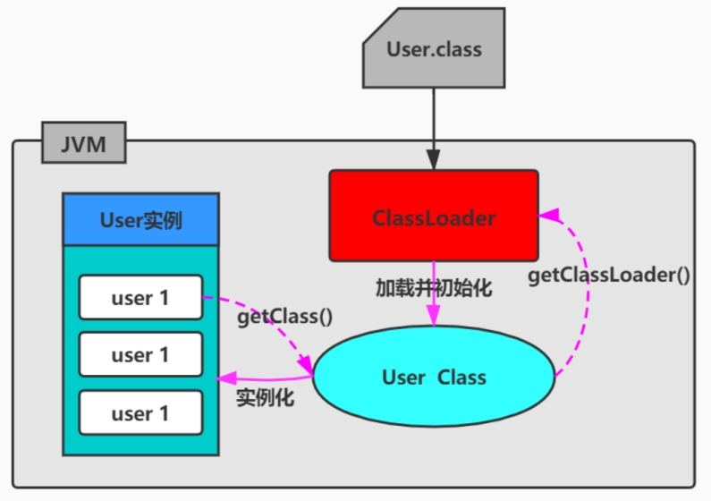

## 面试题

什么是类加载器，类加载器有哪些?（苏宁）

简单说说你了解的类加载器（拼多多）

类加载器都有哪些？（百度） 

类加载器有哪些？  （腾讯）

什么是类加载器，类加载器有哪些？（字节跳动）

## 作用

类加载器是 JVM 执行类加载机制的前提。

**ClassLoader的作用：**

ClassLoader是Java的核心组件，所有的Class都是由ClassLoader进行加载的，ClassLoader负责通过各种方式将Class信息的二进制数据流读入JVM内部，转换为一个与目标类对应的java.lang.Class对象实例。然后交给Java虚拟机进行链接、初始化等操作。

因此，ClassLoader在整个装载阶段，只能影响到类的加载，而无法通过ClassLoader去改变类的链接和初始化行为。至于它是否可以运行，则由Execution Engine决定。

类加载器最早出现在Java1.0版本中，那个时候只是单纯地为了满足Java Applet应用而被研发出来。但如今类加载器却在OSGi、字节码加解密领域大放异彩。这主要归功于Java虚拟机的设计者们当初在设计类加载器的时候，并没有考虑将它绑定在JVM内部，这样做的好处就是能够更加灵活和动态地执行类加载操作。

 ## 类加载的显式加载与隐式加载

**类的加载分类：显式加载 vs 隐式加载**

class文件的显式加载与隐式加载的方式是指 JVM 加载 class 文件到内存的方式。

- 显式加载：指的是在代码中通过调用ClassLoader加载class对象，如直接使用Class.forName(name)或this.getClass().getClassLoader().loadClass()加载class对象。
- 隐式加载：则是不直接在代码中调用ClassLoader的方法加载class对象，而是通过虚拟机自动加载到内存中，如在加载某个类的class文件时，该类的class文件中引用了另外一个类的对象，此时额外引用的类将通过JVM自动加载到内存中。

在日常开发以上两种方式一般会混合使用。

## 类加载机制的必要性

一般情况下，Java开发人员并不需要在程序中显式地使用类加载器，但是了解类加载器的加载机制却显得至关重要。从以下几个方面说：

- 避免在开发中遇到 java.lang.ClassNotFoundException异常或java.lang.NoClassDefFoundError异常时，手足无措。只有了解类加载器的加载机制才能够在出现异常的时候快速地根据错误异常日志定位问题和解决问题

- 需要支持类的动态加载或需要对编译后的字节码文件进行加解密操作时，就需要与类加载器打交道了。
- 开发人员可以在程序中编写自定义类加载器来重新定义类的加载规则，以便实现一些自定义的处理逻辑。

## 加载的类是唯一的吗？

**1.何为类的唯一性？**

对于任意一个类，都需要由加载它的类加载器和这个类本身一同确认其在Java虚拟机中的唯一性。每一个类加载器，都拥有一个独立的类名称空间：比较两个类是否相等，只有在这两个类是由同一个类加载器加载的前提下才有意义。否则，即使这两个类源自同一个Class文件，被同一个虚拟机加载，只要加载他们的类加载器不同，那这两个类就必定不相等。

**2.命名空间**

- 每个类加载器都有自己的命名空间，命名空间由该加载器及所有的父加载器所加载的类组成
- 在同一命名空间中，不会出现类的完整名字（包括类的包名）相同的两个类
- 在不同的命名空间中，有可能会出现类的完整名字（包括类的包名）相同的两个类

在大型应用中，我们往往借助这一特性，来运行同一个类的不同版本。

 ## 类加载机制的基本特征

通常类加载机制有三个基本特征：

- **双亲委派模型**。但不是所有类加载都遵守这个模型，有的时候，启动类加载器所加载的类型，是可能要加载用户代码的，比如 JDK 内部的ServiceProvider / ServiceLoader机制，用户可以在标准API框架上，提供自己的实现，JDK也需要提供些默认的参考实现。例如，Java 中 JNDI、JDBC、文件系统、Cipher等很多方面，都是利用的这种机制，这种情况就不会用双亲委派模型去加载，而是利用所谓的上下文加载器。
- **可见性**。子类加载器可以访问父加载器加载的类型，但是反过来是不允许的。不然，因为缺少必要的隔离，我们就没有办法利用类加载器去实现容器的逻辑。
- **单一性**。由于父加载器的类型对于子加载器是可见的，所以父加载器中加载过的类型，就不会在子加载器中重复加载。但是注意，类加载器“邻居”间，同一类型仍然可以被加载多次，因为互相并不可见。

 

 

