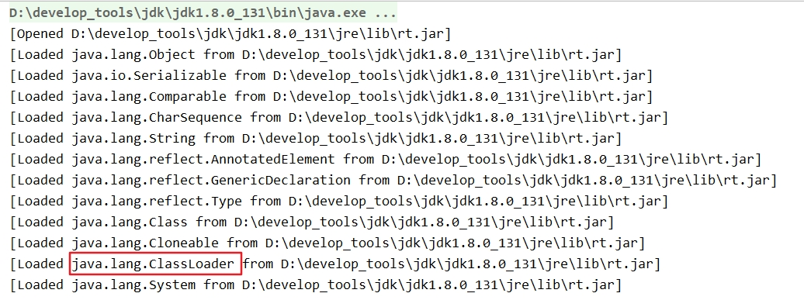
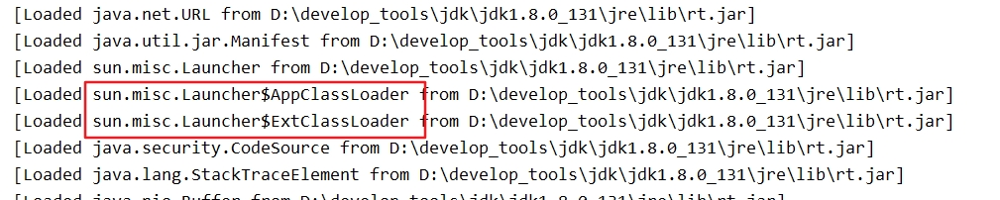
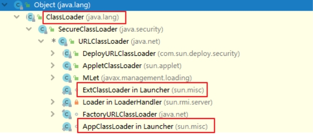

## 类加载器的分类说明

JVM支持两种类型的类加载器，分别为<font color = 'red'>引导类加载器（Bootstrap ClassLoader）和自定义类加载器（User-Defined ClassLoader）</font>。

从概念上来讲，用户自定义类加载器一般指的是程序中由开发人员自定义的一类类加载器，但是Java虚拟机规范却没有这么定义，而是将所有派生于抽象类ClassLoader的类加载器都划分为自定义类加载器。<font color = 'red'>即下图中扩展类加载器、应用程序类加载器、用户自定义类加载器都被划分为自定义类加载器</font>

无论类加载器的类型如何划分，在程序中我们最常见的类加载器结构主要是如下情况：


## 子父类加载器的关系

- 除了顶层的启动类加载器外，其余的类加载器都应当有自己的“父类”加载器。 
- 不同类加载器看似是继承（Inheritance）关系，实际上是包含关系。在下层加载器中，包含着上层加载器的引用。

```java
class ClassLoader{
    ClassLoader parent; //父类加载器 
    public ClassLoader(ClassLoader parent){ 
        this.parent = parent;
    }
}
class ParentClassLoader extends ClassLoader{
     public ParentClassLoader(ClassLoader parent){
          super(parent);
     }
}
class ChildClassLoader extends ClassLoader{
     public ChildClassLoader(ClassLoader parent){ //parent = new ParentClassLoader();
          super(parent);
     }
}
```
## 具体类的加载器介绍

### 引导类加载器

<font color = 'red'>启动类加载器（引导类加载器，Bootstrap ClassLoader）</font>

- 这个类加载使用C/C++语言实现的，嵌套在JVM内部。
- 它用来加载Java的核心库（JAVA_HOME/jre/lib/rt.jar或sun.boot.class.path路径下的内容）。用于提供JVM自身需要的类。
- 并不继承自java.lang.ClassLoader，没有父加载器。
- 出于安全考虑，Bootstrap启动类加载器只加载包名为java、javax、sun等开头的类
- 加载扩展类和应用程序类加载器，并指定为他们的父类加载器。

 使用-XX:+TraceClassLoading参数得到启动类加载器相关信息。





启动类加载器使用C++编写的? Yes!

- C/C++：指针函数&函数指针、C++支持多继承
- Java：由C++演变而来，(C++)--版，单继承

### 扩展类加载器

<font color = 'red'>扩展类加载器（Extension ClassLoader）</font>

- Java语言编写，由sun.misc.Launcher$ExtClassLoader实现。
- 继承于ClassLoader类
- 父类加载器为启动类加载器
- 从java.ext.dirs系统属性所指定的目录中加载类库，或从JDK的安装目录的jre/lib/ext子目录下加载类库。如果用户创建的JAR放在此目录下，也会自动由扩展类加载器加载。



### 系统类加载器

<font color = 'red'>应用程序类加载器（系统类加载器，AppClassLoader）</font>

- java语言编写，由sun.misc.Launcher$AppClassLoader实现
- 继承于ClassLoader类
- 父类加载器为扩展类加载器
- 它负责加载环境变量classpath或系统属性 java.class.path 指定路径下的类库 
- <font color = 'red'>应用程序中的类加载器默认是系统类加载器。</font>
- 它是用户自定义类加载器的默认父加载器
- 通过ClassLoader的getSystemClassLoader()方法可以获取到该类加载器

 ## 用户自定义类加载器

- 在Java的日常应用程序开发中，类的加载几乎是由上述3种类加载器相互配合执行的。在必要时，我们还可以自定义类加载器，来定制类的加载方式。
- 体现Java语言强大生命力和巨大魅力的关键因素之一便是，Java开发者可以自定义类加载器来实现类库的动态加载，加载源可以是本地的JAR包，也可以是网络上的远程资源。
- <font color = 'red'>通过类加载器可以实现非常绝妙的插件机制</font>，这方面的实际应用案例举不胜举。例如，著名的OSGI组件框架，再如Eclipse的插件机制。类加载器为应用程序提供了一种动态增加新功能的机制，这种机制无须重新打包发布应用程序就能实现。
- 同时，<font color = 'red'>自定义加载器能够实现应用隔离</font>，例如 Tomcat，Spring等中间件和组件框架都在内部实现了自定义的加载器，并通过自定义加载器隔离不同的组件模块。这种机制比C/C++程序要好太多，想不修改C/C++程序就能为其新增功能，几乎是不可能的，仅仅一个兼容性便能阻挡住所有美好的设想。
- 所有用户自定义类加载器通常需要继承于抽象类java.lang.ClassLoader。

 ## 测试不同的类加载器

每个Class对象都会包含一个定义它的ClassLoader的一个引用。

获取ClassLoader的途径

```java
获得当前类的ClassLoader
clazz.getClassLoader()
获得当前线程上下文的ClassLoader
Thread.currentThread().getContextClassLoader()
获得系统的ClassLoader
ClassLoader.getSystemClassLoader()
```

**说明：**

站在程序的角度看，引导类加载器与另外两种类加载器（系统类加载器和扩展类加载器）并不是同一个层次意义上的加载器，引导类加载器是使用C++语言编写而成的，而另外两种类加载器则是使用Java语言编写而成的。**由于引导类加载器压根儿就不是一个Java类，因此在Java程序中只能打印出空值。**

数组类的Class对象，不是由类加载器去创建的，而是在Java运行期JVM根据需要自动创建的。对于数组类的类加载器来说，是通过Class.getClassLoader()返回的，与数组当中元素类型的类加载器是一样的；如果数组当中的元素类型是基本数据类型，数组类是没有类加载器的。

```java
String[] strArr = new String[6];
System.out.println(strArr.getClass().getClassLoader());
// 运行结果：null

ClassLoaderTest[] test = new ClassLoaderTest[1];
System.out.println(test.getClass().getClassLoader());
// 运行结果：sun.misc.Launcher$AppClassLoader@18b4aac2

int[] ints = new int[2];
System.out.println(ints.getClass().getClassLoader());
// 运行结果：null
```


