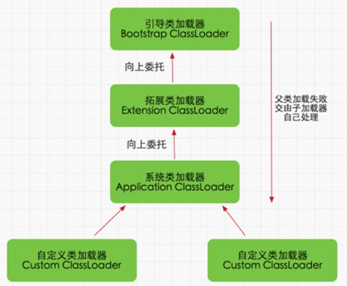
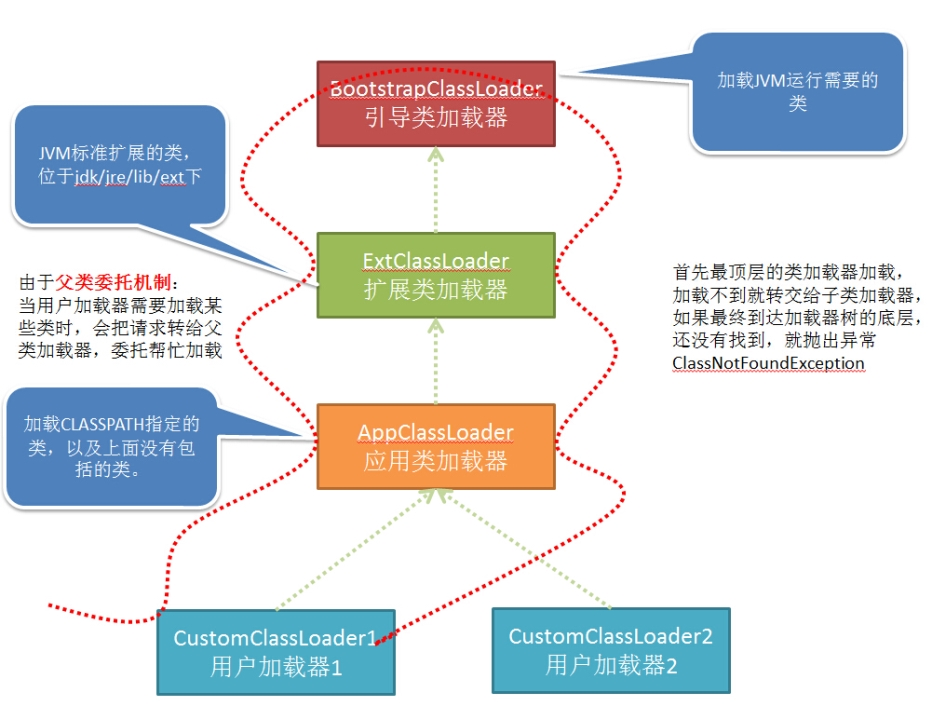
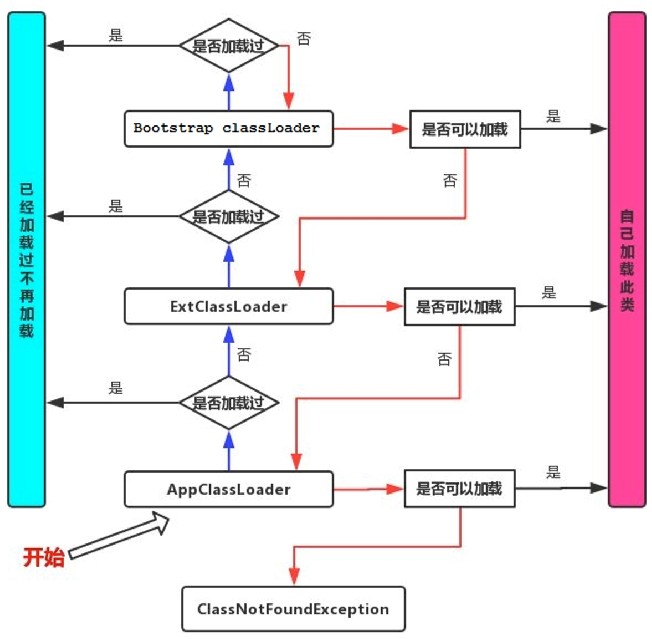
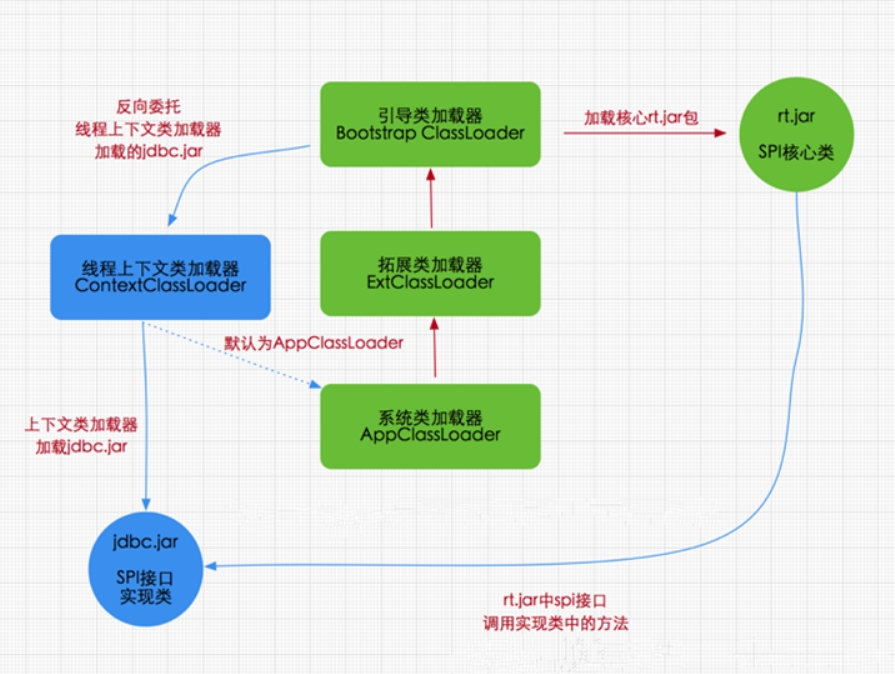
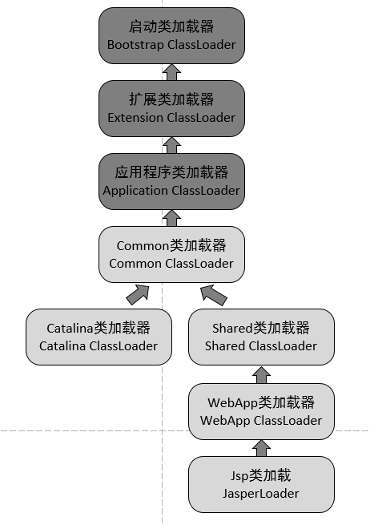
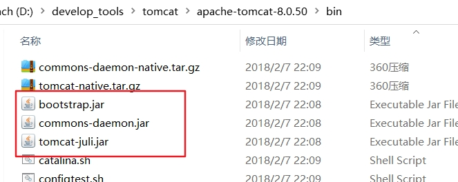

## 双亲委派机制

### 面试题

双亲委派好处有哪些？（亚信）

类加载器双亲委派模型机制？（苏宁）

双亲委派机制 （蚂蚁金服）

双亲委派机制及使用原因 （蚂蚁金服）

类加载器的双亲委派模型是什么？ （蚂蚁金服）

双亲委派模型介绍一下  （小米）

讲一下双亲委派模型，以及其优点  （滴滴）

类加载器的双亲委派模型是什么？ （京东）

### 定义与本质

类加载器用来把类加载到Java虚拟机中。从JDK1.2版本开始，类的加载过程采用双亲委派机制，这种机制能更好地保证Java平台的安全。

1.定义
如果一个类加载器在接到加载类的请求时，它首先不会自己尝试去加载这个类，而是把这个请求任务委托给父类加载器去完成，依次递归，如果父类加载器可以完成类加载任务，就成功返回。只有父类加载器无法完成此加载任务时，才自己去加载。

2.本质
规定了类加载的顺序是：引导类加载器先加载，若加载不到，由扩展类加载器加载，若还加载不到，才会由系统类加载器或自定义的类加载器进行加载。







### 如何证明？源码分析

1.源码分析

双亲委派机[制在java.lang.ClassLoader.loadClass(String,boolean)接口中体现。该接口的逻辑如下：

(1)先在当前加载器的缓存中查找有无目标类，如果有，直接返回。

(2)判断当前加载器的父加载器是否为空，如果不为空，则调用parent.loadClass(name, false)接口进行加载。

(3)反之，如果当前加载器的父类加载器为空，则调用findBootstrapClassOrNull(name)接口，让引导类加载器进行加载。

(4)如果通过以上3条路径都没能成功加载，则调用findClass(name)接口进行加载。该接口最终会调用java.lang.ClassLoader接口的defineClass系列的native接口加载目标Java类。

双亲委派的模型就隐藏在这第2和第3步中。

2.举例

假设当前加载的是java.lang.Object这个类，很显然，该类属于JDK中核心得不能再核心的一个类，因此一定只能由引导类加载器进行加载。当JVM准备加载javaJang.Object时，JVM默认会使用系统类加载器去加载，按照上面4步加载的逻辑，在第1步从系统类的缓存中肯定查找不到该类，于是进入第2步。由于从系统类加载器的父加载器是扩展类加载器，于是扩展类加载器继续从第1步开始重复。由于扩展类加载器的缓存中也一定査找不到该类，因此进入第2步。扩展类的父加载器是null,因此系统调用findClass(String), 最终通过引导类加载器进行加载。

3.思考

如果在自定义的类加载器中重写java.lang.ClassLoader.loadClass(String)或 java.lang.ClassLoader.loadClass(String, boolean)方法,抹去其中的双亲委派机制,仅保留上面这4步中的第1步与第4步，那么是不是就能够加载核心类库了呢？

这也不行！ 因为JDK还为核心类库提供了一层保护机制。不管是自定义的类加载器，还是系统类加载器抑或扩展类加载器，最终都必须调用 java.lang.ClassLoader.defineClass(String, byte[], int, int, ProtectionDomain)方法，而该方法会执行<font color = 'red'>preDefineClass()接口</font>，该接口中提供了对JDK核心类库的保护。

### 优势与劣势

#### 1.双亲委派机制优势

- 避免类的重复加载，确保一个类的全局唯一性

<font color = 'red'>Java类随着它的类加载器一起具备了一种带有优先级的层次关系，通过这种层级关系可以避免类的重复加载</font>，当父亲已经加载了该类时，就没有必要子ClassLoader再加载一次。

- 保护程序安全，防止核心API被随意篡改

#### 2.双亲委托模式的弊端

检查类是否加载的委托过程是单向的，这个方式虽然从结构上说比较清晰，使各个ClassLoader的职责非常明确，但是同时会带来一个问题，即顶层的ClassLoader无法访问底层的ClassLoader所加载的类。

通常情况下，启动类加载器中的类为系统核心类，包括一些重要的系统接口，而在应用类加载器中，为应用类。按照这种模式，<font color = 'red'>应用类访问系统类自然是没有问题，但是系统类访问应用类就会出现问题。</font>比如在系统类中提供了一个接口，该接口需要在应用类中得以实现，该接口还绑定一个工厂方法，用于创建该接口的实例，而接口和工厂方法都在启动类加载器中。这时，就会出现该工厂方法无法创建由应用类加载器加载的应用实例的问题。

3.结论：

<font color = 'red'>由于Java虚拟机规范并没有明确要求类加载器的加载机制一定要使用双亲委派模型，只是建议采用这种方式而已。</font>

比如在Tomcat中，类加载器所采用的加载机制就和传统的双亲委派模型有一定区别，当缺省的类加载器接收到一个类的加载任务时，首先会由它自行加载，当它加载失败时，才会将类的加载任务委派给它的超类加载器去执行，这同时也是Servlet规范推荐的一种做法。

### 破坏双亲委派机制及举例

#### 面试题

- 双亲委派机制可以打破吗？为什么 （京东）
- 可以打破双亲委派么，怎么打破。（拼多多）

 ### 破坏双亲委派机制1

双亲委派模型并不是一个具有强制性约束的模型，而是Java设计者推荐给开发者们的类加载器实现方式。

在Java的世界中大部分的类加载器都遵循这个模型，但也有例外的情况，直到Java模块化出现为止，双亲委派模型主要出现过3次较大规模“被破坏”的情况。

第一次破坏双亲委派机制：

双亲委派模型的第一次“被破坏”其实发生在双亲委派模型出现之前——即JDK 1.2面世以前的“远古”时代。

由于双亲委派模型在JDK 1.2之后才被引入，但是类加载器的概念和抽象类java.lang.ClassLoader则在Java的第一个版本中就已经存在，面对已经存在的用户自定义类加载器的代码，Java设计者们引入双亲委派模型时不得不做出一些妥协，为了兼容这些已有代码，无法再以技术手段避免loadClass()被子类覆盖的可能性，只能在JDK1.2之后的java.lang.ClassLoader中添加一个新的protected方法findClass()，并引导用户编写的类加载逻辑时尽可能去重写这个方法，而不是在loadClass()中编写代码。上节我们已经分析过loadClass()方法，双亲委派的具体逻辑就实现在这里面，按照loadClass()方法的逻辑，如果父类加载失败，会自动调用自己的findClass()方法来完成加载，这样既不影响用户按照自己的意愿去加载类，又可以保证新写出来的类加载器是符合双亲委派规则的。

### 破坏双亲委派机制2

第二次破坏双亲委派机制：线程上下文类加载器

双亲委派模型的第二次“被破坏”是由这个模型自身的缺陷导致的，双亲委派很好地解决了各个类加载器协作时基础类型的一致性问题<font color = 'red'>（越基础的类由越上层的加载器进行加载）</font>，基础类型之所以被称为“基础”，是因为它们总是作为被用户代码继承、调用的API存在，但程序设计往往没有绝对不变的完美规则，如果有基础类型又要调用回用户的代码，那该怎么办呢？

这并非是不可能出现的事情，一个典型的例子便是JNDI服务，JNDI现在已经是Java的标准服务，它的代码由启动类加载器来完成加载（在JDK 1.3时加入到rt.jar的），肯定属于Java中很基础的类型了。但JNDI存在的目的就是对资源进行查找和集中管理，它需要调用由其他厂商实现并部署在应用程序的ClassPath下的JNDI服务提供者接口（Service Provider Interface，SPI）的代码，现在问题来了，启动类加载器是绝不可能认识、加载这些代码的，那该怎么办？（SPI:在Java平台中，通常把核心类rt.jar中提供外部服务、可由应用层自行实现的接口称为SPI）

为了解决这个困境，Java的设计团队只好引入了一个不太优雅的设计：线程上下文类加载器（Thread Context ClassLoader）。这个类加载器可以通过java.lang.Thread类的setContextClassLoader()方法进行设置，如果创建线程时还未设置，它将会从父线程中继承一个，如果在应用程序的全局范围内都没有设置过的话，那这个类加载器默认就是应用程序类加载器。

有了线程上下文类加载器，程序就可以做一些“舞弊”的事情了。JNDI服务使用这个线程上下文类加载器去加载所需的SPI服务代码，这是一种父类加载器去请求子类加载器完成类加载的行为，这种行为实际上是打通了双亲委派模型的层次结构来逆向使用类加载器，已经违背了双亲委派模型的一般性原则，但也是无可奈何的事情。Java中涉及SPI的加载基本上都采用这种方式来完成，例如JNDI、JDBC、JCE、JAXB和JBI等。不过，当SPI的服务提供者多于一个的时候，代码就只能根据具体提供者的类型来硬编码判断，为了消除这种极不优雅的实现方式，在JDK 6时，JDK提供了java.util.ServiceLoader类，以META-INF/services中的配置信息，辅以责任链模式，这才算是给SPI的加载提供了一种相对合理的解决方案。




默认上下文加载器就是应用类加载器，这样以上下文加载器为中介，使得启动类加载器中的代码也可以访问应用类加载器中的类。

 ### 破坏双亲委派机制3

第三次破坏双亲委派机制：

双亲委派模型的第三次“被破坏”是由于用户对程序动态性的追求而导致的。如：代码热替换（Hot Swap）、模块热部署（Hot Deployment）等

IBM公司主导的JSR-291（即OSGi R4.2）实现模块化热部署的关键是它自定义的类加载器机制的实现，每一个程序模块（OSGi中称为Bundle）都有一个自己的类加载器，当需要更换一个Bundle时，就把Bundle连同类加载器一起换掉以实现代码的热替换。在OSGi环境下，类加载器不再双亲委派模型推荐的树状结构，而是进一步发展为更加复杂的网状结构。

当收到类加载请求时，OSGi将按照下面的顺序进行类搜索：

1）将以java.*开头的类，委派给父类加载器加载。

2）否则，将委派列表名单内的类，委派给父类加载器加载。

3）否则，将Import列表中的类，委派给Export这个类的Bundle的类加载器加载。

4）否则，查找当前Bundle的ClassPath，使用自己的类加载器加载。

5）否则，查找类是否在自己的Fragment Bundle中，如果在，则委派给Fragment Bundle的类加载器加载。

6）否则，查找Dynamic Import列表的Bundle，委派给对应Bundle的类加载器加载。

7）否则，类查找失败。
说明：只有开头两点仍然符合双亲委派模型的原则，其余的类查找都是在平级的类加载器中进行的

### 面试题

- 什么是tomcat类加载机制？（猎聘）

- 请解释tomcat的类加载机制？（阿里）

Tomcat8 和 Tomcat6比较大的区别是 ：
Tomcat8可以通过配置 <Loader delegate="true"/>表示遵循双亲委派机制。

Tomcat的类加载机制是违反了双亲委托原则的，对于一些未加载的非基础类，各个web应用自己的类加载器(WebAppClassLoader)会优先查看自己的仓库加载，加载不到时再交给commonClassLoader走双亲委托。

Tomcat 如何实现自己独特的类加载机制？
所以，Tomcat 是怎么实现的呢？牛逼的Tomcat团队已经设计好了。我们看看他们的设计图：



当tomcat启动时，会创建几种类加载器：
1. Bootstrap 引导类加载器 

  加载JVM启动所需的类，以及标准扩展类（位于jre/lib/ext下）

2. System 系统类加载器 

  加载tomcat启动的类，比如bootstrap.jar，通常在catalina.bat或者catalina.sh中指定。位于CATALINA_HOME/bin下。

  

3. CommonClassLoader、CatalinaClassLoader、SharedClassLoader和WebappClassLoader

  这些是Tomcat自己定义的类加载器，它们分别加载/common/*、/server/*、/shared/*（在tomcat 6之后已经合并到根目录下的lib目录下）和/WebApp/WEB-INF/*中的Java类库。其中WebApp类加载器和Jsp类加载器通常会存在多个实例，每一个Web应用程序对应一个WebApp类加载器，每一个JSP文件对应一个Jsp类加载器。
  commonLoader：Tomcat最基本的类加载器，加载路径中的class可以被Tomcat容器本身以及各个Webapp访问；（加载CATALINA_HOME/lib下的结构，比如servlet-api.jar）
  catalinaLoader：Tomcat容器私有的类加载器，加载路径中的class对于Webapp不可见；
  sharedLoader：各个Webapp共享的类加载器，加载路径中的class对于所有Webapp可见，但是对于Tomcat容器不可见；
  WebappClassLoader：单个Tomcat实例中各个Web应用程序私有的类加载器，加载路径中的class只对当前Webapp可见；(加载WEB-INF/lib和WEB-INF/classes下的结构）

从图中的委派关系中可以看出：
CommonClassLoader能加载的类都可以被Catalina ClassLoader和SharedClassLoader使用，从而实现了公有类库的共用，而CatalinaClassLoader和Shared ClassLoader自己能加载的类则与对方相互隔离。
WebAppClassLoader可以使用SharedClassLoader加载到的类，但各个WebAppClassLoader实例之间相互隔离。
而JasperLoader的加载范围仅仅是这个JSP文件所编译出来的那一个.class文件，它出现的目的就是为了被丢弃：当Web容器检测到JSP文件被修改时，会替换掉目前的JasperLoader的实例，并通过再建立一个新的Jsp类加载器来实现JSP文件的HotSwap功能。

**当应用需要到某个类时，则会按照下面的顺序进行类加载：**
1 使用bootstrap引导类加载器加载
2 使用system系统类加载器加载
3 使用应用类加载器在WEB-INF/classes中加载
4 使用应用类加载器在WEB-INF/lib中加载
5 使用common类加载器在CATALINA_HOME/lib中加载

 

好了，至此，我们已经知道了tomcat为什么要这么设计，以及是如何设计的，那么，tomcat 违背了java 推荐的双亲委派模型了吗？答案是：违背了。 我们前面说过：双亲委派模型要求除了顶层的启动类加载器之外，其余的类加载器都应当由自己的父类加载器加载。

很显然，tomcat 不是这样实现，tomcat 为了实现隔离性，没有遵守这个约定，每个webappClassLoader加载自己的目录下的class文件，不会传递给父类加载器。

#### 源码分析

Tomcat中WebappClassLoader的源码分析：

```java
 1 public Class loadClass(String name, boolean resolve)
 2             throws ClassNotFoundException {
 3         Class clazz = null;
 4         // (0) 先从自己的缓存中查找，有则返回，无则继续
 5         clazz = findLoadedClass0(name);
 6         if (clazz != null) {
 7             if (resolve) resolveClass(clazz);            
 8             return (clazz);
 9         }
10         // (0.1) 再从parent的缓存中查找
11         clazz = findLoadedClass(name);
12         if (clazz != null) {
13             if (resolve) resolveClass(clazz);
14             return (clazz);
15         }
16         // (0.2) 缓存中没有，则首先使用system类加载器来加载
17         clazz = system.loadClass(name);
18          if (clazz != null) {
19              if (resolve) resolveClass(clazz);
20              return (clazz);
21          }
22         //判断是否需要先让parent代理
23         boolean delegateLoad = delegate || filter(name);
24         // (1) 先让parent加载，通常delegateLoad == false，即这一步不会执行
25 
26         if (delegateLoad) {
27             ClassLoader loader = parent;
28             if (loader == null)
29                 loader = system;
30             clazz = loader.loadClass(name);
31             if (clazz != null) {
32                 if (resolve) resolveClass(clazz);
33                 return (clazz);
34             }
35         }
36         // (2) delegateLoad == false 或者 parent加载失败，调用自身的加载机制
37         clazz = findClass(name);
38         if (clazz != null) {
39             if (resolve) resolveClass(clazz);
40             return (clazz);
41         }
42         // (3) 自己加载失败，则请求parent代理加载
43 
44         if (!delegateLoad) {
45             ClassLoader loader = parent;
46             if (loader == null)
47                 loader = system;
48             clazz = loader.loadClass(name);
49             if (clazz != null) {
50                 return (clazz);
51             }
52         }
53         throw new ClassNotFoundException(name);
54     }
```

总结一下：

首先findLoadedClass0()和findLoadedClass()分别从本地和父类加载器的缓存中查找当前要加载的类是否已经加载过了。之后为了避免上面提到的安全问题，Tomcat类加载器会将加载请求委派给系统类加载器。接下来根据delegate变量的设置，决定是先由自己加载，还是先由父类加载器去加载。

 #### 5个子问题

<font color = 'red'>1、既然 Tomcat 不遵循双亲委派机制，那么如果我自己定义一个恶意的HashMap，会不会有风险呢？(阿里面试问题)</font>

答： 显然不会有风险，如果有，Tomcat都运行这么多年了，那能不改进吗？ 
tomcat不遵循双亲委派机制，只是自定义的classLoader顺序不同，但顶层还是相同的，还是要去顶层请求classloader。

<font color = 'red'>2、我们思考一下：Tomcat是个web容器， 那么它要解决什么问题？</font>

1. 一个web容器可能需要部署两个应用程序，不同的应用程序可能会依赖同一个第三方类库的不同版本，不能要求同一个类库在同一个服务器只有一份，因此要保证每个应用程序的类库都是独立的，保证相互隔离。 
2. 部署在同一个web容器中相同的类库相同的版本可以共享。否则，如果服务器有10个应用程序，那么要有10份相同的类库加载进虚拟机，这是扯淡的。 
3. web容器也有自己依赖的类库，不能于应用程序的类库混淆。基于安全考虑，应该让容器的类库和程序的类库隔离开来。 
4. web容器要支持jsp的修改，我们知道，jsp 文件最终也是要编译成class文件才能在虚拟机中运行，但程序运行后修改jsp已经是司空见惯的事情，否则要你何用？ 所以，web容器需要支持 jsp 修改后不用重启。

<font color = 'red'>3、Tomcat 如果使用默认的类加载机制行不行？ </font>

答案是不行的。为什么？我们看:

第一个问题，如果使用默认的类加载器机制，那么是无法加载两个相同类库的不同版本的，默认的累加器是不管你是什么版本的，只在乎你的全限定类名，并且只有一份。

第二个问题，默认的类加载器是能够实现的，因为他的职责就是保证唯一性。

第三个问题和第一个问题一样。

我们再看第四个问题，我们想我们要怎么实现jsp文件的热替换，jsp 文件其实也就是class文件，那么如果修改了，但类名还是一样，类加载器会直接取方法区中已经存在的，修改后的jsp是不会重新加载的。那么怎么办呢？我们可以直接卸载掉这jsp文件的类加载器，所以你应该想到了，每个jsp文件对应一个唯一的类加载器，当一个jsp文件修改了，就直接卸载这个jsp类加载器。重新创建类加载器，重新加载jsp文件。

<font color = 'red'>4、如果tomcat 的 Common ClassLoader 想加载 WebApp ClassLoader 中的类，该怎么办？</font>
看了前面的关于破坏双亲委派模型的内容，我们心里有数了，我们可以使用线程上下文类加载器实现，使用线程上下文加载器，可以让父类加载器请求子类加载器去完成类加载的动作。

<font color = 'red'>5、为什么java文件放在Eclipse/IDEA中的src文件夹下会优先jar包中的class?</font>

tomcat类加载机制的理解，就不难明白。因为Eclipse/IDEA中的src文件夹中的文件java以及webContent中的JSP都会在tomcat启动时，被编译成class文件放在 WEB-INF/class 中。

而Eclipse/IDEA外部引用的jar包，则相当于放在 WEB-INF/lib 中。

因此肯定是 java文件或者JSP文件编译出的class优先加载。

 

 