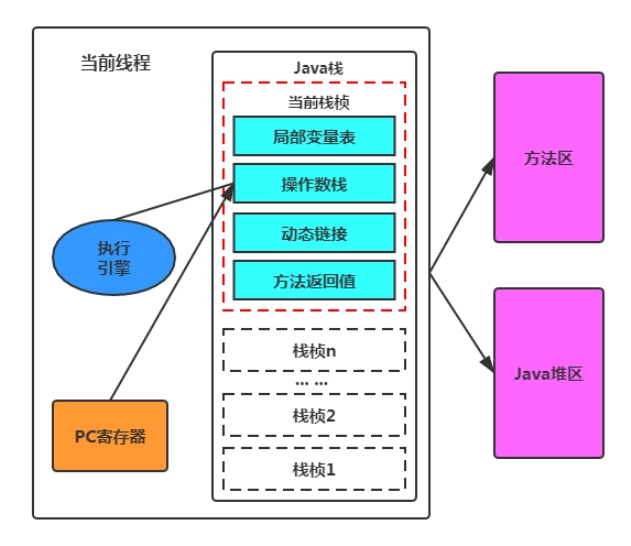
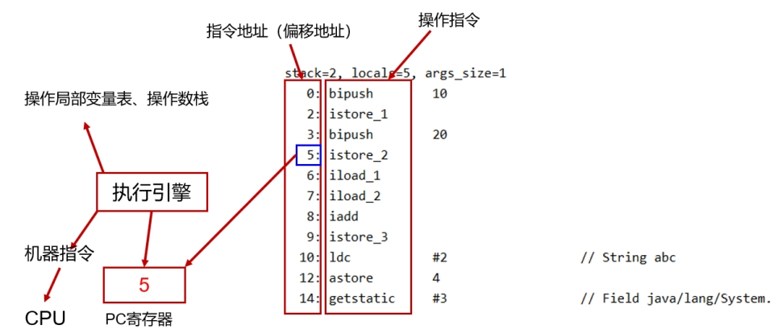
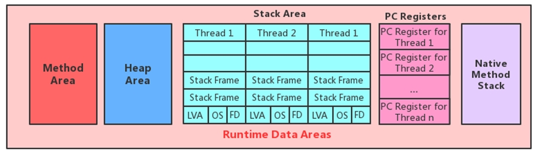
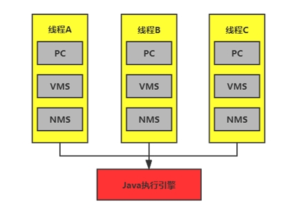

## 面试题

JVM计数器如何记数（京东-物流）

## 为什么需要它？



- 为了保证程序(在操作系统中理解为进程)能够连续地执行下去，CPU必须具有某些手段来确定下一条指令的地址。而程序计数器正是起到这种作用，所以通常又称为指令计数器。
- 在程序开始执行前，必须将它的起始地址，即程序的一条指令所在的内存单元地址送入PC，因此程序计数器（PC）的内容即是从内存提取的第一条指令的地址。当执行指令时，CPU将自动修改PC的内容，即每执行一条指令PC增加一个量，这个量等于指令所含的字节数，以便使其保持的总是将要执行的下一条指令的地址。
- 由于大多数指令都是按顺序来执行的，所以修改的过程通常只是简单的对PC加1。 
- 当程序转移时，转移指令执行的最终结果就是要改变PC的值，此PC值就是转去的地址，以此实现转移。有些机器中也称PC为指令指针IP（Instruction Pointer）。

小结：

它是程序控制流的指示器，分支、循环、跳转、异常处理、线程恢复等基础功能都需要依赖这个计数器来完成。

<font color = 'red'>PC寄存器用来存储指向下一条指令的地址，也即将要执行的指令代码。执行引擎的字节码解释器工作时就是通过改变这个计数器的值来选取下一条需要执行的字节码指令。</font>

### 为什么执行native方法时，是undefined？

任何时间一个线程都只有一个方法在执行，也就是所谓的<font color = 'red'>当前方法</font>。程序计数器会存储当前线程正在执行的Java方法的JVM指令地址；或者，如果是在执行native方法，则是未指定值（undefined）。为什么？

native 本地方法是大多是通过C实现，并未编译成需要执行的字节码指令，所以在计数器中当然是空（undefined）。

 ## 举例说明

 举例：

```java
public int test() {
    int x = 0;
    int y = 1;
    return x + y;
}
```

 对应的字节码：


    public int test();
        descriptor: ()I
    flags: ACC_PUBLIC
     
    Code:
      stack=2, locals=3, args_size=1
         0: iconst_0
         1: istore_1
         2: iconst_1
         3: istore_2
         4: iload_1
         5: iload_2
         6: iadd
         7: ireturn
     
      LineNumberTable:
        line 7: 0
        line 8: 2
        line 9: 4
      LocalVariableTable:
        Start  Length  Slot  Name   Signature
     
            0       8     0  this   Lcom/alibaba/uc/TestClass;
            2       6     1     x   I
            4       4     2     y   I

 

## 基本特征

JVM中的程序计数寄存器（Program Counter Register）中， Register 的命名源于CPU的寄存器，寄存器存储指令相关的现场信息。 CPU只有把数据装载到寄存器才能够运行。

这里，并非是广义上所指的物理寄存器，或许将其翻译为PC计数器（或指令计数器）会更加贴切(也称为程序钩子) ，并且也不容易引起一些不必要的误会。<font color = 'red'>JVM中的PC寄存器是对物理PC寄存器的一种抽象模拟。</font>



它是一块很小的内存空间，几乎可以忽略不记。也是运行速度最快的存储区域。不会随着程序的运行需要更大的空间。

在JVM规范中，每个线程都有它自己的程序计数器，是线程私有的，生命周期与线程的生命周期保持一致。

<font color = 'red'>它是唯一一个在Java 虚拟机规范中没有规定任何OutOtMemoryError 情况的区域。</font>

 ### 两个问题

#### PC寄存器存储字节码指令地址有什么用？

使用PC寄存器存储字节码指令地址有什么用呢？

（为什么使用PC寄存器记录当前线程的执行地址呢？）

因为CPU需要不停的切换各个线程，这时候切换回来以后，就得知道接着从哪开始继续执行。

JVM的字节码解释器就需要通过改变PC寄存器的值来明确下一条应该执行什么样的字节码指令。



### PC寄存器为什么被设定为线程私有的？

我们都知道所谓的多线程在一个特定的时间段内只会执行其中某一个线程的方法，CPU会不停地做任务切换，这样必然导致经常中断或恢复，如何保证分毫无差呢？<font color = 'red'>为了能够准确地记录各个线程正在执行的当前字节码指令地址，最好的办法自然是为每一个线程都分配一个PC寄存器</font>，这样一来各个线程之间便可以进行独立计算，从而不会出现相互干扰的情况。

 

 
