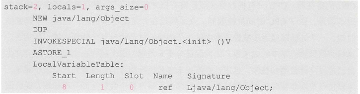
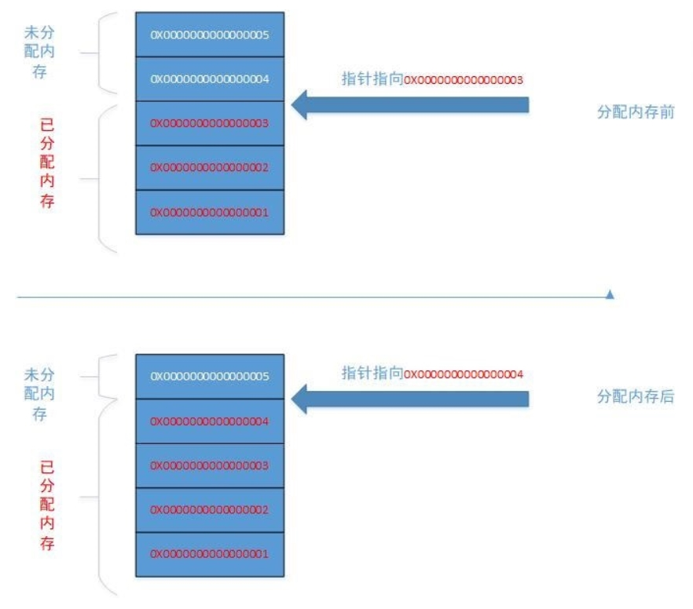
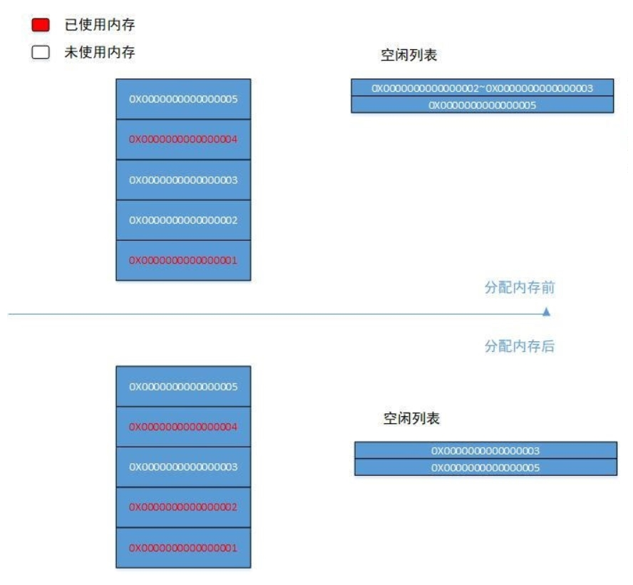

## 你有几种方式创建对象？

- new
  - 最常见的方式
  - 变形1：Xxx的静态方法
  - 变形2：XxxBuilder/XxxFactory的静态方法

- Class的newInstance()：反射的方式，只能调用空参的构造器，权限必须是public
- Constructor的newInstance(Xxx)：反射的方式，可以调用空参、带参的构造器，权限没有要求，实用性更广
- 使用clone()：不调用任何构造器，当前类需要实现Cloneable接口，实现clone()，默认浅拷贝
- 使用反序列化：从文件中、数据库中、网络中获取一个对象的二进制流，反序列化为内存中的对象
- 第三方库Objenesis，利用了asm字节码技术，动态生成Constructor对象

## 创建对象的步骤

### 从字节码角度看待对象创建过程

(1)下面从最简单的Object ref = new Object()； 代码进行分析，利用javap -verbose -p 命令查看对象创建的字节码如下：

- NEW ：如果找不到Class对象，则进行类加载。加载成功后，则在堆中分配内存，从Object 开始到本类路径上的所有属性值都要分配内存。分配完毕之后，进行零值初始化。在分配过程中，注意引用是占据存储空间的，它是一个变量，占用4个字节。这个指令完毕后，将指向实例对象的引用变量压入虚拟机栈顶。
- DUP ：在栈顶复制该引用变量，这时的栈顶有两个指向堆内实例对象的引用变量。如果<init> 方法有参数，还需要把参数压入操作栈中。两个引用变量的目的不同，其中压至底下的引用用于赋值，或者保存到局部变量表，另一个栈顶的引用变量作为句柄调用相关方法。
- INVOKESPECIAL ：调用对象实例方法，通过栈顶的引用变量调用＜init> 方法。

补充：
<clinit> 是类初始化时执行的方法， 而<init> 是对象初始化时执行的方法。

### 从执行步骤角度分析

#### 1.判断对象对应的类是否加载、链接、初始化

虚拟机遇到一条new指令，首先去检查这个指令的参数能否在Metaspace的常量池中定位到一个类的符号引用，并且检查这个符号引用代表的类是否已经被加载、解析和初始化。（即判断类元信息是否存在）。

- 如果没有，那么在双亲委派模式下，使用当前类加载器以ClassLoader+包名+类名为Key进行查找对应的.class 文件。
- 如果没有找到文件，则抛出ClassNotFoundException 异常。
- 如果找到，则进行类加载，并生成对应的Class类对象。

 #### 2.为对象分配内存

首先计算对象占用空间大小，接着在堆中划分一块内存给新对象。
如果实例成员变量是引用变量，仅分配引用变量空间即可，即4个字节大小。

说明：选择哪种分配方式由Java堆是否规整决定，而Java堆是否规整又由所采用的垃圾收集器是否带有压缩整理功能决定。

##### 指针碰撞

如果内存规整，使用指针碰撞

如果内存是规整的，那么虚拟机将采用的是指针碰撞法（Bump The Pointer）来为对象分配内存。意思是所有用过的内存在一边，空闲的内存在另外一边，中间放着一个指针作为分界点的指示器，分配内存就仅仅是把指针向空闲那边挪动一段与对象大小相等的距离罢了。 如果垃圾收集器选择的是Serial、ParNew这种基于压缩算法的，虚拟机采用这种分配方式。 一般使用带有compact（整理）过程的收集器时，使用指针碰撞。

##### 空闲列表

如果内存不规整，虚拟机需要维护一个列表，使用空闲列表分配

如果内存不是规整的，已使用的内存和未使用的内存相互交错，那么虚拟机将采用的是空闲列表法来为对象分配内存。意思是虚拟机维护了一个列表，记录上哪些内存块是可用的，再分配的时候从列表中找到一块足够大的空间划分给对象实例，并更新列表上的内容。这种分配方式称为“空闲列表（Free List）”。

#### 3.处理并发安全问题

在分配内存空间时，另外一个问题是及时保证new对象时候的线程安全性：创建对象是非常频繁的操作，虚拟机需要解决并发问题。 虚拟机采用了两种方式解决并发问题:

- CAS ( Compare And Swap ）失败重试、区域加锁：保证指针更新操作的原子性;
- TLAB 把内存分配的动作按照线程划分在不同的空间之中进行，即每个线程在Java堆中预先分配一小块内存，称为本地线程分配缓冲区，（TLAB ，Thread Local Allocation Buffer）虚拟机是否使用TLAB，可以通过-XX:+/-UseTLAB参数来设定。

#### 4.初始化分配到的空间

内存分配结束，虚拟机将分配到的内存空间都初始化为零值（不包括对象头）。这一步保证了对象的实例字段在Java代码中可以不用赋初始值就可以直接使用，程序能访问到这些字段的数据类型所对应的零值。

#### 5.设置对象的对象头

将对象的所属类（即类的元数据信息）、对象的HashCode和对象的GC信息、锁信息等数据存储在对象的对象头中。这个过程的具体设置方式取决于JVM实现。

#### 6.执行init方法进行初始化

在Java程序的视角看来，初始化才正式开始。初始化成员变量，执行实例化代码块，调用类的构造方法，并把堆内对象的首地址赋值给引用变量。

因此一般来说（由字节码中是否跟随有invokespecial指令所决定），new指令之后会接着就是执行方法，把对象按照程序员的意愿进行初始化，这样一个真正可用的对象才算完全创建出来。

