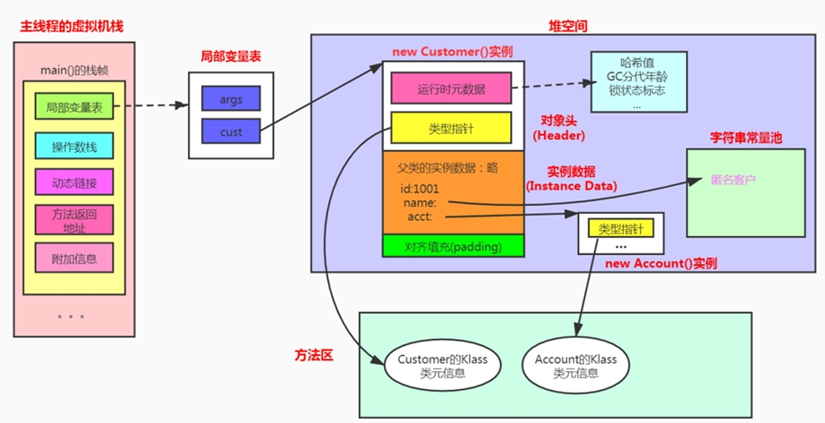

## 对象的内存布局

## 对象头(Header)

对象头：它主要包括两部分。

- 一个是对象自身的运行时元数据(mark word)。
  - 哈希值(hashcode)：对象在堆空间中都有一个首地址值，栈空间的引用根据这个地址指向堆中的对象，这就是哈希值起的作用
  - GC分代年龄：对象首先是在Eden中创建的，在经过多次GC后，如果没有被进行回收，就会在survivor中来回移动，其对应的年龄计数器会发生变化，达到阈值后会进入养老区
  - 锁状态标志，在同步中判断该对象是否是锁
  - 线程持有的锁
  - 线程偏向ID
  - 偏向时间戳

- 另一个是类型指针，指向元数据区的类元数据InstanceKlass，确定该对象所属的类型

此外，如果对象是一个数组，对象头中还必须有一块用于记录数组的长度的数据。因为正常对象元数据就知道对象的确切大小。所以数组必须得知道长度。

### 面试题

- Java对象头里有什么  (蚂蚁金服)
- 对象头信息里面有哪些东西？ (美团)
- 对象在JVM中是怎么存储的

## 实例数据(Instance Data)

**作用：**

它是对象真正存储的有效信息，包括程序代码中定义的各种类型的字段（包括从父类继承下来的和本身拥有的字段）。

**这里需要遵循的一些规则：**

相同宽度的字段总是被分配在一起

父类中定义的变量会出现在子类之前（因为父类的加载是优先于子类加载的）

如果CompactFields参数为true(默认为true)：子类的窄变量可能插入到父类变量的空隙

## 对齐填充(Padding)

对齐填充：不是必须的，也没特别含义，仅仅起到占位符的作用 

