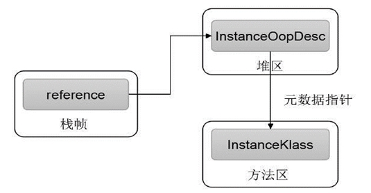
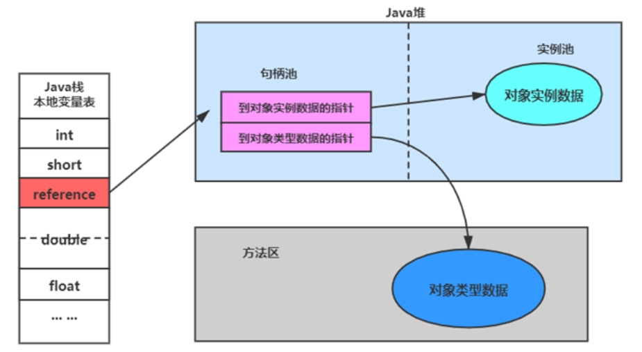
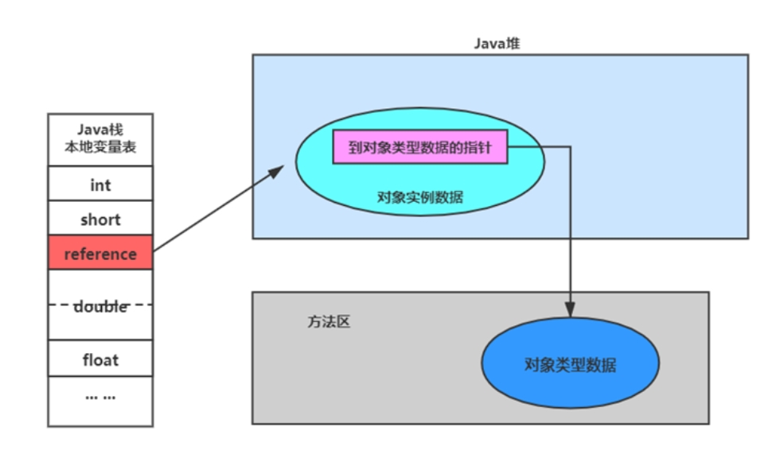

## 对象的访问定位

创建对象的目的是为了使用它。定位，通过栈上reference访问。

JVM是如何通过栈帧中的对象引用访问到其内部的对象实例的呢？

《java虚拟机规范》没有说明，所以对象访问方式由虚拟机实现而定。主流有两种方式：

使用句柄访问

使用直接指针访问

### 方式1：句柄访问

- 实现：堆需要划分出一块内存来做句柄池，reference中存储对象的句柄池地址，句柄中包含对象实例与类型数据各自具体的地址信息。
- 好处：reference中存储稳定句柄地址，对象被移动（垃圾收集时移动对象很普遍）时只会改变句柄中实例数据指针，reference本身不需要被修改。

### 方式2：直接使用指针访问

- 实现：reference中存储的就是对象的地址，如果只是访问对象本身的话，就不需要多一次间接访问的开销。
- 好处：速度更快，java中对象访问频繁，每次访问都节省了一次指针定位的时间开销。

### HotSpot使用哪种方式的呢？

**HotSpot这里主要使用第2种方式：直接指针访问**

JVM可以通过对象引用准确定位到Java堆区中的instanceOopDesc对象，这样既可成功访问到对象的实例信息，当需要访问目标对象的具体类型时，JVM则会通过存储在instanceOopDesc中的元数据指针定位到存储在方法区中的instanceKlass对象上。