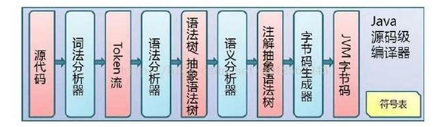
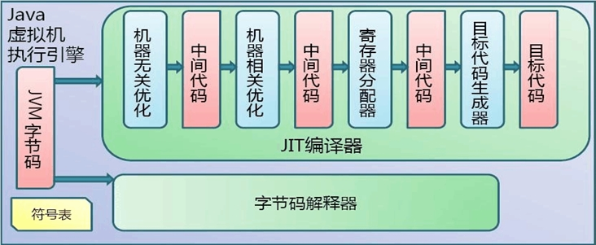

## 代码编译和执行的过程

大部分的程序代码转换成物理机的目标代码或虚拟机能执行的指令集之前，都需要经过上图中的各个步骤。

过程一：javac.exe的执行：

Java代码编译是由Java源码编译器来完成，流程图如下所示：

过程二：java.exe的执行：

Java字节码的执行是由JVM执行引擎来完成，流程图如下所示：

### 概念解释

- Java 语言的 “编译期” 其实是一段“不确定”的操作过程，因为它可能是指一个前端编译器（其实叫 “编译器的前端” 更准确一些）把 .java文件转变成 .class文件的过程；
- 也可能是指虚拟机的后端运行期编译器（JIT 编译器，Just In Time Compiler）把字节码转变成机器码的过程。
- 还可能是指使用静态提前编译器（AOT 编译器，Ahead Of Time Compiler）直接把.java文件编译成本地机器代码的过程。

